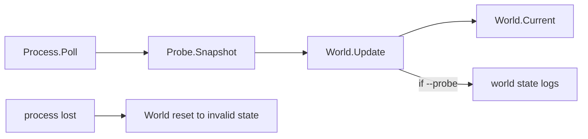

# Plan: Phase 2.3 App-Integration

## Ziel

Schritt 2.3 macht das World Model zur laufenden App-Schicht: Nach jedem erfolgreichen `Process.Poll()` wird ein `memory.Snapshot` gelesen und via `World.Update(...)` in `world.State` überführt. `--probe` steuert danach nur noch Operator-Logging, nicht mehr ob Memory gelesen und World-State aktualisiert wird.



## Scope

- [`internal/app/run_tick.go`](d:/CSharpProjekte/D2R-Offline-Farming-Bot/internal/app/run_tick.go): Snapshot-Read und `World.Update` nach jedem attached `Poll()`, unabhängig von `Options.Probe`.
- Neue Datei [`internal/app/world_log.go`](d:/CSharpProjekte/D2R-Offline-Farming-Bot/internal/app/world_log.go): Logging-Policy auf `world.State` umstellen.
- [`internal/app/probe_log.go`](d:/CSharpProjekte/D2R-Offline-Farming-Bot/internal/app/probe_log.go) und [`internal/app/probe_log_test.go`](d:/CSharpProjekte/D2R-Offline-Farming-Bot/internal/app/probe_log_test.go): nach Migration zu `world_log.go` / `world_log_test.go` löschen, damit keine toten `probeShouldLog`-/`probeHeartbeat`-Symbole bleiben.
- [`internal/app/app.go`](d:/CSharpProjekte/D2R-Offline-Farming-Bot/internal/app/app.go): `logProbeSnapshot` durch `logWorldState` ersetzen; Log-Felder semantisch statt roh.
- [`internal/world/world.go`](d:/CSharpProjekte/D2R-Offline-Farming-Bot/internal/world/world.go): `Reset(at, reason)` ergänzen, damit `app` keinen künstlichen `memory.Snapshot` für Prozessverlust bauen muss.
- [`cmd/d2rbot/main.go`](d:/CSharpProjekte/D2R-Offline-Farming-Bot/cmd/d2rbot/main.go) und ggf. [`internal/app/options.go`](d:/CSharpProjekte/D2R-Offline-Farming-Bot/internal/app/options.go): `--probe`-Hilfetext/Godoc von „enable state probing“ auf „enable world-state logging“ aktualisieren.
- App-Tests in [`internal/app`](d:/CSharpProjekte/D2R-Offline-Farming-Bot/internal/app): alte Annahme „ohne `--probe` kein Snapshot-Read“ ersetzen durch „ohne `--probe` kein World-Log, aber Snapshot + World.Update laufen“.
- Doku: [`docs/features/world-model.md`](d:/CSharpProjekte/D2R-Offline-Farming-Bot/docs/features/world-model.md), [`docs/features/state-probe.md`](d:/CSharpProjekte/D2R-Offline-Farming-Bot/docs/features/state-probe.md), [`docs/CHANGELOG.md`](d:/CSharpProjekte/D2R-Offline-Farming-Bot/docs/CHANGELOG.md).

Nicht Teil dieses Abschnitts: echte GamePhase-Erkennung über UI/Gate, Task-Nutzung von `World.Current`, Pathing, Input, Entities, Items oder separate Telemetry/UI-Reader.

## Run-Loop-Verhalten

Nach attached `Poll()`:

```go
snap := rt.Probe.Snapshot()
worldState := rt.World.Update(snap)
if rt.Options.Probe {
    // world logging policy
}
```

Regeln:

- `Poll()` bleibt vor `Snapshot()`; die bestehende Reihenfolge aus Phase 1 bleibt wichtig wegen Handle-/Detach-Sicherheit.
- Snapshot-Reads passieren nur im attached Zustand nach erfolgreichem `Poll()`.
- `Options.Probe == false` unterdrückt nur Logs; `Probe.Snapshot()` und `World.Update()` laufen trotzdem.
- Beim ersten Attach wird, wenn `--probe` aktiv ist, weiterhin ein forced Log vorbereitet.
- Bei Re-Attach nach Lost wird, wenn `--probe` aktiv ist, wieder ein forced Log vorbereitet.
- Der erste Attach-Tick bleibt ohne Snapshot, weil der Attach-Zweig vor `Poll()` zurückkehrt. `World.Current()` wird erst im nächsten attached Poll-Tick befüllt; das ist für 2.3 akzeptiert und wird dokumentiert.
- `logProcessStateChange` und `state.lastLoggedState` bleiben in Attach- und Lost-Zweigen erhalten. Schritt 2.3 darf die bestehenden `process attached` / `process lost` Logs nicht regressieren.
- Im normalen attached Poll-Tick wird für die Log-Entscheidung gegen `state.world.lastLogged` verglichen, nicht gegen `World.Current()`. `World.Current()` wurde gerade auf `cur` aktualisiert und wäre daher kein sinnvoller Vergleichspunkt.
- Nach einem erfolgreichen World-Log müssen `state.world.lastLogged`, `state.world.lastLog` und `state.world.forceLog` wie beim alten Probe-Logging aktualisiert werden.

Zielstruktur:

```go
st := rt.Process.Poll()
if st.State == process.StateLost {
    prev := rt.World.Current()
    cur := rt.World.Reset(time.Now(), worldResetReasonProcessLost)
    if rt.Options.Probe && worldShouldLog(prev, cur, ...) {
        rt.logWorldState(prev, cur, ...)
    }
    state.world = worldLoopState{}
    state.attached = false
    rt.logProcessStateChange(...)
    state.lastLoggedState = process.StateLost
    return nil
}

snap := rt.Probe.Snapshot()
cur := rt.World.Update(snap)
prev := state.world.lastLogged
if rt.Options.Probe && worldShouldLog(prev, cur, state.world.lastLog, probeHeartbeat, state.world.forceLog, rt.Options.Verbose) {
    rt.logWorldState(prev, cur, ...)
    state.world.lastLogged = cur
    state.world.lastLog = time.Now()
    state.world.forceLog = false
}
```

## Process Lost Reset

Bei `process.StateLost`:

- `state.attached = false` wie bisher.
- World-State wird immer zurückgesetzt, unabhängig von `--probe`: `Valid=false`, `Reason=process_lost`, `Area`/`Player` Zero-Values.
- Lost-Logging-Reihenfolge ist wichtig: `prev := rt.World.Current()`, dann `cur := rt.World.Reset(...)`, dann optional `world unavailable` loggen, danach World-Log-State zurücksetzen und Re-Attach-Force vorbereiten. Sonst geht der Vergleich `valid → invalid` verloren.
- World-Log-State wird auch ohne `--probe` zurückgesetzt, damit intern kein alter valid State hängen bleibt. `--probe` steuert nur, ob ein Operator-Log geschrieben wird.
- Kein `Probe.Snapshot()` im Lost-Tick.

Empfohlene Umsetzung: `world.Model` bekommt eine kleine Godoc-dokumentierte Methode:

```go
func (m *Model) Reset(at time.Time, reason string) State
```

`Reset` setzt `m.current` direkt auf `world.State{At: at, Valid: false, Reason: reason, Phase: GamePhaseUnknown}`. So muss `app` keinen künstlichen `memory.Snapshot` nur für Reset bauen.

Reset-Reason:

- Kein `memory.ReasonNotAttached`, weil der Prozess hier verloren wurde und nicht nur „nie attached“ war.
- Empfehlung: private App-Konstante `const worldResetReasonProcessLost = "process_lost"` in `run_tick.go` oder `world_log.go`.
- `world.Model.Reset` bekommt Godoc: Area/Player sind Zero-Values; Reason wird unverändert übernommen.

## Logging-Policy

`--probe` loggt künftig World-State, nicht rohe Probe-Snapshots.

Empfohlene Helper:

```go
func worldShouldLog(prev, cur world.State, lastLog time.Time, heartbeat time.Duration, force, verbose bool) bool
func isPositionOnlyWorldChange(prev, cur world.State) bool
func (rt *Runtime) logWorldState(prev, cur world.State, heartbeat, verbose bool)
```

Change-Detection darf `State.At` ausdrücklich nicht berücksichtigen. `FromSnapshot` setzt pro Tick einen neuen Zeitpunkt; ein naiver Struct-Vergleich (`prev != cur`) würde deshalb jeden Tick als Änderung werten. Eine explizite Vergleichsfunktion prüft nur:

- `Valid`
- `Reason` bei invaliden States
- `Phase`
- `Area.ID`
- Player-Vitals (`HP`, `MaxHP`, `Mana`, `MaxMana`)
- Position nur für verbose/position-only-Regeln

Mapping der alten Regeln:

- Log sofort bei Valid-Wechsel.
- Invalid: neuer `Reason` einmalig auf Info; unveränderter invalid State nur als Heartbeat auf Debug.
- Valid: Log bei Area-Wechsel, HP-/Mana-/Max-Wert-Wechsel oder Phase-Wechsel.
- Reine Positionsänderungen nur mit `--probe --verbose` auf Debug.
- Heartbeat bleibt 5 Sekunden.
- Forced Log nach Attach/Re-Attach bleibt erhalten.

Log-Inhalt bei validem State:

- Message: `world state`.
- Felder: `phase`, `area_name`, optional `area_id`, `act`, `area_kind`, `hp`, `max_hp`, `hp_pct`, `mana`, `max_mana`, `mana_pct`, `pos_x`, `pos_y`.
- `area_name` ist das primäre Feld; `area_id` darf als Debug-Kontext bleiben, aber Logs sollen nicht mehr nur rohe IDs zeigen.
- `StatsSource` und `PlayerPtr` werden nicht geloggt; sie bleiben Memory-only.
- `StatsSource`-Wechsel löst nicht mehr automatisch ein Operator-Log aus. Das ist eine bewusste Änderung gegenüber Roh-Probe-Logging, weil `StatsSource` nicht Teil von `world.State` ist.
- Für `act` und `area_kind`: entweder kleine `String()`-Methoden in `internal/world` ergänzen oder in `world_log.go` stabile Log-Labels erzeugen. Empfehlung: `String()`-Methoden auf `Act` und `AreaKind`, weil sie für spätere Logs wiederverwendbar sind.
- Falls Log-Assertions sonst zu schwer werden, `worldLogAttrs(cur world.State) []slog.Attr` als pure Hilfsfunktion einführen und testen.

Log-Inhalt bei invalidem State:

- Message: `world unavailable`.
- Feld: `reason`.

## App-State-Struktur

`runState.probe` sollte durch World-Log-State ersetzt werden:

```go
type worldLoopState struct {
    forceLog   bool
    lastLogged world.State
    lastLog    time.Time
}
```

Empfehlung: Feld und Typ auf `world` / `worldLoopState` umbenennen. Halbherzig die alte `probe`-Benennung zu behalten spart wenig Diff und wird ab 2.3 irreführend, weil `--probe` nicht mehr Roh-Probe-Reads steuert.

## Tests

Bestehende App-Tests müssen angepasst werden:

- `TestRunTickWithoutProbeDoesNotCallSnapshot` wird ersetzt: ohne `--probe` wird `Snapshot()` genau einmal nach `Poll()` aufgerufen und `World.Current()` aktualisiert; es erfolgt nur kein Log-spezifischer force/log-state Effekt.
- `TestRunTickWithProbeCallsSnapshotAfterPoll` bleibt sinngemäß, prüft aber zusätzlich `World.Current()`.
- `TestRunTickPollBeforeSnapshot` bleibt wichtig.
- Lost-Test prüft zusätzlich: `World.Current().Valid == false`, `Reason == "process_lost"`, `Area`/`Player` Zero-Values, Reset unabhängig von `--probe`, und kein Snapshot-Read im Lost-Tick.
- Re-Attach mit `--probe` setzt forced World-Log; ohne `--probe` nicht.
- World-Logging-Tests ersetzen/ergänzen Probe-Logging-Tests: HP-Wechsel, Mana-Wechsel, Area-Wechsel, Valid-Wechsel, invalid Reason-Wechsel, Heartbeat, position-only mit/ohne verbose.
- `TestProbeLogIsHeartbeat` wandert als `TestWorldLogIsHeartbeat` nach `world_log_test.go`.
- Phase-Wechsel wird als reine Unit-Test-Policy mit manuell gebauten `world.State` getestet, nicht als Run-Loop-Integrationstest, weil `FromSnapshot` aktuell bei validen Snapshots immer `GamePhaseInGame` setzt.
- `State.At` wird in `worldShouldLog` ignoriert: zwei sonst identische States mit unterschiedlichem `At` dürfen keinen Log auslösen.
- Valid-State-Log-Test prüft semantische Felder mindestens indirekt über Handler-Ausgabe oder einen testbaren Attribute-Builder, falls vorhanden.
- `world.Model.Reset` bekommt einen Test in `internal/world`: invalid State, Reason übernommen, `Area`/`Player` Zero-Values, `Current()` danach reset.

Test-Infrastruktur:

- `testRuntime` muss `World: world.NewModel(config.NewLogger("error"))` setzen, sonst `runTick` beim `World.Update` nil-panicen würde.
- Alle bestehenden `runTick`-Tests brauchen diese `World`-Initialisierung, nicht nur neue Tests.
- Falls Log-Assertions zu schwergewichtig werden, Logging-Feld-Erzeugung in eine kleine pure Hilfsfunktion auslagern und diese testen.

## Dokumentation

`world-model.md`:

- Ergänzen, dass `Model.Update` ab 2.3 im App-Loop kontinuierlich läuft.
- `--probe` als Logging-Schalter beschreiben, nicht mehr als World-Update-Schalter.
- Reset bei Prozessverlust dokumentieren.
- Bestehende Formulierung „Phasenerkennung folgt in 2.3+“ korrigieren: 2.3 macht App-Wiring, echte Gate/UI-Phasenerkennung folgt später.

`state-probe.md`:

- CLI-Tabelle ändern: Default liest nun Snapshots für World-State, loggt sie aber nicht.
- `--probe` bedeutet World-State-Logging.
- Operator-Beispiele von `probe state area_id=...` auf `world state area_name=... hp_pct=...` aktualisieren.
- Phase-1-vs-Phase-2-Tabelle aktualisieren: kontinuierliches World-Update ist jetzt umgesetzt.
- Hinweis ergänzen, dass `StatsSource` nicht mehr im Operator-Log erscheint, weil World-Logs semantisch sind.

`docs/features/README.md`:

- Kurzbeschreibung von State Probe/World Model anpassen: World Model erwähnt kontinuierliches Update im App-Loop (2.3); State Probe darf nicht mehr suggerieren, `--probe` aktiviere Snapshot-Reads.

Startup-Log:

- Bestehendes Feld `probe_enabled` kann bleiben, sollte aber in der Doku als World-State-Logging-Schalter verstanden werden. Eine Umbenennung des Log-Felds ist in 2.3 nicht erforderlich.

`CHANGELOG.md`:

- Unter `Changed`: `Update app loop to refresh world state on every attached poll and make --probe control world-state logging`.
- Optional unter `Added`: `Add world-state logging for named areas, player percentages, and position`.
- Unter `Changed` erwähnen, dass raw `StatsSource` nicht mehr Teil des Operator-World-Logs ist.

## Validierung

Nach Umsetzung:

- `gofmt` auf geänderte Go-Dateien.
- `go test ./internal/app ./internal/world`.
- `go test ./...`.
- `go build ./cmd/d2rbot`.
- `ReadLints` auf geänderte Dateien prüfen.

## Risiken

- Das ist eine sichtbare Verhaltensänderung: Default-Run liest Memory-Snapshots, auch ohne `--probe`. Das ist gewollt für Phase 2, muss aber klar dokumentiert werden.
- Snapshot-Reads können `Poll`/`Detach` kurz blockieren; Reihenfolge bleibt deshalb `Poll()` → `Snapshot()`.
- `GamePhaseInGame` bleibt aus 2.2 eine Best-effort-Heuristik und darf im Logging nicht als harte UI-Phase verkauft werden.
- Der erste Attach-Tick aktualisiert `World.Current()` noch nicht; der erste World-State kommt im folgenden attached Poll-Tick.
- Normaler Shutdown/Detach setzt den World-State in 2.3 nicht zurück. Der Plan deckt nur `process lost` ab; Shutdown-Reset kann später ergänzt werden, wenn UI/Telemetry persistente State-Anzeige braucht.