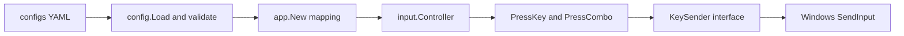

# Phase 3.2 Keyboard Primitives Plan

## Ziel

Phase 3.2 erweitert `internal/input` um Tastatur-Primitives, ohne automatische Spielsteuerung zu starten. Der Controller kann nach 3.2 einzelne Tasten drücken, gedrückt halten/loslassen und Kombinationen senden. Die konkrete Windows-Ausgabe läuft über `SendInput` aus User32, angebunden über `golang.org/x/sys/windows`/LazyDLL und ohne CGO.

Der App-Loop bleibt passiv: `runTick` bindet weiterhin nur das Fenster aus Phase 3.1 und liest Snapshots. Keine Potion, kein Portal und kein Skill-Cast werden automatisch ausgelöst.



## Betroffene Dateien

- [`internal/config/config.go`](d:/CSharpProjekte/D2R-Offline-Farming-Bot/internal/config/config.go): YAML-`InputConfig` mit Delay-Range, Combo-Hold und Key-Mapping ergänzen, Defaults anwenden und Key-Strings über `internal/input` validieren.
- [`configs/config.example.yaml`](d:/CSharpProjekte/D2R-Offline-Farming-Bot/configs/config.example.yaml): neue `input`-Sektion mit Skill-Slots, Belt-Potions und Town-Portal-Taste.
- [`internal/input/input.go`](d:/CSharpProjekte/D2R-Offline-Farming-Bot/internal/input/input.go): Controller um Keyboard-Backend, `input.KeyboardConfig`, Public Methods und serialisierte Key-Aktionen erweitern.
- Neue Datei [`internal/input/keyboard.go`](d:/CSharpProjekte/D2R-Offline-Farming-Bot/internal/input/keyboard.go): Domain-Typen, `KeySender`, Normalisierung, Delay-Policy und Controller-Methoden.
- Neue Datei [`internal/input/keyboard_windows.go`](d:/CSharpProjekte/D2R-Offline-Farming-Bot/internal/input/keyboard_windows.go): `SendInput`-Backend und Virtual-Key-Mapping.
- Neue Datei [`internal/input/keyboard_stub.go`](d:/CSharpProjekte/D2R-Offline-Farming-Bot/internal/input/keyboard_stub.go): `!windows` Backend mit `ErrUnsupportedPlatform`.
- [`internal/input/errors.go`](d:/CSharpProjekte/D2R-Offline-Farming-Bot/internal/input/errors.go): Keyboard-Errors ergänzen, z. B. `ErrInvalidKey`, `ErrUnconfiguredSlot`, `ErrInvalidSlot`, `ErrKeySendFailed`.
- [`internal/input/input_test.go`](d:/CSharpProjekte/D2R-Offline-Farming-Bot/internal/input/input_test.go): vorhandene Window-Tests um Keyboard-Mocks erweitern oder in separate Testdatei auslagern.
- Neue Datei [`internal/input/keyboard_test.go`](d:/CSharpProjekte/D2R-Offline-Farming-Bot/internal/input/keyboard_test.go): Key-Mapping, Reihenfolge, Delay und Fehlerfälle.
- [`internal/app/app.go`](d:/CSharpProjekte/D2R-Offline-Farming-Bot/internal/app/app.go): `input.NewController` mit Input-Config verdrahten, ohne `runTick` um Tastaturaktionen zu erweitern.
- [`docs/features/input-controller.md`](d:/CSharpProjekte/D2R-Offline-Farming-Bot/docs/features/input-controller.md), [`docs/CHANGELOG.md`](d:/CSharpProjekte/D2R-Offline-Farming-Bot/docs/CHANGELOG.md): Phase 3.2 dokumentieren.

## Config-Design

Vorgeschlagene YAML-Struktur:

```yaml
input:
  key_delay_ms_min: 10
  key_delay_ms_max: 40
  combo_hold_ms: 200
  skills:
    slot1: f1
    slot2: f2
    slot3: f3
    slot4: f4
    slot5: f5
    slot6: f6
    slot7: f7
    slot8: f8
  belt:
    slot1: "1"
    slot2: "2"
    slot3: "3"
    slot4: "4"
  town_portal: t
```

Go-Structs:

```go
// internal/config
type InputConfig struct {
    KeyDelayMsMin int       `yaml:"key_delay_ms_min"`
    KeyDelayMsMax int       `yaml:"key_delay_ms_max"`
    ComboHoldMs   int       `yaml:"combo_hold_ms"`
    Skills        SkillKeys `yaml:"skills"`
    Belt          BeltKeys  `yaml:"belt"`
    TownPortal    string    `yaml:"town_portal"`
}

type SkillKeys struct {
    Slot1 string `yaml:"slot1"`
    // ... Slot8
}

type BeltKeys struct {
    Slot1 string `yaml:"slot1"`
    // ... Slot4
}
```

Explizite Structs sind bewusst besser als `map[string]string`: Tippfehler wie `slot9` verschwinden nicht still im Mapping, Defaults sind einfacher, und Slot-Grenzen bleiben klar.

Validierung:

- `key_delay_ms_min >= 0` und `key_delay_ms_max >= key_delay_ms_min`.
- `combo_hold_ms >= 0`, Default `200`.
- Leere Key-Strings sind für optionale Mappings erlaubt, aber Controller-Aktionen mit leerem Key liefern `ErrInvalidKey`.
- Alle nicht-leeren Keys werden beim Config-Load gegen die unterstützte Key-Tabelle aus `internal/input` geprüft. Abhängigkeitsrichtung ist bewusst `config -> input`; `internal/input` darf `internal/config` nicht importieren.
- Defaults werden nach YAML-Unmarshal angewendet, auch wenn die `input`-Sektion komplett fehlt: `key_delay_ms_min=10`, `key_delay_ms_max=40`, `combo_hold_ms=200`, Skill-Slots `f1`–`f8`, Belt-Slots `1`–`4`, `town_portal=t`.
- Default-Erkennung bleibt pragmatisch ohne Pointer-Felder: Volle Defaults nur anwenden, wenn alle drei Timing-Felder `0` sind **und** alle Key-Strings leer sind. Sobald irgendein Input-Feld gesetzt ist, werden nur leere Skill-/Belt-/Town-Portal-Mappings aufgefüllt; explizite `0/0`-Delays bleiben dadurch möglich.

Wichtig: Kein `input.enabled` und kein `dry_run` in 3.2, damit Safety/Operator-Modus in 3.4 nicht halb vorweggenommen wird. Da `runTick` keine Actions auslöst, bleibt die Runtime passiv.

Architekturregel: `internal/input` definiert einen eigenen `KeyboardConfig`-Typ und Validierungs-/Parsing-Funktionen. `app.New` mappt von `config.InputConfig` nach `input.KeyboardConfig`. Dafür eine kleine Mapping-Funktion verwenden, z. B. `mapInputConfig(cfg config.InputConfig) input.KeyboardConfig`, plus Unit-Test, statt Feldkopien inline in `New` zu verteilen. Dadurch bleibt `input` ein Leaf-Paket und es entsteht kein Import-Zyklus.

Exportierte Validierungs-API in `internal/input`:

```go
func NormalizeKey(raw string) (Key, error)
func ValidateKeyStrings(keys ...string) error
```

`config.validate()` nutzt diese Funktionen für alle nicht-leeren Skill-/Belt-/Portal-Strings. Slot-Struktur-Validierung bleibt in `config`; Key-Namen und unterstützte VKs bleiben in `input`.

## Keyboard API

Öffentliche Controller-Methoden:

```go
func (c *Controller) KeyDown(key string) error
func (c *Controller) KeyUp(key string) error
func (c *Controller) PressKey(key string) error
func (c *Controller) PressCombo(keys ...string) error
```

Zusätzlich semantische Helfer über Config-Mappings, damit spätere Tasks nicht direkt Config-Strukturen anfassen müssen:

```go
func (c *Controller) PressSkill(slot int) error
func (c *Controller) PressBelt(slot int) error
func (c *Controller) PressTownPortal() error
```

Regeln:

- Alle Methoden normalisieren Keys (`"F1"` → `"f1"`, `" 1 "` → `"1"`).
- `PressKey` ruft `KeyDown`, wartet eine zufällige Dauer im konfigurierten Bereich und ruft dann `KeyUp`.
- `PressCombo` drückt Keys in gegebener Reihenfolge herunter, wartet `combo_hold_ms` (Default 200 ms wie Koolo), und lässt sie in umgekehrter Reihenfolge los. Combo-Hold ist absichtlich getrennt von `key_delay_ms_min/max`.
- Bei Fehler während `KeyDown` in einer Combo werden bereits gedrückte Keys best-effort wieder losgelassen. Cleanup-Fehler werden als Warnung geloggt; zurückgegeben wird der ursprüngliche Fehler.
- Jede erfolgreiche High-Level-Aktion wird strukturiert geloggt: `input key action` mit `action`, `key` oder `keys`, `delay_ms`. Low-Level `KeyDown`/`KeyUp` können Debug-Logs nutzen, damit normale Logs nicht überladen werden.
- `PressSkill` und `PressBelt` sind 1-basiert: Skills `1..8`, Belt `1..4`. Out-of-range liefert `ErrInvalidSlot`; leere konfigurierte Slots liefern `ErrUnconfiguredSlot`.
- `PressTownPortal()` liefert bei leerem Mapping ebenfalls `ErrUnconfiguredSlot`; der Sentinel bedeutet hier allgemein „konfigurierte Aktion hat keinen Key“, nicht nur numerischer Slot.
- Phase 3.2 macht keinen erzwungenen `Bound()`-Guard vor low-level Tastendrücken. `SendInput` ist globaler OS-Input; High-Level-Tasks und spätere Safety-Schichten prüfen Bound/Fokus in späteren Phasen.
- Alle Keyboard-Methoden werden im Controller serialisiert. Empfehlung: dediziertes `keyMu sync.Mutex`, damit Window-State-Leser nicht durch Sleeps blockieren, aber Tastensequenzen nicht ineinander laufen.

## KeySender Interface

Mockbares Backend:

```go
type KeySender interface {
    KeyDown(key Key) error
    KeyUp(key Key) error
}
```

`Key` ist ein normalisierter Domain-Typ im `input`-Paket. Der Controller bekommt den Sender über Konstruktor-Injection, analog zum bestehenden `windowAPI` aus Phase 3.1.

Empfohlene Konstruktoren:

- `NewController(log, keyboardConfig)` für produktiven Code mit `defaultWindowAPI` und `defaultKeySender`.
- interne Testkonstruktoren wie `newWithBackends(log, windowAPI, keySender, keyboardConfig, keyTimings)`.
- Das bisherige `newWithWindowAPI` wird entweder entfernt oder delegiert auf `newWithBackends` mit Default-Keyboard-Config und Mock-/Default-Sender. Bestehende Window-Tests werden entsprechend migriert.

Dadurch bleiben `internal/input`-Tests ohne echte Windows-Eingaben möglich.

## Windows SendInput

`keyboard_windows.go` implementiert `KeySender` über `SendInput`.

Unterstützte Keys für 3.2:

- Zahlen: `0` bis `9`.
- Buchstaben: `a` bis `z`.
- Funktionstasten: `f1` bis `f12`.
- Modifiers: `shift`, `ctrl`, `alt` als linke VKs (`VK_LSHIFT`, `VK_LCONTROL`, `VK_LMENU`). Aliase wie `control`, `lctrl`, `rctrl` bleiben in 3.2 bewusst ungültig.
- Basis-Tasten: `esc`, `enter`, `space`, `tab`.

Virtual-Key-Mapping bleibt bewusst klein und explizit. Nicht unterstützte Keys liefern `ErrInvalidKey`; keine heuristische String-zu-VK-Konvertierung.

SendInput-Regeln:

- Pro `KeyDown`/`KeyUp` wird genau ein Keyboard-Input gesendet.
- `KEYEVENTF_KEYUP` (`0x0002`) für Release.
- Fehler werden mit Kontext gewrappt und als `ErrKeySendFailed` klassifizierbar gemacht.
- Keine `SetForegroundWindow`-Arbeit in 3.2. Das Fenster-Binding aus 3.1 ist Voraussetzung für spätere Fokussierung, aber Keyboard-Primitives selbst senden nur OS-Input.
- `INPUT`/`KEYBDINPUT` Struct-Layout wird explizit modelliert und per Windows-Test mit `unsafe.Sizeof` abgesichert. Falsches Padding ist bei `SendInput` ein bekanntes Fehlerrisiko.
- Der eigentliche User32-Call liegt hinter einer kleinen injizierbaren Funktion/Interface, damit Unit-Tests Mapping und Payload prüfen können, ohne echte Eingaben zu senden.
- Separater Unit-Test für die VK-Mapping-Tabelle; echte `SendInput`-Calls gehören nicht in automatisierte Tests.

## Timing und Zufall

Delay-Policy:

- Default `min=10`, `max=40` Millisekunden.
- Combo-Hold Default `200` Millisekunden, getrennt vom normalen Key-Delay.
- Wenn `min == max`, deterministischer Delay.
- Tests injizieren eine deterministische Delay-/Random-Quelle; reine `0/0`-Config reicht nicht, wenn irgendwo `time.Sleep` hart verdrahtet wäre.
- Produktion nutzt `math/rand/v2` oder eine kleine interne RNG-Quelle; keine globale Seed-Abhängigkeit in Tests.

Konkretes internes Design:

```go
type keyTimings struct {
    sleep func(time.Duration)
    delay func(minMs, maxMs int) time.Duration
}
```

Default: `time.Sleep` + Zufallswert inklusive Grenzen. Tests: `sleep` no-op, `delay` deterministisch. `PressKey` nutzt `timings.delay(...)` und danach `timings.sleep(...)`; `PressCombo` nutzt **ausschließlich** `timings.sleep(time.Duration(combo_hold_ms) * time.Millisecond)` für die Hold-Zeit, niemals hart verdrahtetes `time.Sleep`.

## App-Integration

`app.New` mappt `cfg.Input` auf `input.KeyboardConfig` und übergibt diesen Input-eigenen Typ an `input.NewController`. Das bestehende `inputController`-Interface in `internal/app/run_tick.go` muss für 3.2 nicht erweitert werden, weil der App-Loop keine Keyboard-Aktionen ausführt.

Wichtig: `verifyComponents()` bleibt bei `Input.Ready()`. `Ready()` bedeutet weiterhin nur Initialisierung, nicht Bound und nicht „Keyboard sendefähig“.

## Tests

`internal/config`:

- Beispiel-Config lädt mit den neuen Input-Keys.
- Fehlende `input`-Sektion erhält vollständige Defaults.
- `TestLoadExampleConfig` prüft Delay, Combo-Hold, Skill/Belt/Town-Portal Defaults.
- Negative Delay-Werte schlagen fehl.
- `max < min` schlägt fehl.
- Ungültiger Key im Mapping schlägt fehl.
- Ungültiger Alias wie `control` oder `lctrl` schlägt fehl.

`internal/input`:

- Key-Normalisierung für Groß-/Kleinschreibung und Whitespace.
- Ungültige Keys liefern `ErrInvalidKey` und rufen den Sender nicht auf.
- `PressKey` ruft `Down`, Delay, `Up` in dieser Reihenfolge auf.
- `PressCombo("ctrl", "f1")` ruft `Down(ctrl)`, `Down(f1)`, Combo-Hold, `Up(f1)`, `Up(ctrl)` auf.
- Combo-Fehler beim zweiten Key räumt den ersten Key best-effort auf; Mock verifiziert Reihenfolge, Cleanup-Fehler wird geloggt und Originalfehler bleibt Rückgabefehler.
- `PressSkill`, `PressBelt`, `PressTownPortal` lösen die konfigurierten Keys auf.
- `PressSkill(0)`, `PressSkill(9)`, `PressBelt(0)`, `PressBelt(5)` liefern `ErrInvalidSlot`.
- Leere konfigurierte Slots liefern `ErrUnconfiguredSlot`.
- Stub-Backend auf `!windows` liefert `ErrUnsupportedPlatform`, ohne echte Eingaben zu senden.

Windows-Adapter-Tests bleiben ohne echte `SendInput`-Calls; die User32-Prozedur wird hinter einer kleinen Funktion/Interface injiziert. Zusätzlich: VK-Mapping-Test und Windows-only Struct-Size-Test. Manuelle Windows-Validierung folgt später über einen separaten Input-Testmodus, nicht in 3.2.

`internal/app`:

- `app.New` verdrahtet Config-Defaults zu `input.KeyboardConfig`, ohne das `inputController`-Interface im Run-Loop zu erweitern.
- Unit-Test für die Mapping-Funktion von `config.InputConfig` nach `input.KeyboardConfig`, damit Skill-/Belt-/Portal-Felder nicht versehentlich vertauscht werden.

## Doku und Changelog

`docs/features/input-controller.md` ergänzen:

- Phase 3.1 Window Binding bleibt Grundlage.
- Phase 3.2 Keyboard-Primitives: unterstützte Keys, Delay-Config, Skill/Belt/Portal-Mapping.
- Grenzen: keine automatische Nutzung, keine globalen Stop/Pause-Hotkeys, kein Fokus-Management, keine Maus.
- Bestehende 3.1-Formulierung „Foreground-Prüfung und `SetForegroundWindow` folgen in Phase 3.2+“ auf „Phase 3.3+“ oder allgemeiner „später“ korrigieren, weil 3.2 bewusst nur Keyboard-Primitives liefert.

Changelog unter `## [Unreleased]`:

```markdown
### Added
- Add configurable keyboard primitives for the input controller using Windows SendInput (Phase 3.2)
```

## Validierung

Nach Umsetzung:

```powershell
gofmt -w internal/input internal/config internal/app
go test ./internal/input ./internal/config ./internal/app
go test ./...
go build ./cmd/d2rbot
```

Manuelle Validierung in 3.2 beschränkt sich auf Start/Config-Load und bestehendes Window Binding. Echte Tastendrücke sollten erst mit einem expliziten Testmodus in einem Folgeschritt ausgelöst werden.

## Hauptrisiken

- `SendInput` ist globaler OS-Input. 3.2 darf deshalb keine automatischen Tastendrücke im App-Loop einbauen.
- `internal/input` darf `internal/config` nicht importieren; `app.New` ist die Mapping-Grenze.
- Combos brauchen längere Hold-Zeit als einzelne Keypresses; `combo_hold_ms` verhindert versteckte Zuverlässigkeitsprobleme.
- Keyboard-Aktionen müssen serialisiert sein, damit spätere parallele Tasks keine ineinander verschachtelten KeyDown/KeyUp-Sequenzen erzeugen.
- `SendInput`-Struct-Layout ist fehleranfällig; Mapping und Layout brauchen Tests.
- Key-Namen müssen klein und explizit bleiben; breite Tastaturlayout-Unterstützung wäre Scope Creep.
- Random Delays dürfen Tests nicht verlangsamen oder flaky machen; Delay/RNG muss injizierbar oder testbar deaktivierbar sein.
- Config-Erweiterung ist user-facing und braucht Beispiel, Validierung, Doku und Changelog.