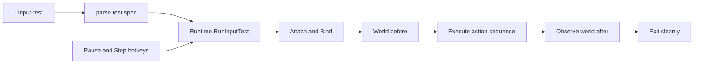

# Phase 3.5 Manual Input Test Plan

## Ziel

Phase 3.5 ergänzt einen expliziten CLI-Testmodus, mit dem die Phase-3-Input-Pipeline im Offline-Spiel manuell validiert werden kann:

1. D2R-Prozess finden.
2. Fenster binden.
3. World-State vor der Aktion loggen.
4. Eine Testaktion oder kurze Sequenz ausführen.
5. World-State danach kurz beobachten und loggen.
6. Sauber beenden; Stop-Hotkey funktioniert jederzeit.

Der normale `Run()`-Loop bleibt unverändert passiv. Der Testmodus wird nur über ein explizites CLI-Flag gestartet.



## CLI-Design

Bestehender `flag`-Stil bleibt erhalten; kein Subcommand-Framework in 3.5.

Neue Flags in [`cmd/d2rbot/main.go`](d:/CSharpProjekte/D2R-Offline-Farming-Bot/cmd/d2rbot/main.go):

```powershell
--input-test "belt:1"
--input-test "potion:1"
--input-test "portal"
--input-test "skill:1"
--input-test "center-click"
--input-test "click:640,360"
--input-test "belt:1,portal,skill:1"
--input-test-observe-ms 3000
```

Semantik:

- `belt:N`: `Input.PressBelt(N)`; `N` ist 1-basiert `1..4`.
- `potion:N`: Alias für `belt:N`, weil Potion-Nutzung aktuell über Belt-Slots modelliert ist.
- `portal`: `Input.PressTownPortal()`.
- `skill:N`: `Input.PressSkill(N)`, 1-basiert `1..8`.
- `center-click`: `MoveTo(width/2, height/2)` und `Click(left)`, basierend auf gebundener `WindowInfo`.
- `click:X,Y`: client-relative Koordinaten, danach `Click(left)`.
- Komma trennt eine kurze Sequenz. Whitespace wird getrimmt.

Nicht Teil von 3.5:

- Interaktive Prompts.
- Wiederholungsschleifen.
- UI-/Waypoint-Klicks.
- Automatische Kampf-/Pathing-Logik.

## App-Optionen

[`internal/app/options.go`](d:/CSharpProjekte/D2R-Offline-Farming-Bot/internal/app/options.go) erweitern:

```go
type Options struct {
    Probe bool
    Verbose bool
    InputTest string
    InputTestObserveMs int
}
```

`cmd/d2rbot/main.go` lädt wie bisher Config und Runtime. Wenn `opts.InputTest != ""`, ruft `run(...)` statt `rt.Run()` den neuen Testmodus:

```go
if opts.InputTest != "" {
    return rt.RunInputTest(opts.InputTest)
}
return rt.Run()
```

Empfohlener Default: `--input-test-observe-ms=3000`.

`RunInputTest(spec string)` liest `observeMs` aus `rt.Options.InputTestObserveMs`; keinen zweiten Parameter einführen. Wenn der Wert `<=0` ist, intern auf 3000 ms normalisieren.

## Test-Spec Parser

Neue Datei [`internal/app/input_test_spec.go`](d:/CSharpProjekte/D2R-Offline-Farming-Bot/internal/app/input_test_spec.go):

```go
type inputTestActionKind string

const (
    inputTestBelt inputTestActionKind = "belt"
    inputTestPortal inputTestActionKind = "portal"
    inputTestSkill inputTestActionKind = "skill"
    inputTestCenterClick inputTestActionKind = "center_click"
    inputTestClick inputTestActionKind = "click"
)

type inputTestAction struct {
    kind inputTestActionKind
    slot int
    x int
    y int
}
```

Parser-Regeln:

- Leerer Spec ist Fehler.
- Unbekannte Aktion ist Fehler mit erlaubten Beispielen.
- Slot-Bounds werden bereits im Parser grob geprüft (`belt/potion 1..4`, `skill 1..8`), damit CLI-Fehler freundlich sind.
- `click:X,Y` akzeptiert negative Werte; Clamping bleibt Aufgabe von `input.MoveTo`.
- `center-click` braucht später `Input.Window()` im Runtime-Test.
- `potion:N` wird im Parser direkt auf dieselbe interne Action wie `belt:N` gemappt.
- Aktionsnamen werden normalisiert: `center-click` ist CLI-Syntax, intern `inputTestCenterClick`.
- Leere Sequenzsegmente wie `belt:1,,portal` sind Fehler.
- Bei `click:X, Y` werden beide Koordinaten nach dem Split getrimmt.

## Input Interface

Das app-seitige `inputController` aus [`internal/app/run_tick.go`](d:/CSharpProjekte/D2R-Offline-Farming-Bot/internal/app/run_tick.go) sollte nicht unnötig für den normalen Tick wachsen.

Empfehlung: ein separates Interface in einer neuen Datei [`internal/app/input_test.go`](d:/CSharpProjekte/D2R-Offline-Farming-Bot/internal/app/input_test.go) vermeiden, weil `_test.go` reserviert ist. Stattdessen z. B. [`internal/app/input_test_mode.go`](d:/CSharpProjekte/D2R-Offline-Farming-Bot/internal/app/input_test_mode.go):

```go
type inputTestController interface {
    inputController
    Window() (input.WindowInfo, bool)
    PressBelt(slot int) error
    PressTownPortal() error
    PressSkill(slot int) error
    MoveTo(clientX, clientY int) error
    Click(button input.MouseButton) error
}
```

`Runtime.Input` kann weiterhin den bestehenden `inputController`-Typ behalten; `RunInputTest` prüft einmal per Type Assertion auf `inputTestController` und gibt einen klaren Fehler zurück, falls ein Test-Mock die Methoden nicht implementiert. Alternativ kann `Runtime.Input` direkt auf das größere Interface erweitert werden; Type Assertion hält die normale Run-Tick-Testoberfläche kleiner.

Tests brauchen dafür einen eigenen `mockInputTestController` mit Call-Tracking für `Window`, `PressBelt`, `PressTownPortal`, `PressSkill`, `MoveTo`, `Click` und einem vollständigen `Status()` inklusive `Enabled`. Das bestehende `mockInput.Status()` muss für Safety-Tests `Enabled` korrekt liefern. Zusätzlich ein Compile-Time-Test nach bestehendem Muster: `var _ inputTestController = (*input.Controller)(nil)`.

## Runtime Test Mode

Neue Methode in [`internal/app/input_test_mode.go`](d:/CSharpProjekte/D2R-Offline-Farming-Bot/internal/app/input_test_mode.go):

```go
func (rt *Runtime) RunInputTest(spec string) error
```

Ablauf:

1. Parse `spec`.
2. Prüfe `Input.Status().Enabled`; wenn `false`, klarer Fehler: `input test requires input.enabled=true`.
3. Starte Context, Signal-Handler und Hotkey-Listener wie in `Run()`; Stop-Hotkey und Ctrl+C rufen `Input.Stop(...)` + `cancel()`.
4. Warte mit wiederholtem `runTick(ctx, state)` auf:
   - Prozess attached,
   - `Input.Bound() == true`,
   - mindestens ein gültiger `World.Current()` oder Timeout.
5. Log `input test ready` mit PID, WindowInfo und World-State vor der Aktion.
6. Führe Aktionen in Reihenfolge aus.
7. Nach jeder Aktion kurz loggen: `input test action completed`.
8. Für `observeMs` weiter Snapshots lesen (`runTick`) und `World.Current()` am Ende loggen.
9. Cleanup wie `Run()`: `Input.Unbind()`, `Process.Detach()`.

Ready-Timeouts:

- `RunInputTest` bekommt eine eigene Ready-Deadline ab Teststart. Nicht auf den bestehenden `runTick`-Attach-Timeout verlassen, weil dieser nur bis zum ersten Attach greift.
- `readyTimeout := attachTimeoutOrDefault(60s)`: wenn `process.attach_timeout_ms > 0`, diesen Wert verwenden; wenn `0`, nur im Testmodus 60s verwenden.
- Die Deadline deckt Attach, Window Binding und gültigen World-State ab. `runTick` selbst bleibt unverändert; normales `Run()`-Verhalten wird nicht geändert.
- Observation-Timeout kommt aus `--input-test-observe-ms`.

World-ready bedeutet: `World.Current().Valid == true`. Der Testmodus erfordert einen lesbaren In-Game-Snapshot, also Charakter geladen und nicht im Hauptmenü/Loading. Bei Timeout muss der Fehlerzustand klar geloggt werden: `attached`, `bound`, `world_valid`, `world_reason`.

Process-lost-Erkennung: `runTick` gibt bei `process.StateLost` bewusst `nil` zurück und setzt `state.attached=false`. `RunInputTest` muss nach jedem Tick erkennen: Wenn `state.hasEverAttached && !state.attached`, Test mit klarem Fehler abbrechen (`process lost during input test`). Nicht weiter auf Re-Attach warten.

Wichtig: `RunInputTest` löst keine Aktion aus, solange `Input` pausiert oder gestoppt ist. Die Action-Guards aus 3.4 bleiben maßgeblich.

Fehlersemantik:

- Stop-Hotkey, Stop-State oder Signal während Wait/Observe: sauberer Abbruch mit `nil` und Log `input test stopped`.
- Guard-Fehler während einer Aktion, z. B. `ErrInputPaused`, bricht die Sequenz mit Fehler ab (`errors.Is(err, input.ErrInputPaused)` bleibt möglich).
- Nicht-Stop-Fehler (Lost, Parser, Disabled, Sender-Fehler) geben einen Fehler zurück.

## Action Execution

Mapping:

```go
belt/potion:N  -> Input.PressBelt(N)
portal         -> Input.PressTownPortal()
skill:N        -> Input.PressSkill(N)
center-click   -> Window center -> MoveTo -> Click(left)
click:X,Y      -> MoveTo(X,Y) -> Click(left)
```

Für `center-click`:

```go
win, ok := Input.Window()
x := win.ClientWidth / 2
y := win.ClientHeight / 2
```

Wenn `ok == false`, gibt `center-click` einen klaren Fehler zurück: `input test: window not bound`.

Hinweis zur Verifikation:

- `belt/potion` kann im World-State HP/Mana ändern, wenn der passende Belt-Slot belegt ist und der Charakter Bedarf hat.
- `portal` verifiziert primär Tastendruck/Log; World-State muss sich nicht ändern.
- `skill` verifiziert Skill-Hotkey/Log; World-State muss sich nicht ändern.
- `center-click` ist nur ein Maus-Primitive-Test. Positionsänderung ist nur erwartbar, wenn die Zielkoordinate im Spiel tatsächlich Laufbewegung auslöst. Für echte Lauf-Verifikation später eher `click:X,Y` mit einer bewusst gewählten Client-Position nutzen.

Hotkey-Reaktionsgrenzen während Sequenzen:

- Während Wait und Observation läuft ein `select` über Tick/Hotkeys/Context, Stop wirkt sofort.
- Während einer einzelnen synchronen Action (`PressKey`, `MoveTo`, `Click`) greift Stop erst nach Rückkehr der Action. Das ist für 3.5 akzeptiert, weil Actions kurz sind.
- Zwischen Actions in einer Sequenz wird ein nicht-blockierender Hotkey/Context-Check ausgeführt. Wenn Stop gesetzt wurde, werden keine weiteren Actions gestartet.
- Konkreter Check zwischen Actions:

```go
select {
case ev := <-hotkeyEvents:
    rt.handleHotkeyEvent(ev, cancel)
default:
}
if ctx.Err() != nil || rt.Input.Status().Stopped {
    return nil
}
```

## Logging

Neue Logs:

- `input test started`: spec, action_count, observe_ms.
- `input test ready`: pid, bound, window dimensions, world area/position/hp/mana.
- `input test action started`: action, slot/x/y.
- `input test action completed`: action.
- `input test observation`: before/after world state, hp/mana/position deltas.
- `input test stopped`: reason hotkey/signal/context.

Action-Logs aus `input.Controller` bleiben erhalten (`input action`, `allowed=true|false`, reason). Testmodus-Logs ergänzen nur den Testablauf.

`--probe` ist im Testmodus optional. `RunInputTest` muss dedizierte World-Logs vor/nach der Aktion immer schreiben, auch wenn `Options.Probe == false`. Dafür einen kleinen Helper verwenden, z. B. `logInputTestWorld(label string, st world.State)`, statt sich auf die normale probe-gated `logWorldState`-Policy zu verlassen.

Observation-Baseline:

- `input test ready` loggt den Pre-Action-World-State.
- `input test observation` verwendet als `before` den ersten Snapshot **nach** der Action-Sequenz.
- `after` ist der letzte Snapshot nach Ablauf von `observeMs`.
- Deltas in `input test observation` beziehen sich auf dieses Observation-`before`/`after`, nicht auf den Pre-Action-State.

Reasons für Actions:

- `input_test_belt`
- `input_test_portal`
- `input_test_skill`
- `input_test_center_click`
- `input_test_click`

Falls die bestehenden Public Methods keine Reason-Parameter haben, bleiben ihre internen Defaults; der Testmodus loggt zusätzlich die Testaktion. Kein API-Bruch in 3.5 erzwingen.

## Hotkeys During Test

Die in 3.4 getesteten Pause-/Stop-Hotkeys werden wiederverwendet:

- Pause-Hotkey ruft `Input.TogglePause("hotkey")`. Wenn vor einer Action pausiert ist, blockiert der Guard die Action und der Testmodus gibt den Guard-Fehler zurück.
- Stop-Hotkey ruft `Input.Stop("hotkey")` und cancelt den Test-Kontext.
- Stop muss auch während Attach/Bind-Wait und Observation wirken.

Dafür am besten die Hotkey-Start-/Event-Handling-Logik aus `Run()` in kleine private Helfer extrahieren, z. B.:

```go
func (rt *Runtime) startHotkeys(ctx context.Context) (<-chan input.HotkeyEvent, error)
func (rt *Runtime) startShutdownSignals(ctx context.Context, cancel context.CancelFunc)
func (rt *Runtime) handleHotkeyEvent(ev input.HotkeyEvent, cancel context.CancelFunc)
```

Falls `handleHotkeyEvent` bereits existiert, nur `startHotkeys` und optional `startShutdownSignals` extrahieren. Ziel: Signal-Handling nicht zwischen `Run()` und `RunInputTest()` duplizieren oder auseinanderlaufen lassen.

## Tests

`cmd/d2rbot`:

- `--input-test` und `--input-test-observe-ms` werden in `app.Options` gesetzt.
- Ohne `--input-test` bleibt `rt.Run()` Pfad unverändert.

`internal/app` parser:

- `belt:1`, `potion:4`, `portal`, `skill:8`, `center-click`, `click:10,20`.
- Sequenz `belt:1,portal,skill:1`.
- Fehlerfälle: leer, unbekannt, Slot out of range, malformed click.

`internal/app` runtime:

- Disabled input: `RunInputTest` bricht vor Aktionen mit klarem Fehler ab.
- Wait bis bound/world-ready ruft `runTick` wiederholt.
- Ready-Timeout läuft auch, wenn Attach bereits erfolgreich ist, aber `World.Current().Valid == false`.
- Bei Ready-Timeout werden attached/bound/world_reason im Log/Fehlerkontext sichtbar.
- `belt/potion`, `portal`, `skill`, `center-click`, `click:X,Y` rufen die richtigen Mock-Input-Methoden.
- Stop-Hotkey während Wait beendet Test sauber.
- Pause-Hotkey vor Action führt zu Guard-Fehler und kein Sender-Aufruf im Input-Mock.
- Stop zwischen zwei Actions einer Sequenz verhindert die nächste Action.
- Observation liest weiter Snapshots und loggt before/after-Deltas.
- Observation-Deltas verwenden ersten Snapshot nach Sequenz als `before` und letzten Snapshot nach `observeMs` als `after`.
- Process lost während Test führt zu Fehler/Abbruch mit Kontext.
- `mockInput`/`mockInputTestController` enthält `Enabled bool`; Default kann `false` bleiben, Tests setzen es explizit.

`internal/input`:

- Keine neuen Primitives nötig, nur sicherstellen, dass bestehende Safety-Guards/Logs im Testmodus nutzbar bleiben.

## Doku und Changelog

Update:

- [`README.md`](d:/CSharpProjekte/D2R-Offline-Farming-Bot/README.md): kurzer Abschnitt „Manual Input Test“ mit Beispielen.
- [`docs/features/input-controller.md`](d:/CSharpProjekte/D2R-Offline-Farming-Bot/docs/features/input-controller.md): Phase 3.5 ergänzen, Actions, Voraussetzungen, Grenzen.
- [`docs/features/README.md`](d:/CSharpProjekte/D2R-Offline-Farming-Bot/docs/features/README.md): Kurzbeschreibung um manuellen Testmodus ergänzen.
- [`docs/CHANGELOG.md`](d:/CSharpProjekte/D2R-Offline-Farming-Bot/docs/CHANGELOG.md): Added-Eintrag.

Godoc:

- Neues exportiertes `RunInputTest` dokumentieren.
- Parser-Typen bleiben nach Möglichkeit unexportiert; falls doch exportiert, Godoc ergänzen.

Changelog:

```markdown
### Added
- Add manual CLI input-test mode for validating keyboard and mouse primitives in-game (Phase 3.5)
```

## Release-Kriterium Phase 3

Phase 3 gilt als abgeschlossen, wenn im Offline-Spiel per CLI validiert werden kann:

```powershell
.\d2rbot.exe --config configs\config.yaml --input-test "belt:1"
.\d2rbot.exe --config configs\config.yaml --input-test "portal"
.\d2rbot.exe --config configs\config.yaml --input-test "skill:1"
.\d2rbot.exe --config configs\config.yaml --input-test "center-click"
```

`--verbose` ist optional für zusätzliche Debug-Logs. `--probe` ist nicht erforderlich, weil `RunInputTest` eigene Vor-/Nachher-World-Logs schreibt.

Erwartung:

- Fenster gefunden und gebunden.
- Input Safety aktiv und `input.enabled=true` bewusst gesetzt.
- Potion/Belt, Portal-Taste, Skill-Slot und Mausbewegung/Klick werden geloggt.
- Der Testmodus loggt World-State vor/nach immer über eigene `input test`-Logs; `--probe` ist optional und liefert nur zusätzliche laufende World-Logs. HP/Mana/Position ändern sich, wenn die Spielsituation das hergibt.
- Pause-Hotkey blockiert Aktionen, Stop-Hotkey beendet den Test jederzeit sauber.

## Risiken und Grenzen

- Der Testmodus sendet echte OS-Eingaben. Er darf nur mit explizitem `--input-test` und `input.enabled=true` Aktionen ausführen.
- World-State-Verifikation ist beobachtend, nicht beweisend: Portal/Skill ändern nicht zwingend HP/Mana/Position.
- `center-click` kann je nach Spielsituation keine Positionsänderung auslösen. Für Bewegungsverifikation ist `click:X,Y` genauer.
- Kein Fokus-Management in 3.5. Wenn D2R nicht im Fokus ist, können Eingaben trotz gebundenem Fenster woanders landen; die Doku muss das klar nennen.
- Keine Automatisierungsschleife: 3.5 ist ein manueller Operator-Test, kein Task-Runner.