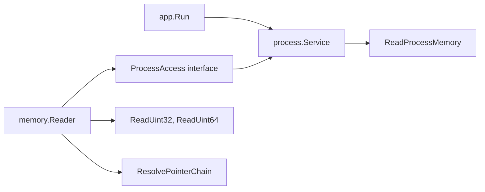

# Plan: `internal/memory` Low-Level Reader

## Ziel

Schritt 2 baut die reine Byte-zu-Typ-Schicht fuer Phase 1: `internal/memory` kann aus einem angebundenen D2R-Prozess rohe Bytes lesen, `uint32`/`uint64` little-endian decodieren und Pointer-Ketten aufloesen. Es werden noch keine HP-, Mana-, Area- oder World-Semantik implementiert.



## Scope

Betroffene Dateien:

- [`internal/process/api.go`](d:/CSharpProjekte/D2R-Offline-Farming-Bot/internal/process/api.go): interne API um `ReadMemory(handle, addr, buf)` erweitern.
- [`internal/process/process.go`](d:/CSharpProjekte/D2R-Offline-Farming-Bot/internal/process/process.go): exportiertes `ReadAt(addr uintptr, buf []byte) error` auf `Service`, mit State-/Handle-Checks und `ReadMemory` unter demselben Mutex.
- `internal/process/process_windows.go`: `ReadProcessMemory`-Implementierung ueber `golang.org/x/sys/windows`.
- `internal/process/process_stub.go`: Nicht-Windows-Stub fuer portable Tests.
- [`internal/memory/memory.go`](d:/CSharpProjekte/D2R-Offline-Farming-Bot/internal/memory/memory.go): `Reader`, `ProcessAccess`-Interface, Primitive und Pointer-Ketten.
- `internal/memory/memory_test.go`: Tests mit Mock-ProcessAccess.
- `internal/process/process_test.go`: Tests fuer `ReadAt` State-Checks, invalid pointer / partial read, concurrent `ReadAt`/`Detach` und Wrapper-Fehler.
- [`docs/features/memory-reader.md`](d:/CSharpProjekte/D2R-Offline-Farming-Bot/docs/features/memory-reader.md), [`docs/features/README.md`](d:/CSharpProjekte/D2R-Offline-Farming-Bot/docs/features/README.md), [`docs/CHANGELOG.md`](d:/CSharpProjekte/D2R-Offline-Farming-Bot/docs/CHANGELOG.md): Feature-Doku und Changelog.

## Boundary-Design

Kein `windows.Handle` wird exportiert. `memory.Reader` kennt nur ein schmales Interface, das `process.Service` erfuellt:

```go
type ProcessAccess interface {
    ReadAt(addr uintptr, buf []byte) error
    ModuleBase() uintptr
}
```

`process.Service.ReadAt` bleibt die einzige Stelle ausserhalb des Windows-Adapters, die gegen den echten Prozess liest. `internal/memory` ist dadurch plattformneutral testbar und bleibt frei von Windows-Handle-Typen. `ModuleBase()` ist Teil des Interfaces fuer Schritt 3 und spaetere Snapshot-Caller; Schritt 2 nutzt es noch nicht aktiv.

## Process-Erweiterung

`processAPI` wird intern erweitert:

```go
type processAPI interface {
    // existing methods...
    ReadMemory(handle nativeHandle, addr uintptr, buf []byte) error
}
```

`Service.ReadAt(addr, buf)`:

- Haelt den Service-Mutex fuer die gesamte Operation: State-/Handle-Check plus `api.ReadMemory`.
- Blockiert dadurch `Poll()`/`Detach()` waehrend eines Reads; fuer Schritt 2 bewusst akzeptiert, um Use-after-close des Handles zu vermeiden.
- Prueft: State muss `StateAttached` sein, Handle darf nicht `0` sein, `buf` darf nicht leer sein.
- Gibt bei detached/lost einen typed Fehler zurueck, z. B. `ErrNotAttached`, mit State im Wrap (`not attached (lost)`).
- Leerer Buffer liefert einen klaren Prozess-Read-Fehler, kein Plattformaufruf mit Laenge `0`.
- Ruft `api.ReadMemory(handle, addr, buf)` auf, waehrend der Lock gehalten wird.
- Exportiertes Symbol bekommt Godoc.
- Keine Retry-Logik in `process`: Der Adapter macht genau einen OS-Read; `memory.Reader` entscheidet ueber Retries.

Windows-Adapter:

- Nutzt `windows.ReadProcessMemory` oder passenden syscall-Wrapper aus `x/sys/windows`.
- Behandelt partial reads explizit: wenn `bytesRead != len(buf)`, `process.ErrPartialRead` statt stiller Erfolg.
- Invalid pointer / access violation / partial copy werden nicht als retryable behandelt.
- `process.ErrReadFailed` ist nur fuer vermutlich transiente oder unerwartete OS-Read-Fehler gedacht.
- Nicht retryable auf `process`-Ebene: Adresse `0`, `ERROR_NOACCESS`, `ERROR_INVALID_PARAMETER`, `ERROR_PARTIAL_COPY` und partial reads.
- Zur eindeutigen Klassifikation stellt `process` eine Helper-Funktion bereit, z. B. `IsReadRetryable(err error) bool`, die aktuell nur `ErrReadFailed` ohne strukturelle Sentinel-Fehler akzeptiert.
- Windows-Fehler-Mapping nutzt die bestehende `mapWindowsError`-Logik aus `process_windows.go`.
- Kein Panic bei Adresse `0` oder kaputter Pointer-Kette.
- Alle `processAPI`-Implementierer muessen erweitert werden: echte Windows-API, `process_stub.go` und `mockAPI` in `process_test.go`.

## Memory Reader API

`memory.Reader` wird an einen `ProcessAccess` gebunden:

```go
func NewReader(log *slog.Logger) *Reader
func (r *Reader) Bind(access ProcessAccess)
func (r *Reader) ReadBytes(addr uintptr, size int) ([]byte, error)
func (r *Reader) ReadUint32(addr uintptr) (uint32, error)
func (r *Reader) ReadUint64(addr uintptr) (uint64, error)
func (r *Reader) ResolvePointerChain(base uintptr, offsets ...uintptr) (uintptr, error)
```

Verhalten:

- Little-endian Decoding (`encoding/binary`).
- `Ready()` bleibt im Scaffold-Sinn definiert: Reader initialisiert, nicht zwingend gebunden.
- `ReadBytes` validiert gebundenen Access, Adresse != `0`, `size > 0` und `size <= maxReadSize`.
- `maxReadSize = 64 KiB` als defensives Limit gegen versehentliche Riesen-Allokationen.
- Fester Retry-Default: bis zu 3 Versuche pro Read, 2 ms Backoff, danach typed error.
- Backoff ist ueber unexported Retry-Konfiguration fuer Tests injizierbar/no-op, damit CI nicht unnoetig wartet.
- Minimaler Mechanismus:

```go
type retryConfig struct {
    attempts int
    backoff  time.Duration
    sleep    func(time.Duration)
}
```

- `NewReader` nutzt Default (`attempts=3`, `backoff=2ms`, `sleep=time.Sleep`); Tests nutzen einen unexported Konstruktor wie `newReaderWithRetry`.
- Retries nur fuer `process.IsReadRetryable(err)`, nicht fuer strukturelle Fehler.
- Nicht retryen: `ErrNotBound`, `process.ErrNotAttached`, `ErrInvalidAddress`, `ErrInvalidPointer`, `process.ErrPartialRead`, Argumentfehler.
- Logging im Reader hoechstens Debug, keine Info-Spam-Ausgabe.
- `Bind(access)` ist fuer einmaliges Wiring beim Start gedacht, z. B. in `app.New()`, und wird nicht parallel zu Reads aufgerufen; fuer Schritt 2 ist kein eigener Bind-Mutex vorgesehen.

## Pointer-Ketten

`ResolvePointerChain(base, offsets...)`:

- Startet bei `base`.
- Fuer jeden Offset: liest `uint64` als Pointer an aktueller Adresse, prueft `0`, addiert Offset.
- Bei leerer Offset-Liste wird `base` unveraendert zurueckgegeben.
- Rueckgabe ist die finale Zieladresse fuer einen nachfolgenden Feld-Read, nicht bereits der Feldwert.
- Gibt bei Null-/Invalid-Pointer typed error zurueck.
- Keine D2R-spezifischen Offsets, keine Semantik, keine Snapshot-Struktur.
- Godoc soll klarstellen: `base` ist typischerweise eine absolute Adresse, z. B. `moduleBase + staticOffset`.

Eine moegliche Semantik fuer `offsets`:

```go
addr := base
for _, off := range offsets {
    ptr, err := r.ReadUint64(addr)
    if err != nil { return 0, err }
    if ptr == 0 { return 0, ErrInvalidPointer }
    addr = uintptr(ptr) + off
}
return addr
```

## App-Integration

Minimal halten:

- In [`internal/app/app.go`](d:/CSharpProjekte/D2R-Offline-Farming-Bot/internal/app/app.go) nach `process.New(...)` oder in `New`: `Memory` kann an `Process` gebunden werden, z. B. `rt.Memory.Bind(rt.Process)`.
- `Run()` bleibt weiterhin Prozess-Probe; keine laufenden Memory-Reads, keine Debug-Werte aus D2R.
- Damit ist Schritt 2 testbar, ohne Phase 1 Schritt 3 (Offsets/Snapshot) vorwegzunehmen.

## Fehlerklassen

Neue typed errors in `internal/memory`, z. B.:

- `ErrNotBound` — Reader hat kein ProcessAccess.
- `ErrInvalidAddress` — Adresse `0` oder ungültige Groesse.
- `ErrInvalidPointer` — Pointer-Kette trifft auf `0` oder unlesbare Adresse.

Neue typed errors in `internal/process` fuer Read-Operationen:

- `ErrNotAttached` — `ReadAt` wurde in `detached` oder `lost` aufgerufen.
- `ErrPartialRead` — OS-Read lieferte weniger Bytes als angefordert.
- `ErrInvalidRead` — ungueltige Read-Anfrage auf Prozess-Ebene, z. B. Adresse `0` oder leerer Buffer.
- `ErrReadFailed` — OS-Read ist vermutlich transient/unerwartet fehlgeschlagen.
- `IsReadRetryable(err error) bool` — zentrale Retry-Entscheidung fuer `memory.Reader`; aktuell nur `ErrReadFailed` und nicht `ErrInvalidRead`, `ErrPartialRead`, `ErrNotAttached`.

Fehler werden mit Kontext gewrappt, z. B. `read uint64 at 0x...: ...`.

`internal/memory` darf `internal/process` fuer diese Fehlertypen importieren. Die Richtung bleibt unkritisch: `process` kennt `memory` nicht, und `memory` bleibt ueber `ProcessAccess` von konkreten Handle-Typen entkoppelt.

## Tests

Memory-Tests mit Mock-Access:

- `ReadUint32` decodiert little-endian korrekt.
- `ReadUint64` decodiert little-endian korrekt.
- `ReadBytes` gibt Kopie zurueck und validiert Groesse.
- `ReadBytes` lehnt Adresse `0`, `size <= 0` und `size > 64 KiB` mit `ErrInvalidAddress` ab.
- Reader ohne `Bind` liefert `ErrNotBound`.
- Transienter `process.ErrReadFailed` wird bis zu 3 Mal retryt und kann danach erfolgreich sein.
- Dauerhafter retryable Read-Fehler wird nach 3 Versuchen mit Kontext zurueckgegeben.
- Nicht-retryable Fehler (`ErrNotBound`, `ErrInvalidAddress`, `process.ErrNotAttached`, `process.ErrPartialRead`) werden sofort zurueckgegeben.
- Retry-Backoff ist im Test als No-op injizierbar.
- Pointer-Kette loest erwartete Adresse ueber mindestens 3 Ebenen auf.
- Pointer-Kette ohne Offsets gibt `base` zurueck.
- Null-Pointer in Kette liefert `ErrInvalidPointer`.

Process-Tests erweitern:

- `ReadAt` aus `StateDetached`/`StateLost` liefert Fehler.
- `ReadAt` mit leerem Buffer liefert `process.ErrInvalidRead`.
- `ReadAt` aus `StateAttached` ruft Mock-API mit Handle, Adresse und Buffer auf.
- Partial read / invalid pointer aus API wird sauber gewrappt.
- Concurrent `ReadAt` und `Detach` verursacht keine Race/Use-after-close-Situation.
- Optional: `ReadAt` und `Poll` waehrend eines langen Reads; verzögerte Lost-Erkennung ist akzeptiert.
- `process_stub.go` kompiliert in Nicht-Windows-Tests.
- Optionaler Compile-Time-Interface-Check in einem passenden Paket, z. B. `var _ memory.ProcessAccess = (*process.Service)(nil)` in `internal/app`-Tests, um Import-Zyklen zu vermeiden.

Pointer-/Read-Tests ergaenzen:

- Unlesbare Adresse in Pointer-Kette (`ReadUint64` liefert Prozess-Read-Fehler) bleibt Read-Fehler und wird nicht zu `ErrInvalidPointer` umgedeutet.
- `ErrInvalidPointer` ist nur fuer gelesenen Null-Pointer reserviert.

## Dokumentation

Neue Feature-Doku `docs/features/memory-reader.md`:

- Zweck: Low-Level Read-only Memory Reader.
- Code-Ort: `internal/memory` und `process.Service.ReadAt`.
- Grenzen: keine Game-State-Semantik, keine Offsets, keine HP/Mana/Area-Ausgabe.
- Fehlerverhalten: partial read, invalid pointer, retry.
- Bezug zu Phase 1 Schritt 1: nutzt Process Detection und Modulbasis.
- Klarstellung: Schritt 2 liefert Primitive und Pointer-Adressen, aber noch keinen Snapshot.
- Bestehende `process-detection.md` falls noetig von „Phase 2“ auf „Phase 1 Schritt 2“ angleichen.

`docs/features/README.md` bekommt den Link; `docs/CHANGELOG.md` bekommt unter `[Unreleased]` einen `Added`-Eintrag.

## Validierung

Nach Umsetzung:

```powershell
go test ./...
go build ./cmd/d2rbot
```

Optional manuell: Bot starten und sicherstellen, dass das bestehende Prozess-Attach-Verhalten unveraendert bleibt. Memory wird in Schritt 2 noch nicht aktiv im Loop gelesen.