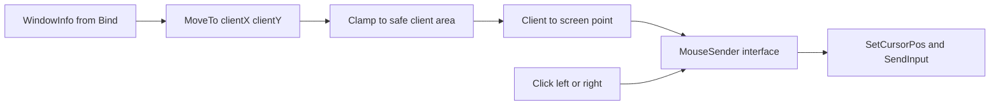

# Phase 3.3 Mouse Primitives Plan

## Ziel

Phase 3.3 erweitert `internal/input` um Maus-Primitives, ohne automatische Spielsteuerung zu starten. Der Controller kann eine Mausposition relativ zum D2R-Clientbereich anfahren und Links-/Rechtsklicks senden.

Koordinaten sind immer **client-relativ**: `(0,0)` bedeutet obere linke Ecke des D2R-Clientbereichs aus `WindowInfo`, nicht globale Screen-Pixel.



Nicht Teil von 3.3: automatische Navigation, Pathing, Waypoint-/UI-Klicks, Fokus-Management, globaler Stop/Pause-Hotkey oder ein manueller Input-Testmodus. Der `runTick` bleibt passiv.

## Betroffene Dateien

- [`internal/input/input.go`](d:/CSharpProjekte/D2R-Offline-Farming-Bot/internal/input/input.go): `Controller` um `MouseSender`, `mouseMu` und Maus-Methoden erweitern.
- Neue Datei [`internal/input/mouse.go`](d:/CSharpProjekte/D2R-Offline-Farming-Bot/internal/input/mouse.go): Domain-Typen, unexportierte Punkt-/Konvertierungs-Helfer, Clamping, client-to-screen Konvertierung und Controller-Methoden.
- Neue Datei [`internal/input/mouse_windows.go`](d:/CSharpProjekte/D2R-Offline-Farming-Bot/internal/input/mouse_windows.go): Windows-Backend mit `SetCursorPos` und `SendInput` für Button Down/Up.
- Neue Datei [`internal/input/mouse_stub.go`](d:/CSharpProjekte/D2R-Offline-Farming-Bot/internal/input/mouse_stub.go): `!windows` Backend mit `ErrUnsupportedPlatform`.
- Neue Datei [`internal/input/mouse_stub_test.go`](d:/CSharpProjekte/D2R-Offline-Farming-Bot/internal/input/mouse_stub_test.go): Stub-Verhalten analog zu `keyboard_stub_test.go`.
- [`internal/input/errors.go`](d:/CSharpProjekte/D2R-Offline-Farming-Bot/internal/input/errors.go): Maus-Errors ergänzen, z. B. `ErrWindowNotBound`, `ErrInvalidMouseButton`, `ErrMouseSendFailed`.
- Neue Datei [`internal/input/mouse_test.go`](d:/CSharpProjekte/D2R-Offline-Farming-Bot/internal/input/mouse_test.go): Unit-Tests mit Mock-Window und Mock-MouseSender.
- Bestehende Tests in [`internal/input/input_test.go`](d:/CSharpProjekte/D2R-Offline-Farming-Bot/internal/input/input_test.go) und [`internal/input/keyboard_test.go`](d:/CSharpProjekte/D2R-Offline-Farming-Bot/internal/input/keyboard_test.go): Testkonstruktoren auf den neuen Backend-Parameter migrieren.
- [`docs/features/input-controller.md`](d:/CSharpProjekte/D2R-Offline-Farming-Bot/docs/features/input-controller.md), [`docs/features/README.md`](d:/CSharpProjekte/D2R-Offline-Farming-Bot/docs/features/README.md), [`docs/CHANGELOG.md`](d:/CSharpProjekte/D2R-Offline-Farming-Bot/docs/CHANGELOG.md): Phase 3.3 dokumentieren.

## Mouse API

Öffentliche Controller-Methoden:

```go
type MouseButton string

const (
    MouseLeft  MouseButton = "left"
    MouseRight MouseButton = "right"
)

func (c *Controller) MoveTo(clientX, clientY int) error
func (c *Controller) Click(button MouseButton) error
```

Regeln:

- `MoveTo` verlangt ein gebundenes Fenster. Ohne `Bound()` liefert es `ErrWindowNotBound`.
- `MoveTo` nimmt Client-Koordinaten entgegen, clamp’t sie auf eine sichere Client-Fläche und konvertiert erst danach zu Screen-Koordinaten: `screenX = WindowInfo.ClientLeft + clampedX`, `screenY = WindowInfo.ClientTop + clampedY`.
- `Click(left|right)` verlangt ebenfalls ein gebundenes Fenster. Ohne `Bound()` liefert es `ErrWindowNotBound`. Der Check ist konservativ, weil ein globaler Klick sonst das aktuell unter dem Cursor liegende Fenster treffen würde.
- `Click(left|right)` sendet Button Down und Button Up für die aktuelle Mausposition. Es bewegt die Maus nicht selbst.
- Ungültige Buttons liefern `ErrInvalidMouseButton` und rufen den Sender nicht auf.
- Mausaktionen werden über ein dediziertes `mouseMu sync.Mutex` serialisiert. Das verhindert ineinanderlaufende Move/Click-Sequenzen, blockiert aber nicht Window-State-Leser oder Keyboard-Sequenzen unnötig.
- Erfolgreiche `MoveTo`-Aktionen loggen strukturiert: `input mouse action` mit `action=move`, `client_x`, `client_y`, `screen_x`, `screen_y`, `clamped`.
- Erfolgreiche `Click`-Aktionen loggen nur `action=click` und `button`. Keine Koordinaten in Click-Logs, weil `Click` die Maus nicht bewegt und 3.3 keinen `GetCursorPos` einführt.
- Alle exportierten Symbole (`MouseButton`, `MouseLeft`, `MouseRight`, `MoveTo`, `Click`, neue Errors) erhalten Godoc.

Interne Helfer:

```go
type mousePoint struct {
    clientX int
    clientY int
    screenX int
    screenY int
    clamped bool
}
```

`mousePoint` bleibt unexportiert; die öffentliche API bleibt bewusst `MoveTo(clientX, clientY int)`.

## Clamping Policy

3.3 nutzt eine einfache, konservative Safe-Area innerhalb des gebundenen Clientbereichs:

```go
const defaultMouseEdgeMargin = 10
```

- X wird auf `[margin, ClientWidth-1-margin]` begrenzt.
- Y wird auf `[margin, ClientHeight-1-margin]` begrenzt.
- Wenn Clientbreite/-höhe kleiner als `2*margin+1` ist, wird auf den 0-basierten Mittelpunkt der jeweiligen Achse geklemmt: `(ClientWidth-1)/2` bzw. `(ClientHeight-1)/2`.
- Negative Eingaben sind erlaubt und werden geklemmt, statt Fehler zu werfen.
- Das Clamping ist bewusst kein D2R-UI-Modell. Es vermeidet nur Fenster-/HUD-Ränder und verhindert, dass Mausbewegungen außerhalb der gemessenen Clientfläche landen. Spezifische HUD-/Panel-Vermeidung folgt erst, wenn UI-/Pathing-Anforderungen konkret sind.

Wichtig: `WindowInfo` ist seit 3.1 statisch bis zum nächsten Bind. Move/Resize/Minimierung nach erfolgreichem Bind können Koordinaten veralten lassen. 3.3 dokumentiert diese Grenze; `Refresh()` oder Re-Bind vor echten Pathing-Aktionen kommt später.

Lock-Reihenfolge für `MoveTo` und `Click`:

1. `c.mu` locken, Bound prüfen, `WindowInfo` kopieren, `c.mu` unlocken.
2. Clamp/Konvertierung ohne Lock berechnen.
3. `c.mouseMu` locken, Sender aufrufen, `c.mouseMu` unlocken.

Niemals `c.mu` und `c.mouseMu` gleichzeitig halten. `mouseMu` darf während `SetCursorPos`/`SendInput` gehalten werden, aber nicht den Window-State-Lock blockieren.

## MouseSender Interface

Mockbares Backend:

```go
type MouseSender interface {
    MoveTo(screenX, screenY int) error
    ButtonDown(button MouseButton) error
    ButtonUp(button MouseButton) error
}
```

Der Controller bekommt den Sender über den bestehenden internen Konstruktor. `NewController` delegiert auf einen internen `newWithBackends(...)`, der nun `windowAPI`, `KeySender`, `MouseSender`, `KeyboardConfig` und `keyTimings` akzeptiert.

Bestehende Tests werden so angepasst, dass sie einen `mockMouseSender` oder ein No-op-Backend bekommen. Dadurch bleiben Window- und Keyboard-Tests unabhängig von echten Windows-Mausaktionen.

## Windows Backend

`mouse_windows.go` implementiert `MouseSender` ohne CGO:

- `SetCursorPos(x, y)` für absolute Screen-Positionierung.
- `SendInput` für Button Down/Up.
- Linke Maustaste: `MOUSEEVENTF_LEFTDOWN` / `MOUSEEVENTF_LEFTUP`.
- Rechte Maustaste: `MOUSEEVENTF_RIGHTDOWN` / `MOUSEEVENTF_RIGHTUP`.

Implementierungsregeln:

- User32 wie in `keyboard_windows.go` über `golang.org/x/sys/windows`, `NewLazySystemDLL`/`NewProc` und injizierbare Call-Funktionen anbinden.
- Kein `robotgo`, kein CGO.
- Kein `SetForegroundWindow` in 3.3.
- `SetCursorPos` teleportiert den Cursor. Das ist als Primitive in 3.3 akzeptiert; spätere Pathing-/UI-Schritte können bei Bedarf `SendInput`-Move oder schrittweise Bewegung ergänzen.
- `Click` besteht aus genau einem Down- und einem Up-Event. Optionaler Click-Hold-Delay wird **nicht** in 3.3 eingeführt, solange kein praktisches Problem sichtbar ist.
- Wenn `ButtonDown` erfolgreich ist und `ButtonUp` fehlschlägt, versucht `Click` einmalig ein best-effort `ButtonUp`-Cleanup und loggt Cleanup-Fehler als Warnung. Zurückgegeben wird der ursprüngliche Fehler.
- Fehler werden mit Kontext gewrappt und als `ErrMouseSendFailed` klassifizierbar gemacht.
- Maus-Events verwenden verpflichtend separate, klar benannte `mouseInputRecord` / `mouseInput`-Strukturen. Das bestehende Keyboard-`inputRecord` wird nicht für Maus-Events wiederverwendet.
- `mouseInputRecord` bekommt eigene Windows-only Layout-Tests analog zum Keyboard-Struct-Test. Wenn ein gemeinsamer `sendInputs`-Wrapper entsteht, muss er die Struct-Größe typkorrekt übergeben.
- `SetCursorPos` und Mouse-`SendInput` liegen hinter injizierbaren Funktionen, z. B. `setCursorPosFunc` und `sendMouseInputFunc`, damit Tests keine echte Maus bewegen.

## App-Integration

`app.New` muss nicht erweitert werden, sofern Maus keine YAML-Config bekommt. Es erstellt weiterhin `input.NewController(log, mapInputConfig(cfg.Input))`.

Das `inputController`-Interface in [`internal/app/run_tick.go`](d:/CSharpProjekte/D2R-Offline-Farming-Bot/internal/app/run_tick.go) bleibt unverändert (`Bind`, `Unbind`, `Bound`, `Ready`), weil der App-Loop keine Mausaktionen ausführt.

## Tests

`internal/input`:

- `MoveTo` ohne gebundenes Fenster liefert `ErrWindowNotBound` und ruft den Sender nicht auf.
- `Click` ohne gebundenes Fenster liefert `ErrWindowNotBound` und ruft den Sender nicht auf.
- Tabellarische Move-Tests mit expliziter Fixture `WindowInfo{ClientLeft:100, ClientTop:200, ClientWidth:800, ClientHeight:600}`:
  - `MoveTo(0, 0)` bewegt wegen Margin auf `screen=(110,210)`.
  - `MoveTo(799, 599)` wird auf `screen=(889,789)` geklemmt bei Margin 10.
- Negative Koordinaten und zu große Koordinaten werden geklemmt.
- Sehr kleine Clientflächen klemmen auf `(ClientWidth-1)/2` und `(ClientHeight-1)/2` statt ungültige Bounds zu erzeugen.
- `Click(MouseLeft)` ruft `ButtonDown(left)`, `ButtonUp(left)` in Reihenfolge auf.
- `Click(MouseRight)` analog für rechts.
- Ungültiger Button liefert `ErrInvalidMouseButton` ohne Sender-Aufruf.
- Click-Fehler nach erfolgreichem `ButtonDown` triggert best-effort `ButtonUp`-Cleanup; Test verifiziert Reihenfolge und dass der Originalfehler zurückkommt.
- Sender-Fehler bei Move oder Button-Events werden als `ErrMouseSendFailed`/gewrappt zurückgegeben.
- `mouseMu` serialisiert zusammengesetzte Mausaktionen; Tests können sich auf Reihenfolge im Mock beschränken, keine echten Goroutine-Stresstests nötig.

Windows-Adapter:

- Unit-Test für Button-Flag-Mapping ohne echte `SendInput`-Calls.
- Test für `SetCursorPos`-Call-Wrapper mit Mock-Funktion.
- Windows-only Struct-Layout-Test für `mouseInputRecord`.
- `!windows` Stub liefert `ErrUnsupportedPlatform`; `mouse_stub_test.go` prüft dieses Verhalten.

## Doku und Changelog

`docs/features/input-controller.md` ergänzen:

- Phase 3.3 Mouse-Primitives: `MoveTo(clientX, clientY)` und `Click(left|right)`.
- Koordinatenmodell: client-relativ, Konvertierung über `WindowInfo.ClientLeft/Top`.
- Clamping: Default-Margin 10 px, keine vollständige D2R-HUD-Erkennung.
- Grenzen: keine automatische Nutzung, kein Fokus-Management, keine Pathing-/UI-Klicks, statische Geometrie bis Re-Bind/Refresh.
- Grenzen: `SetCursorPos` teleportiert den Cursor; keine schrittweise Bewegung in 3.3.
- Grenzen: DPI-/Multi-Monitor-Verhalten hängt von `ClientToScreen` und der DPI-Awareness des Prozesses ab; kein eigener DPI-Fix in 3.3.
- [`docs/features/README.md`](d:/CSharpProjekte/D2R-Offline-Farming-Bot/docs/features/README.md): Input-Controller-Kurzbeschreibung um Keyboard- und Maus-Primitives erweitern.

Changelog unter `## [Unreleased]`:

```markdown
### Added
- Add client-relative mouse movement and click primitives for the input controller (Phase 3.3)
```

## Validierung

Nach Umsetzung:

```powershell
gofmt -w internal/input internal/app
go test ./internal/input ./internal/app
go test ./...
go build ./cmd/d2rbot
```

Manuelle Validierung bleibt auf Start/Config-Load und Window Binding beschränkt. Echte Mausbewegungen sollten erst über einen expliziten Testmodus in einem Folgeschritt ausgelöst werden.

## Hauptrisiken

- Mausaktionen sind globaler OS-Input. 3.3 darf deshalb keine automatischen Move/Click-Aufrufe im App-Loop einbauen.
- Veraltete `WindowInfo` nach Move/Resize/Minimize kann Screen-Koordinaten verfälschen. Das wird dokumentiert und später über `Refresh()` oder Re-Bind gelöst.
- DPI-/Multi-Monitor-Setups können Screen-Koordinaten beeinflussen. 3.3 nutzt die vorhandenen ClientToScreen-Werte und dokumentiert die Grenze.
- `SetCursorPos` erzeugt keine natürliche Mausbewegung. Für primitives Positionieren ist das akzeptiert; Pathing kann später andere Bewegung nutzen.
- HUD-Vermeidung ist in 3.3 nur ein Rand-Clamp, kein semantisches UI-Modell. Keine willkürlichen D2R-spezifischen Bottom-HUD-Abzüge einbauen, solange sie nicht validiert sind.
- Windows Mouse-`SendInput`-Structs sind ähnlich fehleranfällig wie Keyboard-Structs; Mapping und Layout brauchen Tests.

## Empfohlene Implementierungsreihenfolge

```mermaid
flowchart TD
    domain[\"errors and mouse domain\"] --> sender[\"MouseSender and mocks\"]
    sender --> constructor[\"newWithBackends migration\"]
    constructor --> migrateTests[\"input and keyboard test migration\"]
    migrateTests --> windowsBackend[\"mouse_windows backend and layout tests\"]
    windowsBackend --> stubBackend[\"mouse_stub and stub test\"]
    stubBackend --> controllerMethods[\"MoveTo and Click tests\"]
    controllerMethods --> docs[\"docs changelog validation\"]
```