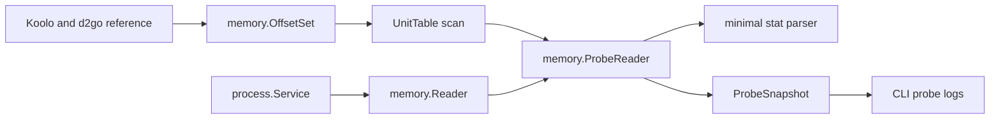

# Plan: `internal/memory` Offset-Recherche

## Ziel

Schritt 3 verbindet den fertigen Low-Level-Reader mit minimalen D2R-Offsets fuer die Phase-1-Probe. Ergebnis: Der Bot kann read-only den Main-Player ueber die UnitTable finden und HP, MaxHP, Mana, MaxMana, Area ID und rohe Position X/Y anzeigen. Koolo/d2go dienen als Recherche-Referenz, werden aber nicht als Runtime-Dependency eingebunden.



## Scope

Betroffene Dateien:

- [`internal/memory/offsets.go`](d:/CSharpProjekte/D2R-Offline-Farming-Bot/internal/memory/offsets.go): versionierte d2go-nahe Offset-Sets, Quellenhinweise, D2R-Build/Version-Metadaten.
- [`internal/memory/probe.go`](d:/CSharpProjekte/D2R-Offline-Farming-Bot/internal/memory/probe.go): read-only Probe-Reader fuer UnitTable, Unit-Felder und Minimalwerte.
- `internal/memory/stats.go`: minimaler Parser fuer Life/MaxLife/Mana/MaxMana aus der Stat-Liste, falls die Recherche d2go bestaetigt.
- [`internal/memory/memory.go`](d:/CSharpProjekte/D2R-Offline-Farming-Bot/internal/memory/memory.go): vorhandene Primitive weiterverwenden, keine Windows-API-Erweiterung.
- [`internal/app/app.go`](d:/CSharpProjekte/D2R-Offline-Farming-Bot/internal/app/app.go): nach `Poll()` und nur im attached-State Probe-Snapshot lesen und sparsam loggen.
- `internal/app/app_test.go`: kleine Helper-Tests fuer Probe-Log-Dedup/Heartbeat.
- `internal/memory/*_test.go`: Tests fuer Offset-Auswahl, UnitTable-Parsing, Stat-Parsing, Scaling/Decoding und Fehlerfaelle.
- Neue [`docs/features/state-probe.md`](d:/CSharpProjekte/D2R-Offline-Farming-Bot/docs/features/state-probe.md): D2R-Offsets, Validierung, CLI-Logs und Grenzen dokumentieren. `memory-reader.md` bleibt generisch und verweist auf `state-probe.md`.
- [`docs/features/README.md`](d:/CSharpProjekte/D2R-Offline-Farming-Bot/docs/features/README.md) und [`docs/CHANGELOG.md`](d:/CSharpProjekte/D2R-Offline-Farming-Bot/docs/CHANGELOG.md): Index und Changelog.

## Offset-Ablage

Offsets werden in Go versioniert, nicht in YAML:

```go
type OffsetSet struct {
    Name        string
    D2RVersion  string
    Source      string
    SourceCommit string
    VerifiedAt  string
    ModuleName  string
    GameData    uintptr
    UnitTable   uintptr
    Unit        UnitOffsets
    Stats       StatOffsets
}

type UnitOffsets struct {
    UnitType  uintptr
    MainPlayer uintptr // nur wenn die gepinnte d2go-Referenz ein direktes Flag/Feld nutzt
    Area      uintptr
    PositionX uintptr
    PositionY uintptr
    StatsList uintptr
    // weitere nur falls fuer Main-Player-Erkennung wirklich noetig
}

type StatOffsets struct {
    ID    uintptr
    Layer uintptr
    Value uintptr
    Next  uintptr
}

type PointerChain struct {
    StaticOffset uintptr
    DerefOffsets []uintptr
}
```

Wichtig:

- `D2RVersion`, `VerifiedAt`, `Source` und `SourceCommit` dokumentieren, gegen welche Spielversion und Referenz die Offsets validiert wurden.
- `OffsetSet` orientiert sich an d2go/Koolo: `GameData`, `UnitTable`, Unit-Felder und Stat-Liste statt flacher HP/Mana-Felder.
- `GameData` und `UnitTable` sind zunaechst modulrelative Static-Offsets (`moduleBase + offset`). `PointerChain` ist nur fuer optionale Ketten vorgesehen, z. B. ein InGame-Flag innerhalb von `GameData`, falls die Referenz das so nahelegt.
- Fragile Offset-Listen nicht in Feature-Doku auswalzen; dort nur Verhalten und Validierungsansatz beschreiben.
- Kein Config-Schema fuer Offsets in Schritt 3. YAML-Overrides koennen spaeter kommen, wenn Patch-Wechsel real zum Problem werden.

## Recherche-Vorgehen

Koolo nutzt d2go als Memory-Abstraktion. Es wird genau eine Referenzlinie festgelegt und mit Repo + Commit-Hash im OffsetSet dokumentiert, bevorzugt das von Koolo verwendete `github.com/hectorgimenez/d2go`. Forks wie `notedhouse/d2go` koennen als Zusatzvergleich dienen, aber nicht als unbenannte Mischquelle.

Relevante Referenzpunkte:

- Koolo-Repo: wie der Bot Player-State verwendet, nicht direkt kopieren.
- d2go memory package: `Offset`, `GameReader`, `RawPlayerUnit`, `PlayerUnit`, UnitTable-Zugriff und Stat-Parsing.
- Gesuchte Daten: Main-Player-Unit-Adresse via UnitTable, Area, rohe Position, Stats fuer HP/Mana.

Vorgehen:

1. Modul-Offsets recherchieren: `GameData`, `UnitTable`, optional InGame-/Loading-Gate.
2. UnitTable-Iterationsmuster aus d2go nachvollziehen: Bucket-Layout (z. B. 128 Buckets), linked-list-Struktur, Unit-Type-Filter und Early-Exit nach Main-Player-Fund.
3. Main-Player-Erkennung aus `GetRawPlayerUnits().GetMainPlayer()` nachvollziehen: verwendetes Kriterium dokumentieren (direktes Flag/Feld, Roster-Pfad oder d2go-spezifische IsMainPlayer-Logik).
4. Unit-Struct-Felder recherchieren: Unit-Type, Area, Position, Stats-Pointer und ggf. Main-Player-Marker.
5. Minimalen Stat-Parser recherchieren: Life, MaxLife, Mana, MaxMana als Stat-IDs, Wert-Typ (`uint16`/`uint32`), Layer-Regel und Skalierung.
6. Nur die minimal noetigen Adressen/Felder fuer Phase 1 extrahieren.
7. Jede Annahme im Code als knapper Kommentar mit Quelle/Datum/Commit festhalten.
8. Keine d2go-Abhaengigkeit aufnehmen und keine fremden Structs grossflaechig kopieren.

## Probe-Datenmodell

Ein kleiner Raw-Snapshot in `internal/memory`, noch kein `world.Model`:

```go
type ProbeSnapshot struct {
    At        time.Time
    Valid     bool
    Reason    string
    PlayerPtr uintptr
    HP        uint32
    MaxHP     uint32
    Mana      uint32
    MaxMana   uint32
    AreaID    uint32
    PosX      uint32
    PosY      uint32
}
```

Regeln:

- `PosX`/`PosY` sind in Schritt 3 bewusst Rohwerte aus dem Unit-Struct, noch keine normalisierten Weltkoordinaten fuer Pathing.
- `Valid=false` bei unlesbarer UnitTable, Null-Pointer, nicht im Spiel, Loading Screen oder Prozessverlust.
- `Reason` bleibt technisch, kurz und als Konstanten definiert.
- Vorgesehene Reasons: `not_attached`, `not_in_game`, `unit_table_unavailable`, `player_pointer_unavailable`, `stats_unavailable`, `read_failed`.
- Keine Area-Namen, keine Einheitenliste, keine Items, keine Monster.

## Implementierungsstrategie

1. Referenzcode pinnen: Repo + Commit fuer Koolo/d2go notieren.
2. `OffsetSet`, `UnitOffsets`, `StatOffsets`, `PointerChain` und `DefaultOffsetSet()` anlegen.
3. `NewProbeReader(reader *Reader, offsets OffsetSet)` und `Snapshot() ProbeSnapshot` anlegen.
4. `GameData`/InGame-Gate zuerst validieren; falls kein belastbarer InGame-Offset gefunden wird, Doku: Probe ist nur im laufenden Spiel gueltig und Menues liefern expected invalid.
5. UnitTable-Iteration implementieren: vollständiger Scan pro Snapshot ist fuer Schritt 3 akzeptabel, kein Caching; maximale Iterationstiefe/Loop-Schutz setzen; Early-Exit nach Main-Player-Fund.
6. Main-Player-Adresse mit exakt dem Kriterium aus der gepinnten d2go-Referenz finden; falls das Kriterium nicht belastbar rekonstruierbar ist, Umsetzung stoppen und Plan/Recherche aktualisieren statt heuristisch irgendeinen Player zu waehlen.
7. Area und rohe Position vom Unit-Struct lesen.
8. Minimalen Stat-Parser implementieren: Life, MaxLife, Mana, MaxMana.
9. App-Loop erweitern: zuerst `Poll()`, dann nur bei attached Probe lesen.
10. Bei Read-Fehlern nicht crashen: Snapshot invalid markieren, Prozess-Lifecycle weiterlaufen lassen.

`ProbeReader` lebt als Feld auf `app.Runtime`, z. B. `Probe *memory.ProbeReader`, und wird in `app.New()` einmalig mit `memory.NewProbeReader(rt.Memory, memory.DefaultOffsetSet())` verdrahtet. Keine ProbeReader-Allokation pro Tick.

App-Logging sparsam halten:

```text
probe state hp=... max_hp=... mana=... max_mana=... area_id=... pos_x=... pos_y=...
probe unavailable reason=...
```

Kein Log pro 100 ms, wenn sich nichts aendert. Regeln:

- Log bei gueltiger Wert-Aenderung.
- Fester Heartbeat alle 5s im `app`-Paket, kein Config-Key in Schritt 3.
- Invalid Snapshots: einmalig auf Info bei Reason-Wechsel plus 5s Heartbeat; Details auf Debug.
- `!attached`: kein Probe-Read.
- `StateLost`: `lastProbe`/`lastLoggedProbe` zuruecksetzen.
- Re-Attach: einmalig loggen, auch wenn Werte zufaellig gleich aussehen.
- Helper testbar halten, z. B. `probeShouldLog(prev, cur memory.ProbeSnapshot, lastLog time.Time, heartbeat time.Duration, force bool) bool`; `force=true` direkt nach erfolgreichem Attach/Re-Attach.

## Manuelle Validierung

Validierung erfolgt bewusst im Spiel, weil Offsets patch- und zustandsabhaengig sind:

- Bot starten, D2R danach starten: Attach muss unveraendert funktionieren.
- Validierung ausschliesslich Offline/Singleplayer, kein Battle.net.
- In Town stehen: Werte fuer HP/Mana/Area/Position plausibilisieren.
- Laufen: Position X/Y muss sich aendern.
- Area wechseln: Area ID muss sich aendern.
- Schaden nehmen oder Mana verbrauchen: HP/Mana muss sich aendern.
- D2R schliessen und neu starten: Lost/Re-Attach bleibt stabil; Probe wird wieder valid.

Validierungsnotiz im Code/Doku aktualisieren: D2R-Version, Datum, welche Werte bestaetigt wurden.

## Fehlerbehandlung

- Null-Pointer in UnitTable/Main-Player-Pfad: kein Panic, `Valid=false`.
- `process.ErrNotAttached`: `Valid=false`, App wartet weiter.
- Partial/invalid reads: `Valid=false`, technische Debug-Details auf Debug-Level.
- Wiederholte invalid Snapshots nicht im Info-Log spammen.
- Wenn Offsets falsch sind, lieber keine Werte anzeigen als geratenes Mapping loggen.
- Wegen `ReadAt`-Mutex: Ein fehlgeschlagener Probe-Snapshot kann `Poll()`/`Detach()` kurz verzoegern. Deshalb im App-Loop immer zuerst `Poll()`, danach Probe.
- Wenn einer der vier Stats (HP, MaxHP, Mana, MaxMana) fehlt oder nicht decodierbar ist: kompletter Snapshot `Valid=false` mit `stats_unavailable`, keine partiell gueltige Anzeige.

## Tests

Unit-Tests mit Mock-`ProcessAccess`/Mock-Memory:

- OffsetSet hat Versions-/Source-/Commit-Metadaten und nicht-leere GameData-/UnitTable-Felder.
- ProbeReader liest UnitTable, Main-Player, Area und rohe Position an erwarteten Mock-Adressen.
- Minimaler Stat-Parser liest HP/MaxHP/Mana/MaxMana aus Mock-Stat-Liste.
- UnitTable-Test deckt Bucket-/linked-list-Iteration, Unit-Type-Filter, Loop-Schutz und Early-Exit nach Main-Player-Fund ab.
- Main-Player-Test bildet das konkrete Kriterium aus der gepinnten d2go-Referenz nach.
- Stat-Parser testet Stat-IDs als Konstanten (`StatLife`, `StatMaxLife`, `StatMana`, `StatMaxMana`), Layer-Regel und fehlenden Einzel-Stat -> `stats_unavailable`.
- Null Player-Pointer erzeugt invalid Snapshot.
- Fehler beim HP/Mana/Area/Position-Read erzeugt invalid Snapshot mit Reason.
- Nicht-im-Spiel/InGame-Gate erzeugt `ReasonNotInGame`, falls ein belastbarer Offset verfuegbar ist.
- Konstanten fuer Reasons verhindern Tippfehler in Tests.

App-Tests:

- `probeShouldLog` loggt bei Wert-Aenderung.
- Unveraenderte Snapshots loggen erst nach 5s Heartbeat.
- Invalid Reason-Wechsel loggt einmalig.
- `StateLost`-Reset fuehrt nach Re-Attach zu neuem Log.

Keine Tests gegen echte D2R-Prozesse im automatisierten Testlauf.

## Dokumentation

Dokumentieren:

- Zweck: Phase 1 Schritt 3, read-only State Probe.
- Eigene `state-probe.md`; `memory-reader.md` bleibt generisch und verweist auf `state-probe.md`.
- `process-detection.md` aktualisieren, falls dort noch steht, dass kein aktiver Memory-Read existiert.
- Referenzen: Koolo/d2go als Recherchequelle mit Repo + Commit.
- D2R-Version/Build, fuer die Offsets manuell validiert wurden.
- Operator-Verhalten: welche Werte geloggt werden und wie man sie prueft.
- Grenzen: Offsets koennen nach Patches brechen; Positionen sind rohe Werte; keine World-Semantik; keine Online-/Battle.net-Unterstuetzung.

## Validierung

Nach Umsetzung:

```powershell
go test ./...
go build ./cmd/d2rbot
```

Danach manueller Probe-Lauf mit D2R Offline/Singleplayer und dokumentierten Beobachtungen.