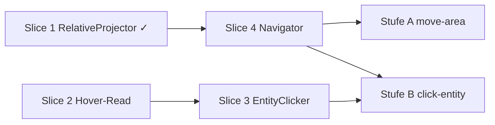

# Phase 4.3 — Pathing-Grundlagen (Koolo-Modell)

## Ziel

Vom **read-only World Model** (4.2) zu **bewegbarem Bot-Verhalten**: Der Navigator bewegt sich **ausschließlich per Teleport** (kein Laufen/Pathfinding), erkennt **Zielerreichung primär über Area-Wechsel** (`world.State.Area.ID`), bricht bei Stuck ab und erkundet unbekannte Layouts.

## Methodenwechsel: Warum kein Memory-Camera-Spike

Der frühere Plan setzte für präzise Entity-Klicks (Stufe B) einen **Memory-Camera-Spike** voraus — manuelles Reverse Engineering der Viewport-Origin-Offsets. Diese Vorgehensweise ist **verworfen**:

- Keine öffentliche Referenz (d2go, MapAssist, Koolo, D2R-BMBot) liest eine Kamera aus dem Speicher.
- Manuelles RE pro D2R-Patch ist für dieses Projekt nicht leistbar (vgl. gescheiterter Keybindings-Memory-Read, ersetzt durch YAML in 3.6).
- **Koolo beweist, dass es ohne geht:** feste isometrische Projektion vom Spieler aus + Hover-Feedback-Loop aus dem Speicher.

### Das Koolo-Modell (Referenz: `.tmp/koolo-src`)

```text
GameCoordsToScreenCords(playerX, playerY, targetX, targetY):
    diffX = targetX - playerX
    diffY = targetY - playerY
    screenX = (diffX - diffY) * 19.8 + GameAreaSizeX/2
    screenY = (diffX + diffY) * 9.9  + GameAreaSizeY/2
```

Präzision kommt **nicht** aus der Projektion, sondern aus dem geschlossenen Kreislauf:

1. Projektion liefert **Startpunkt** (grob, spieler-relativ)
2. Maus dorthin bewegen
3. **Hover-Daten aus Memory** lesen: `{IsHovered, UnitType, UnitID}`
4. Stimmt die UnitID mit dem Ziel überein → **Klick**
5. Sonst **Spiral-Offset** um den Startpunkt, zurück zu 2 (max. N Versuche)

Der Hover-Offset kommt — wie UnitTable und UI bei uns bereits — per **Signature-Scan** aus d2go (`FindPattern`), nicht aus manueller RE-Arbeit.

**Ein Projektionsmodus** genügt damit: `relative`. Der frühere `memory`-Modus (Camera) entfällt ersatzlos.

### D2R Skill-Bindings (Operator + Bot)

LMB und RMB haben jeweils **einen aktuell gewählten Skill** — nicht fest verdrahtet. **Town Portal**, **Teleport**, Combat-Skills und **Belt** nutzen ab Phase 3.6 explizite YAML-Bindings in `input.bindings`:

1. `CastSkillAt(Teleport, clientX, clientY)` bzw. `SelectSkill` — YAML-Hotkey legt Skill auf den konfigurierten Mausbutton
2. `MoveTo(clientX, clientY)` — Ziel-Tile auf dem Screen
3. `Click(castButton)` — Cast-Button aus `input.bindings.skills.<skill>.button` (`left`/`right`)

**Precheck (3.6):** `BindingsPrecheck` — `input.bindings.skills.teleport` muss gesetzt sein und `button: right` verwenden. Town Portal ist Warnung. Keine F1–F8-Kalibrierung im Navigator.

### Release-Kriterien (zweistufig, beide in 4.3)

```text
# Stufe A — Navigator + Bearing-Explore (nur RelativeProjector)
go run ./cmd/d2rbot --pathing-test move-area:black_marsh

# Stufe B — Hover-Loop (Hover-Scan + EntityClicker)
go run ./cmd/d2rbot --pathing-test click-entity:waypoint
```

Stufe A: wartet auf Ready, Bearing-Explore bis `Area.ID == BlackMarsh` oder `reason=stuck`.
Stufe B: EntityClicker klickt Waypoint/Entrance erst nach **bestätigtem Hover** (`hover.UnitID == target.UnitID`); Log zeigt Versuche und finalen Treffer.
`go test ./...` grün nach beiden Stufen.

**Explizit nicht in 4.3:** Countess-Run-Steps (4.4+), Route-Cache ([`docs/backlog.md`](docs/backlog.md)), Laufen ohne Teleport, Klassen-Erkennung, Waypoint-UI-Panel-Klicks, Pickit, Perspective-Mode, Memory-Camera (verworfen).

```mermaid
flowchart TD
    subgraph mem [internal/memory]
        scan[ScanProbeOffsets inkl. Hover-Signatur]
        snap[Snapshot inkl. HoverState]
    end
    subgraph path [internal/pathing]
        rel[RelativeProjector]
        clicker[EntityClicker Spiral+Hover]
        move[TeleportMover]
        stuck[StuckDetector]
        nav[Navigator.Tick]
        explore[ExplorePlanner bearing|entity]
    end
    subgraph app [internal/app]
        tick[pathing-test loop]
        world[World.Update]
    end
    scan --> snap
    snap --> world
    rel --> move
    rel --> clicker
    world --> nav
    world --> clicker
    explore --> nav
    move --> input[input.Controller]
    clicker --> input
    stuck --> nav
    tick --> world --> nav
```

## Gebietswechsel — zwei Mechanismen

| Übergang | Beispiel | Strategie | Präzision |
|----------|----------|-----------|-----------|
| **Outdoor-Grenze** | Blood Moor → Black Marsh | Bearing Richtung Rand; Erfolg = `Area.ID` | grob (Projektion genügt) |
| **Town-Ausgang** | Rogue Encampment → Blood Moor | Bearing zum Ausgang | grob |
| **Entrance-Unit** | Marsh → Tower (ID 10), Catacombs Up/Down | annähern bis `distance ≤ max_entrance_click_distance`, dann **EntityClicker** (Hover-Loop) | präzise via Hover |
| **Waypoint-Object** | Town → Marsh (Object-Klick) | `NearestObject(Waypoint)` → **EntityClicker** | präzise via Hover |

## Architektur-Entscheidungen

| Thema | Entscheidung |
|-------|--------------|
| Erfolgssignal Area | **Primär:** `state.Area.ID == goal.TargetArea`. Sekundär Positions-Ziele: `world.Distance(player, target) <= arrival_distance` |
| Teleport | `CastSkillAt(Teleport, x, y)` aus Phase 3.6 YAML-Bindings; **keine** Sorc-Hardcodierung |
| Projektion | **Nur `RelativeProjector`** (Koolo-Formel). Kein Camera-Read, kein `memory`-Modus |
| Klick-Präzision | **Hover-Feedback-Loop** (EntityClicker): Klick nur nach bestätigtem `hover.UnitID`-Match; Spiral-Suche um projizierten Startpunkt |
| Hover-Datenfluss | `HoverState` in **`memory.Snapshot`** → `world.State.Hover`; Entities matchen `IsHovered` über UnitID+UnitType (wie d2go) |
| Hover-Offset | **Signature-Scan** in `ScanProbeOffsets` (d2go-Pattern `\xc6\x84\xc2...`, 12-Byte-Buffer: uint16 isHovered, +0x04 unitType, +0x08 unitID) — kein manuelles RE |
| Navigator-API | `Tick(ctx, world.State)` — Hover kommt aus `state.Hover`, kein Extra-Parameter |
| Explore | **bearing-first** (Default); **entity** nur wenn `distance ≤ max_entrance_click_distance` |
| Fail-Verhalten | EntityClicker: nach `max_hover_attempts` ohne Hover-Match → `reason=hover_not_found` (kein blinder Klick) |
| Auflösung | **1280×720 windowed empfohlen** (Koolo-Kalibrierung 19.8/9.9); Warnung (kein Hard-Fail) bei anderem Aspect/Größe |
| Task-Integration | `tasks.Navigator` erweitern; Countess-Stub unverändert — Travel-Steps 4.4 |
| Route-Cache | Außen vor |

## Ausgangslage (nach Aufräumarbeiten)

- [`internal/pathing/transform.go`](internal/pathing/transform.go): `Projector`-Interface + `RelativeProjector` **fertig** (Slice 1); Camera-/MemoryProjector-Code entfernt
- [`internal/memory/scan.go`](internal/memory/scan.go): Signature-Scan für UnitTable/UI/Expansion/GameData — Muster für Hover-Scan vorhanden
- [`internal/memory/probe.go`](internal/memory/probe.go): Snapshot ohne Camera; Entities (Objects/Entrances/Monsters) mit `UnitID`
- [`internal/world/entity.go`](internal/world/entity.go): `NearestEntrance`, `NearestObject`, `FindSuperUnique`, `Distance`; alle Entities tragen `UnitID` → hover-matchbar
- [`internal/tasks/deps.go`](internal/tasks/deps.go): `Navigator` = `Ready()` only
- [`internal/input/mouse.go`](internal/input/mouse.go): `MoveTo(clientX, clientY)`, `Click` — client-relativ
- [`internal/app/options.go`](internal/app/options.go): noch kein `--pathing-test`
- Kein `ParseAreaSpec` / Area-Name-Resolver für CLI

---

## Slice 1 — Projektion (Relative + Interface) ✅ fertig

`Projector`-Interface, `RelativeProjector` mit `PlayableCenterX/Y`, `TileWidth/Height` (19.8/9.9), signed int32-Deltas. Unit-Tests grün.

---

## Slice 2 — Hover-Read (Memory)

**Quelle:** d2go `HoveredData()` + `calculateOffsets()` (Referenz `.tmp/d2go-ref`, Commit `16d248a53591`) — dieselbe Methode, mit der wir bereits UnitTable/UI scannen.

### Signature-Scan

In [`internal/memory/scan.go`](internal/memory/scan.go) ergänzen:

```go
// d2go: pattern "\xc6\x84\xc2\x00\x00\x00\x00\x00\x48\x8b\x74", mask "xxx?????xxx"
// hoverOffset = ReadUInt(pattern+3, Uint32) - 1  (module-relative)
func scanHoverOffset(image []byte) (uintptr, error)
```

- `OffsetSet.Hover uintptr` + YAML-Overlay (`hover:` in offsets-Datei) + Scan-Cache (`offsets.scanned.yaml`)
- Scan-Fehler: Hover bleibt 0 → `HoverState` immer `IsHovered=false`; Probe bleibt gültig (fail-open fürs Lesen, fail-closed fürs Klicken)

### Memory-Typen

```go
// HoverState mirrors the D2R hover buffer (12 bytes at moduleBase+Hover).
type HoverState struct {
    IsHovered bool   // uint16 at +0x00 > 0
    UnitType  uint32 // +0x04 — 1=monster, 2=object, 5=entrance (d2go)
    UnitID    uint32 // +0x08
}
```

- `ProbeReader.readHover(moduleBase, off) HoverState` — ein einzelner 12-Byte-Read pro Tick
- `Snapshot.Hover HoverState`

### World-Mapping

- `world.State.Hover HoverInfo` (eigener world-Typ, kein memory-Leak ins world-Paket)
- Optional pro Entity: `IsHovered bool` beim Mapping setzen (`hover.UnitID == e.UnitID && hover.UnitType == kind`), wie d2go es für Objects/Entrances/Monsters macht

**Exit-Kriterium:** `--probe` loggt Hover-Wechsel beim manuellen Überfahren eines Waypoints (UnitID stimmt mit enumeriertem Object überein).

---

## Slice 3 — EntityClicker (Hover-Feedback-Loop)

**Datei:** `internal/pathing/click.go`

```go
// EntityClicker moves the mouse to a projected entity position and clicks
// only after memory hover data confirms the target unit is under the cursor.
type EntityClicker struct { /* Input, Projector, Config */ }

// ClickResult: hit | hover_not_found | too_far | projection_failed
func (c *EntityClicker) Tick(state world.State, target ClickTarget) ClickTickResult
```

Ablauf pro Versuch (tick-basiert, damit Stop/Pause greifen):

1. `distance > max_entrance_click_distance` → `too_far` (Navigator muss erst annähern)
2. `Project(player, target.Position - anchorOffset, win)` — Anker wie Koolo: Entrances/Objects ~2 Tiles versetzt (Klickpunkt = sichtbarer Körper, nicht Boden-Tile)
3. Spiral-Offset für Versuch N: archimedische Spirale (Koolo `helper.Spiral`)
4. `MoveTo(clientX, clientY)` mit Client-Clamping (Margin 10px)
5. Nächster Tick: `state.Hover.UnitID == target.UnitID && UnitType passt` → `Click(left)` → `hit`
6. Nach `max_hover_attempts` (Default 15) → `hover_not_found`

**Kein blinder Klick:** ohne Hover-Bestätigung wird nie geklickt (Fehlklicks auf Monster/Boden vermeiden).

---

## Slice 4 — Pathing-Kern-API

**Dateien** unter `internal/pathing/`:

| Datei | Inhalt |
|-------|--------|
| `types.go` | `Goal`, `GoalKind`, `NavStatus`, `NavResult` |
| `transform.go` | `Projector`, `RelativeProjector` (fertig) |
| `click.go` | `EntityClicker` (Slice 3) |
| `teleport.go` | `TeleportMover` — `CastSkillAt(Teleport, clientX, clientY)`; loggt Select/Move/Click |
| `stuck.go` | `StuckDetector` |
| `explore.go` | `ExplorePlanner` — `bearing` \| `entity` |
| `navigator.go` | `Navigator` State-Machine |
| `config.go` | `PathingConfig` |

**Goal:**

```go
type Goal struct {
    Kind        GoalKind
    TargetArea  world.AreaID
    TargetPos   world.Position
    ViaEntrance world.EntranceKind // optional
}
```

**Navigator:**

```go
func NewNavigator(log *slog.Logger, deps Deps) *Navigator
func (n *Navigator) Start(goal Goal) error
func (n *Navigator) Tick(ctx context.Context, state world.State) NavTickResult
func (n *Navigator) Active() bool
func (n *Navigator) LastResult() NavResult
```

`Deps`: `Input`, YAML-backed `BindingSource`, `Config`.

**NavStatus:** `idle` | `moving` | `exploring` | `clicking` | `arrived` | `stuck` | `failed`

**NavResult.Reason:** `""` | `stuck` | `hover_not_found` | `cancelled` | `invalid_goal` | `projection_failed`

**Explore-Planner** (bearing-first):

1. **entity** nur wenn `NearestEntrance`/`NearestObject` gefunden **und** `distance ≤ max_entrance_click_distance` → EntityClicker übernimmt
2. Sonst **bearing**: `bearing_count` Kompass-Richtungen (Default 8), rotierend, `step_distance_tiles`
3. Area-Wechsel → Bearing-Index reset
4. `move_interval_ms` zwischen Teleports

**Stuck-Detector:**

- Fortschritt: Position Δ ≥ `stuck_progress_tiles` (Default 3) **oder** `Area.ID` wechselt
- Timeout: `stuck_timeout_ms` (Default 8000)
- Log bei Stuck: `player_mana` mit ausgeben (Teleport ohne Mana erkennbar)

**tasks.Navigator:**

```go
type Navigator interface {
    Ready() bool
    Start(goal pathing.Goal) error
    Tick(ctx context.Context, state world.State) pathing.NavTickResult
    Active() bool
}
```

---

## Slice 5 — Config & App-Wiring

**[`configs/config.example.yaml`](configs/config.example.yaml):**

```yaml
pathing:
  stuck_timeout_ms: 8000
  stuck_progress_tiles: 3
  move_interval_ms: 250
  arrival_distance: 15
  projection:
    playable_center_x: 0.5
    playable_center_y: 0.52
    tile_width: 19.8
    tile_height: 9.9
  click:
    max_hover_attempts: 15
    spiral_step: 40          # Grad pro Versuch (Koolo-Spirale)
    anchor_offset_tiles: 2   # Klickpunkt-Versatz für Entrances/Objects
  explore:
    bearing_count: 8
    step_distance_tiles: 25
    max_entrance_click_distance: 15
```

- `internal/config`: `PathingConfig`, `applyDefaults()`, Validierung
- Kein `projection.mode` mehr — es gibt nur relative Projektion
- `max_entrance_click_distance` klein halten (Koolo: 10–15 Tiles) — Hover-Loop funktioniert nur, wenn die Entity auf dem Screen sichtbar ist
- Pathing-Start: `BindingsPrecheck` aus 3.6 (Teleport YAML-Hard-Stop, Town Portal Warnung)
- [`internal/app/app.go`](internal/app/app.go): `pathing.NewNavigator(log, pathing.Deps{Input, Bindings, Config})`
- **Auflösung:** beim Bind `ClientWidth/ClientHeight` prüfen; Empfehlung 1280×720 windowed loggen, Warnung bei Abweichung
- **4.4-Hinweis:** `runTick` ruft Pathing in 4.3 nur aus `--pathing-test` — Task-Loop-Integration kommt 4.4

---

## Slice 6 — CLI `--pathing-test`

Analog [`internal/app/input_test_mode.go`](internal/app/input_test_mode.go).

**Flags** in [`cmd/d2rbot/main.go`](cmd/d2rbot/main.go) + [`internal/app/options.go`](internal/app/options.go):

- `--pathing-test <spec>`
- `--pathing-test-timeout-ms` (Default 120000)

**Area-Resolver** (neu, z. B. `internal/world/area_parse.go`):

- `ParseAreaSpec("black_marsh")` → `world.BlackMarsh`; `ParseAreaSpec("6")` → AreaID 6

| Spec | Verhalten |
|------|-----------|
| `teleport:TX,TY` | Einmaliger Teleport auf Weltkoordinate; loggt `client_x/y` — Kalibrier-Hilfe für `playable_center`/`tile_width` |
| `hover:watch` | Read-only: loggt Hover-Wechsel beim manuellen Mausführen (Slice-2-Validierung) |
| `move-area:<id\|name>` | `Navigator.Start(MoveToArea)` bis arrived/stuck/fail (**Stufe A**) |
| `click-entity:waypoint` | `NearestObject(Waypoint)` → EntityClicker (**Stufe B**) |
| `click-entity:entrance` | `NearestEntrance` (beliebig) — Debug für Tower/Treppen |

**Guards** in [`internal/app/run_mode.go`](internal/app/run_mode.go):

- `input.enabled` erforderlich (außer `hover:watch`)
- Mutual exclusive: `--pathing-test` / `--run` / `--input-test`
- Ready-Wait: `Valid`, `Bound`, `Phase==InGame`
- Stop/Pause/Process-Lost wie Input-Test

**Logging:** `pathing nav` mit `goal`, `area`, `explore_mode`, `player_x/y`, `target_x/y`, `client_x/y`, `hover_attempt`, `status`, `reason`

---

## Slice 7 — Tests

| Bereich | Tests |
|---------|-------|
| `transform` | Synthetische Deltas → erwartete Pixel (vorhanden) |
| `memory` hover | 12-Byte-Buffer-Parsing (gesetzt/leer); Scan-Pattern gegen synthetisches Image |
| `pathing` spiral | Deterministische Offsets pro Versuchsindex |
| `pathing` clicker | Mock-Hover-Sequenz: Treffer nach N Versuchen → `hit`; nie Hover → `hover_not_found`; kein Klick ohne Match |
| `explore` | Bearing-Rotation; entity nur unter `max_entrance_click_distance`; Reset bei Area-Wechsel |
| `stuck` | Kein Fortschritt → `stuck`; Area-Wechsel resettet Timer |
| `navigator` | Mock Area-Sequenz → `arrived` |
| `world` | `ParseAreaSpec` für `black_marsh`, `6`, ungültig; Hover→Entity-Matching |
| `config` | Defaults, ungültige Werte |
| `app` | Mutual exclusive flags; `NewNavigator` mit Deps |

Keine Live-Game-Tests in CI.

---

## Slice 8 — Dokumentation

- Neu: [`docs/features/pathing.md`](docs/features/pathing.md)
  - Koolo-Modell: Relative-Projektion + Hover-Feedback-Loop (warum keine Memory-Camera)
  - Outdoor vs. Entrance-Transitions
  - Kalibrierung (`teleport:`-Spec, `playable_center`, `tile_width`)
  - Manuelle Validierung Stufe A + B
  - Auflösungs-Empfehlung (1280×720 windowed)
- Update: [`docs/features/state-probe.md`](docs/features/state-probe.md) — Hover-Read ergänzen
- Update: [`docs/features/README.md`](docs/features/README.md), [`docs/CHANGELOG.md`](docs/CHANGELOG.md) **Added**
- Godoc auf exportierten Symbolen

---

## Manuelle Validierungsmatrix

| Szenario | Mechanismus | Erwartung |
|----------|-------------|-----------|
| `hover:watch` über Waypoint | Hover-Read | Log zeigt UnitID des enumerierten Waypoint-Objects |
| Outdoor Teleport | relative | Position ändert sich in Logs |
| `move-area:black_marsh` | bearing | `status=arrived`, Area Marsh (**Stufe A**) |
| `click-entity:waypoint` in Town | Hover-Loop | Klick erst nach Hover-Match (**Stufe B**) |
| Tower-Entrance (Marsh) | Hover-Loop | Area → Forgotten Tower |
| Catacombs Down (Tower) | Hover-Loop | Area → Cellar |
| Entity zu weit | Distanz-Gate | `too_far`, Navigator nähert per bearing an |
| Hover nie bestätigt | Fail-closed | `reason=hover_not_found`, kein blinder Klick |
| Ecke/Stuck | — | `reason=stuck`, Log mit `player_mana` |
| Loading | — | kein Pathing-Tick (`Phase!=InGame`) |
| `--probe` parallel | — | Area-Transition konsistent |

---

## Risiken & Mitigation

| Risiko | Mitigation |
|--------|------------|
| Hover-Signatur bricht bei D2R-Patch | Gleiches Risiko wie UnitTable/UI heute; Scan-Cache + YAML-Override vorhanden; fail-open fürs Lesen |
| Projektion ungenau bei anderer Auflösung | 1280×720-Empfehlung + Warnung; Kalibrierung via `teleport:`-Spec und Config |
| Spiral findet Entity nicht (verdeckt/off-screen) | Distanz-Gate klein (≤15 Tiles); Navigator nähert erst an; `hover_not_found` statt Fehlklick |
| Hover matcht falsche Unit (Monster vor Entrance) | UnitType **und** UnitID prüfen; kein Klick bei Mismatch |
| Playable center falsch | Config-Tuning; `teleport:`-Test dokumentiert |
| Fenster-Resize | Warnung + D2R fix lassen |
| Explore ineffizient | Route-Cache später ([`docs/backlog.md`](docs/backlog.md)) |
| Combat (später) | Monster tragen UnitID → gleicher Hover-Loop nutzbar |

---

## Abhängigkeiten zu späteren Phasen

| Phase | Nutzt aus 4.3 |
|-------|----------------|
| 4.4 Town→Marsh Travel | `Navigator.Start(MoveToArea)`, `NearestObject(Waypoint)` + EntityClicker |
| 4.5 Tower | `NearestEntrance`, entity-Explore, EntityClicker |
| 4.6 Countess Kill | `MoveToPosition`, `FindSuperUnique`, Hover-Loop auf Monster |
| Route-Cache | Explore-Sequenz als Aufzeichnungsformat |

---

## Implementierungsreihenfolge (empfohlen)



1. ~~RelativeProjector + Projector-Interface~~ ✓ (fertig, Camera-Code entfernt)
2. Hover-Read: Signature-Scan + `Snapshot.Hover` + `hover:watch`-Validierung
3. Navigator + Bearing-Explore + `--pathing-test move-area` (**Stufe A**)
4. EntityClicker (Spiral + Hover-Match)
5. `click-entity:waypoint` (**Stufe B**)
6. Config, Tests, Docs
