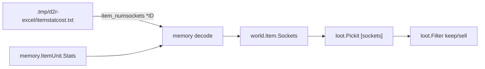

# Pickit: Sockel-Support (MVP)

## Zielbild

Operatoren können Regeln wie diese schreiben und first-match auswerten:

```text
[type] == polearm && [tier] == elite && [sockets] == 4
[name] == "fla" && [sockets] >= 3 && [flag] == ethereal
[flag] == socketed && [quality] == normal
```

Das deckt den in [docs/features/pickit-engine.md](docs/features/pickit-engine.md) und [docs/features/phase-13-core-contract.md](docs/features/phase-13-core-contract.md) bewusst zurückgestellten Fall ab.

**Nicht in diesem Slice:** `[emptysockets]`, Socket-Inhalte (Runen/Gems in `ItemLocationSocket`), Katalog-`gemsockets` / „kann bei Larzuk N Sockel bekommen“.

## Warum so (nicht Operator-`[stat:…]`)



1. **Named predicate für Operatoren:** `[sockets]` ist der etablierte NIP-Alias und schon fail-closed abgewiesen. Operatoren sollen keine Stat-IDs raten.
2. **Stat-ID nur aus Excel:** Interne Decode-Konstante kommt aus [`.tmp/d2r-excel/itemstatcost.txt`](.tmp/d2r-excel/itemstatcost.txt), Zeile `item_numsockets` → `*ID` **194** (Extrakt vom 13.07.2026, Version wie übrige Kataloge). Keine IDs aus Koolo/d2go oder Training-Daten.
3. **Eigenes Feld, nicht über `[stat:…]`:** Stats sind in [internal/loot/pickit.go](internal/loot/pickit.go) an `Identified=true` gebunden. Sockelzahl muss für weiße/graue Bases **vor/ohne Identify** matchen dürfen — genau der Pickup-Fall am Boden.
4. **Fail-closed Availability:** Wie bei Set-/Unique-Identität: fehlt die Sockel-Quelle, matcht keine `[sockets]`-/`socketed`-Regel positiv. Lieber liegen lassen als falsch aufheben.
5. **Kein Katalog-Max zuerst:** „4 Sockel am Drop“ kommt aus dem Live-Item (`item_numsockets`), nicht aus `gemsockets` in weapons/armor. Das wäre ein anderes Feature (Larzuk-Potenzial).

## Autoritative Excel-Quelle

| Bedarf | Datei unter `.tmp/d2r-excel/` | Status |
|--------|------------------------------|--------|
| Stat-ID Sockelanzahl | `itemstatcost.txt` → `item_numsockets` / `*ID` 194 | vorhanden |
| Basis-/Typ-Katalog (bereits) | `weapons.txt`, `armor.txt`, `misc.txt`, … | vorhanden |
| Max-Sockel pro Base (später) | Spalte `gemsockets` in weapons/armor | vorhanden, **nicht** MVP |
| Item-Flag-Bit `socketed` | nicht in Excel | Live/Memory-Gate |

**Regel:** Jede numerische Excel-ID (Stats, TxtFileNo, …) wird aus diesem Verzeichnis abgeleitet und im Code mit Kommentar auf Stat-Name + Quelldatei dokumentiert. Fehlt eine benötigte Datei, Implementierung stoppen und nachreichen lassen — nicht raten.

Aktueller Stand: benötigte MVP-Datei `itemstatcost.txt` ist lokal vorhanden; kein Nachreichen nötig.

## Datenquelle (Gate vor Parser-Freigabe)

Vor dem Freischalten der Syntax:

1. **Stat-ID:** Konstante `itemNumSocketsStatID = 194` aus `itemstatcost.txt` (`item_numsockets`) festnageln.
2. **Live-Check:** Ground-Item mit sichtbaren Sockeln — Stat 194 in bereits gelesenen `Stats` (aktive Liste, sonst Base wie heute) liefert die Anzahl.
3. **Flag-Bit `socketed`:** Bitmaske in `ItemData.Flags` (analog `0x10`/`0x400000` in [internal/memory/items.go](internal/memory/items.go)) nur nach Live-Bestätigung; nicht aus Excel/Koolo übernehmen.
4. **Konsistenz:** Flag gesetzt ⇒ Anzahl ≥ 1; Anzahl 0 ⇒ nicht socketed; Stat fehlt ⇒ `SocketsAvailable=false`.

Unit-Tests mocken danach die festgelegte Quelle.

Promotion in [internal/world/item.go](internal/world/item.go) `mapItem`:

```go
Sockets          int
SocketsAvailable bool  // false → Pickit-Sockelregeln matchen nie
Socketed         bool  // convenience; derived, nicht zweite Wahrheitsquelle
```

`memory.ItemUnit` bekommt dieselben Felder (oder nur Raw + Decode in `world`) — Decode einmal, klar und testbar.

## Pickit-Engine

In [internal/loot/pickit.go](internal/loot/pickit.go):

- Neues `fieldSockets`; `parsePickitField("sockets")` akzeptieren (Tests in [internal/loot/pickit_test.go](internal/loot/pickit_test.go) umdrehen: bisher „unsupported keyword“).
- Literal: Integer; Ops wie Stats (`==`, `!=`, `>`, `>=`, `<`, `<=`).
- `eval`: wenn `!item.SocketsAvailable` → `false`; sonst `compareInt(item.Sockets, …)`.
- `[flag] == socketed` / `!=` ergänzen neben `identified`/`ethereal`; bei `!SocketsAvailable` ebenfalls `false`.
- Kanonischer Serializer und Phase-13-Parser-Tests anpassen.

**Identified-Gate bleibt für echte Stats.** `[sockets]` ist davon entkoppelt.

## API / Preview / UI

Damit Editor und Katalogvorschau dieselbe Semantik wie Runtime haben:

- [internal/api/pickit_dto.go](internal/api/pickit_dto.go): Preview-Item um `sockets` + Availability (oder weglassen und Preview fail-closed dokumentieren — besser explizit mitgeben).
- Editor-Hilfe / erlaubte Felder in `web/src/features/pickit/` und Feature-Docs aktualisieren.
- Kein Schema-Bruch an YAML-Profilen: nur Ausdruckssprache wächst; `schema_version` unverändert, solange Profile ohne Sockel weiter laden.

## Docs & Contract

Aktualisieren (Sockel nicht mehr „excluded“):

- [docs/features/pickit-engine.md](docs/features/pickit-engine.md)
- [docs/features/phase-13-core-contract.md](docs/features/phase-13-core-contract.md) (oder klar als Phase-13-Nachtrag / neuer Slice kennzeichnen)
- [docs/features/pickit-editor.md](docs/features/pickit-editor.md)
- [docs/features/item-enumeration.md](docs/features/item-enumeration.md) (Felder am Item)
- [docs/CHANGELOG.md](docs/CHANGELOG.md) unter **Added**

## Implementierungsreihenfolge

1. **Excel binden:** `item_numsockets` → 194 aus `.tmp/d2r-excel/itemstatcost.txt` als benannte Konstante (Godoc mit Quellverweis).
2. **Live-Gate:** Flag-Bit für `socketed` + Stat 194 auf Ground-Items bestätigen.
3. **Memory → World:** Felder + Decode + Unit-Tests (`enumerate_test`, `mapItem`).
4. **Pickit:** Parser/Eval/Serializer + Tests (Match, fail-closed, unidentifiziert, Kombi mit `[tier]`/`[type]`).
5. **API/Preview/UI-Texte:** Felder spiegeln; keine neue Workflow-Oberfläche nötig.
6. **Docs + Changelog.**
7. Optional danach: Beispielregel in einem Profil (nur wenn gewünscht; Default-Profile müssen nicht plötzlich Bases farmen).

## Spätere Erweiterungen (bewusst getrennt)

| Thema | Warum später | Excel-Quelle |
|-------|----------------|--------------|
| `[emptysockets]` | Parent→Child-Join über `ItemLocationSocket` + Owner | — |
| Socket-Inhalte matchen | Eigene Policy (Host vs. Inserts) | — |
| Katalog-`gemsockets` | Larzuk-/Max-Sockel-Potenzial | `weapons.txt` / `armor.txt` Spalte `gemsockets` (lokal bereits vorhanden) |

## Risiken

- Falsche Flag-Bitmaske (nicht in Excel) → leere Matches oder falsche Keeps — Live-Gate vor Syntax-Freigabe.
- Items ohne Stats-Array: Availability=false, Regel greift nicht.
- Gefüllte Sockel: MVP zählt **Sockelplätze** (`item_numsockets`), nicht leere; „4os leer“ vs. „4os mit Runeword“ unterscheiden wir hier noch nicht.
- Excel-Drift nach Patch: bei neuer D2R-Version `itemstatcost.txt` neu extrahieren und `*ID` erneut prüfen — Runtime liest Excel nicht.
