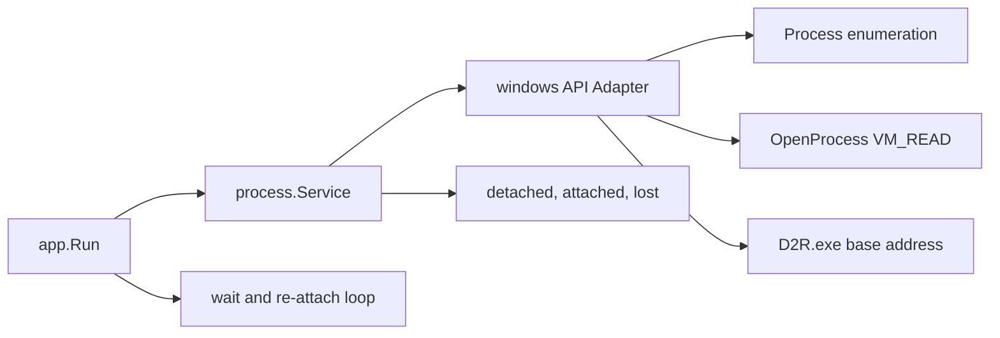

# Plan: `internal/process` Fundament

## Ziel

Schritt 1 liefert eine robuste, testbare Grundlage fuer spaetere Memory-Reads: `internal/process` kann `D2R.exe` anhand der Config finden, mit Read-Rechten oeffnen, die Modul-Basisadresse bestimmen, den Prozesszustand pollen und das Handle sauber freigeben. Wenn D2R beim Bot-Start noch nicht laeuft, wartet `app.Run()` im Poll-Takt, bis der Prozess erscheint oder der Context durch Ctrl+C abbricht. Es wird noch kein Game-State und kein Memory-Snapshot gelesen.



## Umfang

Betroffene Dateien:

- [`internal/process/process.go`](d:/CSharpProjekte/D2R-Offline-Farming-Bot/internal/process/process.go): Public Service API, Statusmodell, Lifecycle.
- `internal/process/process_windows.go`: echte Windows-Implementierung hinter Build-Tag `//go:build windows`.
- `internal/process/process_stub.go`: minimale `//go:build !windows`-Factory, damit portable Mock-Tests moeglich bleiben; echte App-Ausfuehrung bleibt durch `app.verifyEnvironment()` auf Windows begrenzt.
- `internal/process/process_test.go`: Unit-Tests mit Mock-API, ohne laufendes D2R.
- [`internal/app/app.go`](d:/CSharpProjekte/D2R-Offline-Farming-Bot/internal/app/app.go): nur minimale Integration in `Run()` fuer Attach/Poll/Detach-Logging.
- [`docs/features/process-detection.md`](d:/CSharpProjekte/D2R-Offline-Farming-Bot/docs/features/process-detection.md), [`docs/features/README.md`](d:/CSharpProjekte/D2R-Offline-Farming-Bot/docs/features/README.md), [`docs/CHANGELOG.md`](d:/CSharpProjekte/D2R-Offline-Farming-Bot/docs/CHANGELOG.md): Pflicht-Doku fuer neues read-only Verhalten.
- [`go.mod`](d:/CSharpProjekte/D2R-Offline-Farming-Bot/go.mod), [`go.sum`](d:/CSharpProjekte/D2R-Offline-Farming-Bot/go.sum): `golang.org/x/sys/windows` als Windows-API-Dependency.

Logging-Konvention: `process.Service` loggt technische Details hoechstens auf Debug und liefert Fehler mit Kontext zurueck. `app.Run()` loggt operator-relevante State-Wechsel auf Info/Error: waiting, attached, lost, detached und fatal attach problems. Dadurch gibt es pro Attach/Re-Attach keinen doppelten Info-Log.

## Service-Design

`process.Service` bleibt die einzige API, die `app` und spaetere Pakete nutzen. Intern bekommt der Service einen Windows-API-Adapter, damit Tests keine echten Prozesse brauchen. Der echte Windows-Handle bleibt intern; Phase 2 soll `memory.Reader` nicht direkt an `golang.org/x/sys/windows` koppeln, sondern ueber ein schmales Process-Access-Interface arbeiten.

Geplante Kern-API:

```go
// Service finds and manages the D2R game process.
type Service struct { ... }

func New(log *slog.Logger, processName string) *Service
func (s *Service) Attach(ctx context.Context) error
func (s *Service) Poll() Status
func (s *Service) Detach() error
func (s *Service) Status() Status
func (s *Service) ModuleBase() uintptr
```

Kein `Handle() windows.Handle` in der Public API. Fuer Tests wird kein globaler Windows-Zugriff verdrahtet, sondern ein unexportierter Konstruktor oder Options-Pattern genutzt, z. B. `newWithAPI(log, processName, api)` im Paket `process`.

`Status` sollte explizit genug sein, um Lifecycle sauber zu loggen:

```go
type State string

const (
    StateDetached State = "detached"
    StateAttached  State = "attached"
    StateLost      State = "lost"
)

type Status struct {
    State      State
    PID        uint32
    Process    string
    ModuleBase uintptr
    LastError   string
}
```

Alle exportierten Symbole bekommen Godoc. `Ready()` bleibt im Scaffold-Sinn definiert: Service ist initialisiert, nicht zwingend an D2R attached.

## Windows-API-Schicht

Echte Implementierung in `process_windows.go` mit `golang.org/x/sys/windows`:

- Prozessliste enumerieren: `CreateToolhelp32Snapshot`, `Process32First`, `Process32Next`.
- Prozessname vergleichen: case-insensitive gegen `cfg.Process.ProcessName`, aktuell `D2R.exe`.
- Wenn mehrere passende Instanzen gefunden werden: klarer Fehler `multiple D2R.exe instances found`; kein zufaelliger erster Treffer.
- Handle oeffnen: `OpenProcess(PROCESS_QUERY_INFORMATION|PROCESS_VM_READ, false, pid)`.
- Modul-Basisadresse lesen: `CreateToolhelp32Snapshot(TH32CS_SNAPMODULE, pid)`, dann `Module32First/Next`, passend zu `D2R.exe`; D2R ist 64-bit, `TH32CS_SNAPMODULE32` wird nicht verwendet. Modulnamen werden ebenfalls case-insensitive verglichen.
- Alive-Check: `GetExitCodeProcess` und die `windows.STILL_ACTIVE`-Konstante, keine Magic Number.
- Cleanup: `CloseHandle` fuer Prozess- und Snapshot-Handles; direkt nach erfolgreichem Snapshot per `defer`, damit Fehlerpfade keine Handles leaken.
- Operator-taugliche Fehler: z. B. `open process pid=12345: access denied (try running bot as administrator)`.

Die API-Schicht sollte klein bleiben, z. B.:

```go
type windowsAPI interface {
    FindProcessByName(name string) (ProcessInfo, error)
    OpenReadHandle(pid uint32) (Handle, error)
    ModuleBase(pid uint32, moduleName string) (uintptr, error)
    IsAlive(handle Handle) bool
    Close(handle Handle) error
}
```

Die State-Machine-Logik bleibt in `process.go` und ist damit plattformneutral testbar. `process_windows.go` enthaelt nur den echten Adapter; `process_stub.go` liefert nur eine Stub-Factory fuer Nicht-Windows.

## Lifecycle-Verhalten

`Attach(ctx)`:

- Sucht den Prozessnamen aus der Config.
- Oeffnet ein VM-Read-faehiges Handle.
- Ermittelt die Basisadresse des Hauptmoduls.
- Setzt `StateAttached` und loggt `pid`, `process`, `module_base`.
- Fehler werden mit Kontext gewrappt, z. B. `find process D2R.exe: ...`.
- Erlaubte Uebergaenge: `detached -> attached` und `lost -> attached`.
- `Attach()` aus `attached` liefert einen klaren Fehler, damit kein Doppel-Handle entsteht.
- Nach `lost` ist das alte Handle bereits geschlossen; Re-Attach oeffnet immer ein neues Handle.
- Fehler werden klassifiziert: `process not found` ist retryable; `multiple instances`, `access denied` und `module base not found` sind fatal fuer den aktuellen Operator-Zustand. Fatal bedeutet im App-Loop: einmalig auf Error loggen und weiter im Poll-Takt warten, damit der Nutzer D2R/Privileges korrigieren kann, ohne den Bot neu zu starten.

`Poll()`:

- Wenn attached und Prozess lebt: Status unveraendert zurueckgeben.
- Wenn attached und Prozess beendet: `StateLost`, Handle schliessen, einmalig loggen.
- Wenn detached/lost: kein Auto-ReAttach in `Poll()`; Re-Attach wird ausschliesslich im App-Loop entschieden.
- `Poll()` hat bewusst Seiteneffekte: Lifecycle pruefen, State mutieren, Handle schliessen.

`Status()`:

- Read-only Snapshot des letzten bekannten Zustands.
- Kein Alive-Check, kein Close, kein State-Wechsel.

`Detach()`:

- Idempotent: mehrfacher Aufruf ist ok.
- Schließt vorhandenes Handle.
- Setzt `StateDetached`.
- `Poll()` und `Detach()` koennen durch Ticker und Ctrl+C nah beieinander laufen; `Service` schuetzt State, Handle und Log-Flags mit `sync.Mutex`.

## App-Integration

`app.Run()` wird nur so weit erweitert, dass Schritt 1 sichtbar testbar ist:

- `context.WithCancel` in `Run()` anlegen.
- `signal.Notify` fuer `os.Interrupt` verwenden, damit Ctrl+C den Context abbricht; beim Verlassen `signal.Stop(ch)` aufrufen.
- `defer rt.Process.Detach()` direkt nach dem Context-Setup.
- `time.Ticker` mit `rt.Config.Runtime.PollIntervalMs` verwenden.
- Wenn D2R beim Start nicht laeuft: Wait-Loop im Poll-Takt, mit sparsamen Logs, bis `Attach(ctx)` klappt oder der Context abbricht.
- Bei Erfolg Status mit PID und Modulbasis loggen.
- Nach `StateLost`: App-Loop wechselt wieder in den Wait-/Attach-Modus und kann D2R nach Neustart erneut verbinden.
- State-Wechsel nur einmalig loggen, z. B. durch Vergleich mit dem vorherigen Status, damit `poll_interval_ms: 100` kein Log-Spam erzeugt.

Skizze fuer die Loop-Struktur:

```go
attached := false
for {
    select {
    case <-ctx.Done():
        return nil
    case <-ticker.C:
        if !attached {
            if err := rt.Process.Attach(ctx); err != nil {
                // retryable/fatal klassifizieren, sparsam loggen, weiter warten
                continue
            }
            attached = true
            // attached state change einmalig auf Info loggen
        }

        st := rt.Process.Poll()
        if st.State == process.StateLost {
            attached = false
            // lost state change einmalig auf Info loggen
        }
    }
}
```

Keine Memory-Reads, keine Input-Aktionen, kein World Model.

## Tests

Unit-Tests fuer `internal/process` mit Mock-API:

- `Attach` findet Prozess, oeffnet Handle, liest Modulbasis und setzt `StateAttached`.
- `Attach` meldet klaren Fehler, wenn `D2R.exe` nicht gefunden wird.
- `Attach` meldet klaren Fehler, wenn mehrere `D2R.exe`-Instanzen gefunden werden.
- `Attach` aus `StateAttached` verhindert Doppel-Handle.
- `Attach` schliesst nichts versehentlich, wenn `OpenProcess` scheitert.
- `Poll` erkennt Exit und wechselt auf `StateLost`.
- `Poll` in `detached` oder `lost` bleibt harmlos und schliesst kein Null-Handle.
- `Attach` nach `lost` oeffnet ein neues Handle und setzt wieder `StateAttached`.
- `Detach` ist idempotent und schliesst genau einmal.
- Prozessname-Vergleich ist case-insensitive.
- Modulname-Vergleich ist case-insensitive.
- Optional wertvoll: Race-Test fuer paralleles `Poll()` und `Detach()`.

Integration mit echtem D2R bleibt manuell: `go run ./cmd/d2rbot`, D2R starten/schliessen, Logs pruefen.

## Dokumentation

Neue Feature-Doku `docs/features/process-detection.md` nach Projektregel:

- Zweck: Read-only D2R-Prozessbindung.
- Code-Ort: `internal/process`, Einstieg ueber `app.Run`.
- Operator-Verhalten: Bot kann vor D2R gestartet werden und wartet; ggf. Admin-Rechte, wenn D2R erhoeht laeuft; Logs bei Attach/Lost/Detach/Re-Attach.
- Grenzen: kein Memory-Snapshot, keine Steuerung; Re-Attach passiert im App-Loop, nicht in `Poll()`.
- Grenzen: Wenn waehrend einer bestehenden Bindung eine zweite `D2R.exe` startet, bleibt der Bot an der bestehenden PID; Mehrfach-Instanz-Pruefung greift erst beim naechsten Attach/Re-Attach.
- Hinweis fuer Phase 2: `memory.Reader` soll Zugriff ueber `process.Service` oder ein schmales Process-Access-Interface bekommen, nicht ueber einen exportierten `windows.Handle`.

`docs/features/README.md` bekommt den Link, `docs/CHANGELOG.md` unter `[Unreleased]` einen `Added`-Eintrag.

## Validierung

Nach Umsetzung:

```powershell
go test ./...
go build ./cmd/d2rbot
```

Manueller Check auf Windows:

```powershell
go run ./cmd/d2rbot
```

Erwartung: Bei laufendem D2R erscheinen `attached`-Logs mit PID und Modulbasis; nach Schliessen von D2R erscheint einmalig `lost`, danach wartet der Bot wieder auf einen Attach.

Zusaetzlicher manueller Check: Bot zuerst starten, dann D2R oeffnen; der Bot soll warten und danach automatisch attachen. Danach D2R schliessen und erneut starten; der App-Loop soll nach `lost` wieder attachen.