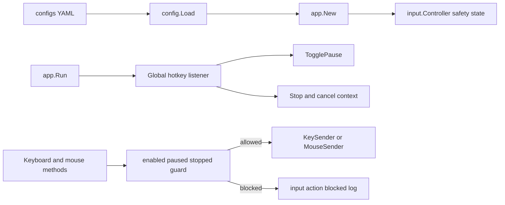

# Phase 3.4 Safety & Logging Plan

## Ziel

Phase 3.4 macht die bisher passiven Input-Primitives sicher bedienbar:

- Echte Eingaben sind per Default deaktiviert: `input.enabled: false`.
- Globale Hotkeys steuern Stop/Pause unabhängig vom D2R-Fokus.
- Jede erlaubte oder abgelehnte Input-Aktion wird einheitlich mit `slog` geloggt.
- Bei `paused`, `stopped` oder `!enabled` werden Tastatur-/Mausaktionen abgelehnt und nicht an Windows weitergereicht.

Window Binding, Process/Memory-Probe und World-Updates bleiben aktiv, auch wenn Input deaktiviert oder pausiert ist.



## Betroffene Dateien

- [`internal/config/config.go`](d:/CSharpProjekte/D2R-Offline-Farming-Bot/internal/config/config.go): `InputConfig` um `enabled`, `pause_hotkey`, `stop_hotkey` erweitern, Defaults/Validierung ergänzen.
- [`configs/config.example.yaml`](d:/CSharpProjekte/D2R-Offline-Farming-Bot/configs/config.example.yaml): neue Safety-Keys dokumentieren, `enabled: false` explizit setzen.
- [`internal/app/input_config.go`](d:/CSharpProjekte/D2R-Offline-Farming-Bot/internal/app/input_config.go): YAML-Config auf Input-eigene Safety/Keyboard-Config mappen.
- [`internal/input/input.go`](d:/CSharpProjekte/D2R-Offline-Farming-Bot/internal/input/input.go): Controller um Safety-State, Hotkey-Backend und Guard-Helfer erweitern.
- Neue Datei [`internal/input/safety.go`](d:/CSharpProjekte/D2R-Offline-Farming-Bot/internal/input/safety.go): `SafetyConfig`, `Status`, `Enable/Disable`, `Pause/Resume/TogglePause`, `Stop`, `actionGuard`, einheitliches Logging.
- Neue Datei [`internal/input/hotkey.go`](d:/CSharpProjekte/D2R-Offline-Farming-Bot/internal/input/hotkey.go): plattformunabhängige Hotkey-Typen, Events und Listener-Interface.
- Neue Datei [`internal/input/hotkey_windows.go`](d:/CSharpProjekte/D2R-Offline-Farming-Bot/internal/input/hotkey_windows.go): `RegisterHotKey`/`UnregisterHotKey` + Message-Loop.
- Neue Datei [`internal/input/hotkey_stub.go`](d:/CSharpProjekte/D2R-Offline-Farming-Bot/internal/input/hotkey_stub.go): `!windows` Stub mit `ErrUnsupportedPlatform`.
- [`internal/input/keyboard.go`](d:/CSharpProjekte/D2R-Offline-Farming-Bot/internal/input/keyboard.go), [`internal/input/mouse.go`](d:/CSharpProjekte/D2R-Offline-Farming-Bot/internal/input/mouse.go): alle Sender-Aufrufe durch Safety-Guard und einheitliches Action-Logging führen.
- [`internal/input/errors.go`](d:/CSharpProjekte/D2R-Offline-Farming-Bot/internal/input/errors.go): `ErrInputDisabled`, `ErrInputPaused`, `ErrInputStopped`, `ErrHotkeyUnavailable` ergänzen.
- [`internal/app/app.go`](d:/CSharpProjekte/D2R-Offline-Farming-Bot/internal/app/app.go): Hotkey-Listener im Run-Lifecycle starten und Stop-Hotkey an `cancel()` koppeln.
- [`internal/app/run_tick.go`](d:/CSharpProjekte/D2R-Offline-Farming-Bot/internal/app/run_tick.go): `inputController`-Interface um Safety-/Hotkey-Methoden erweitern; `runTick` bleibt ohne echte Input-Aktionen.
- [`docs/features/input-controller.md`](d:/CSharpProjekte/D2R-Offline-Farming-Bot/docs/features/input-controller.md), [`docs/features/README.md`](d:/CSharpProjekte/D2R-Offline-Farming-Bot/docs/features/README.md), [`docs/CHANGELOG.md`](d:/CSharpProjekte/D2R-Offline-Farming-Bot/docs/CHANGELOG.md): Phase 3.4 dokumentieren.

## Config-Design

YAML-Erweiterung:

```yaml
input:
  enabled: false
  pause_hotkey: pause
  stop_hotkey: f12
  key_delay_ms_min: 10
  key_delay_ms_max: 40
  combo_hold_ms: 200
  skills:
    slot1: f1
    # ...
```

Regeln:

- `enabled` defaultet immer auf `false`, auch wenn die gesamte `input`-Sektion fehlt.
- `InputConfig.applyDefaults()` setzt `Enabled=false` explizit, nicht nur implizit über Go-Zero-Value.
- `pause_hotkey` defaultet auf `pause`, `stop_hotkey` auf `f12`.
- Hotkeys werden mit der bestehenden `input.NormalizeKey`-Tabelle validiert. Dafür muss `pause` als unterstützter Key ergänzt werden (`VK_PAUSE`, `0x13`).
- `pause_hotkey` und `stop_hotkey` dürfen nicht leer sein und dürfen nicht gleich sein.
- Bestehende Keyboard-Defaults bleiben unverändert.
- Kein CLI-Flag für `enabled` in 3.4. Opt-in passiert bewusst über YAML, damit lokale Config explizit sichtbar ist.

## Safety-State

`internal/input` bekommt eine eigene Config und Status-Struktur:

```go
type SafetyConfig struct {
    Enabled     bool
    PauseHotkey string
    StopHotkey  string
}

type Status struct {
    Enabled bool
    Paused  bool
    Stopped bool
}
```

Controller-State:

- `enabled` aus Config.
- `paused` initial `false`.
- `stopped` initial `false`.
- eigener `stateMu sync.Mutex` für Safety-State. Nicht `keyMu`, `mouseMu` oder Window-`mu` dafür verwenden.

Öffentliche Methoden:

```go
func (c *Controller) Status() Status
func (c *Controller) SetEnabled(enabled bool)
func (c *Controller) Pause(reason string)
func (c *Controller) Resume(reason string)
func (c *Controller) TogglePause(reason string) bool
func (c *Controller) Stop(reason string)
```

`SetEnabled` ist primär testbar/operatorisch; in 3.4 wird es nicht über CLI verdrahtet.
`Status().Enabled` spiegelt den aktuellen Laufzeitwert wider, inklusive `SetEnabled`, nicht nur den initialen YAML-Wert. Ein späteres Config-Reload ist nicht Teil von 3.4.

Konstruktorentscheidung:

```go
func NewController(log *slog.Logger, keyboard KeyboardConfig, safety SafetyConfig) *Controller
```

`newWithBackends(...)` erhält ebenfalls `SafetyConfig`. `app.New` ruft:

```go
Input: input.NewController(log, mapInputConfig(cfg.Input), mapSafetyConfig(cfg.Input))
```

`internal/app/input_config.go` bekommt dafür eine zweite Mapping-Funktion:

```go
func mapSafetyConfig(cfg config.InputConfig) input.SafetyConfig
```

Alternativen wie ein großer `input.Options`-Typ bleiben für später möglich, werden in 3.4 aber nicht verwendet.

Beim Controller-Start ein Info-Log schreiben:

```go
input safety configured enabled=false pause_hotkey=pause stop_hotkey=f12
```

So sieht der Operator sofort, ob echte Eingaben erlaubt sind und welche globalen Hotkeys belegt werden.

`Pause`, `Resume` und `TogglePause` sind No-Ops mit Debug/Warn-Log, wenn `stopped == true`. Stop ist terminal und wird nicht durch Pause/Resume zurückgesetzt.

## Action Guards

Alle Methoden, die echte OS-Inputs senden, prüfen vor dem Sender-Aufruf den Safety-State:

- Keyboard: `KeyDown`, `KeyUp`, `PressKey`, `PressCombo`, `PressSkill`, `PressBelt`, `PressTownPortal`.
- Mouse: `MoveTo`, `Click`.

Reihenfolge:

1. Argumente validieren (`NormalizeKey`, Button-Check, Slot-Bounds). Ungültige Argumente liefern weiterhin `ErrInvalidKey`, `ErrInvalidMouseButton`, `ErrInvalidSlot` unabhängig vom Safety-State.
2. Bei Mausaktionen, die ein Fenster benötigen, `ErrWindowNotBound` prüfen: `MoveTo` und `Click` liefern bei fehlendem Bind `ErrWindowNotBound`, bevor `ErrInputDisabled`/`ErrInputPaused` geprüft wird.
3. Safety-Guard ausführen.
4. Erst danach `keyMu`/`mouseMu` und Sender-Aufrufe.

Guard-Fehler:

- `!enabled` → `ErrInputDisabled`.
- `paused` → `ErrInputPaused`.
- `stopped` → `ErrInputStopped`.

Priorität: `stopped` vor `disabled` vor `paused`. Stop ist terminal.

Cleanup-Ausnahmen: Best-effort Releases nach einem bereits begonnenen `PressCombo` oder `Click` dürfen den Guard umgehen, damit keine Taste/Maustaste hängen bleibt. Diese Cleanup-Pfade loggen weiterhin Warnungen bei Fehlern.

Delegation vermeiden: `PressSkill`, `PressBelt` und `PressTownPortal` dürfen nicht einfach `PressKey` mit Default-Reason aufrufen. Stattdessen interne reason-aware Helfer einführen:

```go
func (c *Controller) pressKey(key Key, reason string) error
func (c *Controller) pressCombo(keys []Key, reason string) error
func (c *Controller) moveTo(clientX, clientY int, reason string) error
func (c *Controller) click(button MouseButton, reason string) error
```

Öffentliche Methoden validieren/auflösen ihre Argumente und rufen die internen Helfer mit passendem Reason (`skill_slot`, `belt_slot`, `town_portal`, `combo`, `direct_call`, `mouse_move`, `mouse_click`) auf. Cleanup-Pfade (`releasePressedKeys`, `releaseMouseButton`) rufen weiterhin direkt `KeySender`/`MouseSender` auf, nicht die öffentlichen Controller-Methoden und nicht erneut den Guard.

## Action Logging

Das bestehende Logging wird auf ein einheitliches Format gebracht:

```go
c.log.Info("input action",
    "kind", "keyboard",
    "action", "press",
    "key", key,
    "reason", reason,
    "allowed", true,
)
```

Regeln:

- Erfolgreiche Aktionen loggen `allowed=true`.
- Abgelehnte Aktionen loggen `allowed=false`, `blocked_by` (`disabled|paused|stopped`) und den Fehler.
- `reason` ist Pflicht im internen Log-Helfer. Bestehende Public Methods ohne Reason verwenden konservative Defaults wie `"direct_call"`, `"skill_slot"`, `"belt_slot"`, `"town_portal"`, `"mouse_move"`, `"mouse_click"`.
- Bestehende spezifische Logs wie `input key action` / `input mouse action` werden entweder entfernt oder in den neuen `input action`-Helper überführt, damit keine Doppel-Logs entstehen.
- `KeyDown`/`KeyUp` bleiben Debug für Low-Level-Details; die Info-Zeile kommt vom Action-Helper.

Kein Log-Spam: Rejected actions werden pro Aufruf geloggt, weil echte Aktionen in 3.4 noch nicht automatisch im Loop laufen. Wenn spätere Tasks häufig blockiert werden, kann eine Drosselung ergänzt werden.

## Global Hotkeys

Hotkeys sind Bot-Safety-Steuerung, keine D2R-Eingabe. Sie sollen unabhängig vom Game-Fokus funktionieren.

Plattformunabhängige API:

```go
type HotkeyAction string

const (
    HotkeyActionPause HotkeyAction = "pause"
    HotkeyActionStop  HotkeyAction = "stop"
)

type HotkeyEvent struct {
    Action HotkeyAction
    Key    Key
}

type HotkeyBindings struct {
    Pause Key
    Stop  Key
}

type HotkeyListener interface {
    Listen(ctx context.Context, bindings HotkeyBindings, events chan<- HotkeyEvent) error
}
```

`Controller.ListenHotkeys` ist die App-facing API und delegiert an einen internen `HotkeyListener` (`defaultHotkeyListener` auf Windows, Stub auf `!windows`). Der Controller speichert die normalisierten `HotkeyBindings` aus `SafetyConfig` bereits bei `NewController`; `ListenHotkeys` validiert oder normalisiert die Keys nicht erneut, sondern startet nur den Listener mit diesen Bindings.

Windows-Implementierung:

- `RegisterHotKey` mit `HWND=0`, keine Modifier in 3.4.
- `pause` und `f12` über VK-Mapping aus `input`.
- Message-Loop verarbeitet `WM_HOTKEY`.
- `UnregisterHotKey` beim Context-Cancel/Exit.
- Fehler bei Registrierung werden mit `ErrHotkeyUnavailable` gewrappt.
- Wenn ein Hotkey durch andere Software belegt ist, schlägt Startup hart fehl. Safety-Hotkeys sollen nicht still fehlen.
- Hotkey-IDs festlegen: `pause=1`, `stop=2`, eindeutig pro Listener-Goroutine.
- Registrierung und Message-Pump laufen in derselben Goroutine.
- Kein blockierendes `GetMessage` ohne Context-Ausweg. Für 3.4: `PeekMessage` + kurzer Sleep (z. B. 10 ms) oder `MsgWaitForMultipleObjects` mit Context-Signal verwenden.
- `UnregisterHotKey` in `defer`, auch bei partiell erfolgreicher Registrierung nach späterem Fehler.
- `HotkeyAction`-Konstanten klar von Key-Namen trennen, z. B. `HotkeyActionPause` / `HotkeyActionStop`, damit `Key("pause")` nicht mit der Aktion verwechselt wird.

Nicht-Windows-Stub:

- `Listen` liefert `ErrUnsupportedPlatform`.
- Da `app.verifyEnvironment()` Nicht-Windows ohnehin ablehnt, ist der Stub primär für Pakettests.

## App-Lifecycle

`app.Run` startet nach Context-Erstellung den Hotkey-Listener und verarbeitet Events im zentralen Select-Loop (Modell A).

Event-Verhalten:

- Pause-Hotkey: `rt.Input.TogglePause("hotkey")`, Log `input safety state changed` mit `paused=true|false`.
- Stop-Hotkey: `rt.Input.Stop("hotkey")`, Log `input safety stop requested`, dann `cancel()`.

Lifecycle-Regeln:

- Hotkey-Listener startet unabhängig von `input.enabled`. Auch bei deaktivierten Eingaben muss Stop/Pause als Safety-Mechanismus verfügbar sein.
- Wenn Hotkey-Registrierung fehlschlägt, gibt `Run` einen Fehler zurück, bevor der Poll-Loop startet.
- Bei normalem Shutdown wird der Context gecancelt und der Listener unregistert.
- `runTick` bleibt unverändert passiv; es löst keine Input-Aktionen aus.

Implementation-Hinweis: Um Startup-Fehler synchron zu erkennen, kann `StartHotkeys` einen `ready/error` Channel verwenden, bevor `Run` in den Ticker-Loop geht.

Konkretes Event-Routing:

```go
hotkeyEvents := make(chan input.HotkeyEvent, 4)
hotkeyReady := make(chan error, 1)
go rt.Input.ListenHotkeys(ctx, hotkeyEvents, hotkeyReady)

if err := <-hotkeyReady; err != nil {
    return err
}

for {
    select {
    case <-ctx.Done():
        return nil
    case ev := <-hotkeyEvents:
        rt.handleHotkeyEvent(ev, cancel)
    case <-ticker.C:
        // existing runTick
    }
}
```

`hotkeyEvents` ist gepuffert (`cap=4`), damit die Windows-Message-Loop nicht blockiert, wenn der App-Loop gerade im Tick arbeitet.

`inputController` wird Pflicht-erweitert:

```go
type inputController interface {
    Bind(pid uint32) error
    Unbind()
    Bound() bool
    Ready() bool
    Status() input.Status
    TogglePause(reason string) bool
    Stop(reason string)
    ListenHotkeys(ctx context.Context, events chan<- input.HotkeyEvent, ready chan<- error)
}
```

`mockInput` in App-Tests bekommt entsprechende Spy-Felder.

Signal-Semantik: Bei `os.Interrupt` / `SIGTERM` ruft der Signal-Handler zusätzlich `rt.Input.Stop("signal")`, bevor er `cancel()` auslöst. Damit ist Signal-Shutdown konsistent mit Stop-Hotkey. Mehrfacher Stop bleibt idempotent.

Für Tests `Run` nicht gegen echte Windows-Hotkeys koppeln: `ListenHotkeys` bleibt Teil des mockbaren `inputController`, oder alternativ wird eine kleine `startHotkeys`/`handleHotkeyEvent`-Funktion extrahiert. Ziel ist, Registrierungsfehler, Pause-Event und Stop-Event ohne echte `RegisterHotKey`-Calls zu testen.

## Tests

`internal/config`:

- Beispiel-Config lädt mit `enabled=false`, `pause_hotkey=pause`, `stop_hotkey=f12`.
- Fehlende `input`-Sektion setzt `enabled=false` und Hotkey-Defaults.
- `TestLoadExampleConfig` prüft `Enabled == false`, `PauseHotkey == "pause"`, `StopHotkey == "f12"`.
- `TestInputDefaultsWhenSectionMissing` prüft ebenfalls `Enabled == false` plus Hotkey-Defaults.
- Gleiche Pause-/Stop-Hotkeys schlagen fehl.
- Leere Hotkeys schlagen fehl.
- Ungültiger Hotkey schlägt fehl.
- `pause` ist ein gültiger Key.

`internal/input`:

- Default Safety-State: disabled, not paused, not stopped.
- Bestehende Keyboard-/Mouse-Action-Tests werden migriert: Test-Helper aktivieren Safety explizit, z. B. `testControllerEnabled(...)` oder `c.SetEnabled(true)`, damit bestehende Erfolgsfälle nicht an `ErrInputDisabled` scheitern.
- Enabled-Aktion erreicht Mock-Sender und loggt `allowed=true`.
- Disabled/paused/stopped blockieren Keyboard und Mouse vor Sender-Aufruf und loggen `allowed=false`.
- Argumentvalidierung gewinnt vor Guard: ungültiger Key/Button/Slot liefert den spezifischen Fehler auch wenn disabled.
- `TogglePause` toggelt Status und ist idempotent über Pause/Resume testsicher.
- `Stop` setzt terminalen Zustand; danach blockiert alles mit `ErrInputStopped`.
- `TogglePause` nach Stop ist No-Op und ändert Status nicht.
- Cleanup-Pfade bei Combo/Click umgehen Guard nur für Release und loggen Warnung bei Cleanup-Fehlern.
- Hotkey-Listener-Interface kann mit Mock-Events getestet werden.

`internal/app`:

- `Run` startet Hotkey-Listener vor Poll-Loop.
- `Run` verarbeitet Hotkey-Events über eigenen Select-Case, nicht direkt in der Listener-Goroutine.
- Pause-Event toggelt `Input`-Pause und beendet Run nicht.
- Stop-Event cancelt den Context und beendet Run sauber.
- Hotkey-Registrierungsfehler bricht `Run` mit Fehler ab.
- Bei `input.enabled=false` laufen Attach/Probe/World weiterhin; nur Aktionen würden blockiert.
- `mockInput` implementiert die erweiterten Safety-/Hotkey-Methoden.
- Fokus der Unit-Tests: `handleHotkeyEvent` und Hotkey-Startup-Handshake isoliert testen. Optional ein kurzer `Run`-Smoke-Test mit kleinem `poll_interval_ms` und injiziertem Stop-Event, aber kein echter globaler Hotkey.

Windows-Hotkey-Adapter:

- VK-Mapping für `pause` und `f12` ohne echte Registrierung testen.
- Register/Unregister-Funktionen hinter injizierbaren Callbacks testen.
- Message-Loop soweit möglich über kleine Handler-Funktionen testen; keine echten globalen Hotkeys in automatisierten Tests registrieren.
- Partielle Registrierung cleanup testen: Pause registriert, Stop schlägt fehl, Pause wird wieder unregistert.

## Doku und Changelog

`docs/features/input-controller.md` ergänzen:

- Phase 3.4 Safety & Logging.
- `input.enabled=false` Default und explizites Opt-in.
- Pause/Stop-Hotkeys und ihr Verhalten.
- Aktionen werden bei disabled/paused/stopped blockiert und geloggt.
- Hotkeys funktionieren unabhängig vom D2R-Fokus, sind aber Windows-global und können mit anderen Apps kollidieren.
- Den bisherigen Grenzen-Abschnitt umschreiben: „Keine Stop/Pause-Hotkeys“ entfällt; stattdessen Grenzen wie „keine automatische Nutzung“, „kein Fokus-Management“, „Hotkeys können belegt sein“.
- Alternative Hotkeys in Doku erwähnen, z. B. `stop_hotkey: f11`, falls `f12` durch andere Software belegt ist.

`docs/features/README.md`:

- Input-Controller-Kurzbeschreibung um Safety/Logging und globale Hotkeys ergänzen.

Godoc:

- Alle neuen exportierten Symbole dokumentieren: `SafetyConfig`, `Status`, `HotkeyAction`, `HotkeyActionPause`, `HotkeyActionStop`, `HotkeyEvent`, `HotkeyBindings`, `HotkeyListener`, neue Error-Sentinels und neue Controller-Methoden.

`docs/CHANGELOG.md` unter `## [Unreleased]`:

```markdown
### Added
- Add input safety controls, global pause/stop hotkeys, and action logging (Phase 3.4)
```

## Validierung

Nach Umsetzung:

```powershell
gofmt -w internal/input internal/config internal/app
go test ./internal/input ./internal/config ./internal/app
go test ./...
go build ./cmd/d2rbot
```

Manuelle Validierung:

- Start mit `input.enabled: false`: Window Binding und `--probe` laufen, direkte Test-Actions würden blockiert loggen.
- Start mit `input.enabled: true`: Pause-Hotkey toggelt blockierten Zustand, Stop-Hotkey beendet den Bot sauber.

## Hauptrisiken

- Globale Hotkeys können bereits belegt sein. 3.4 soll dann hart fehlschlagen statt ohne Safety zu laufen.
- `input.enabled=false` darf nicht mit `Input.Ready()` oder Window Binding verwechselt werden; es blockiert nur echte Eingaben.
- Stop/Pause-Hotkeys sind global. Doku muss klar sagen, welche Tasten belegt werden.
- Guard-Reihenfolge muss konsistent bleiben, damit Tests und spätere Tasks vorhersagbare Fehler bekommen.
- Cleanup für bereits gedrückte Keys/Buttons darf nicht vom Guard blockiert werden.
- Existing Input-Tests brechen sonst wegen `enabled=false`; Test-Helper müssen erfolgreiche Action-Tests explizit aktivieren.