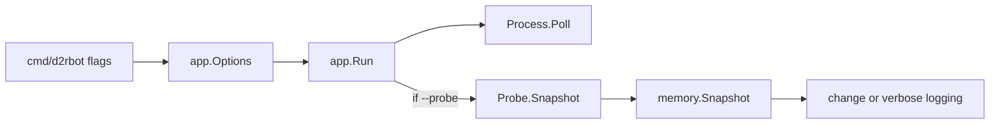

# Plan: Snapshot + Probe-Loop in `app`

## Ziel

Schritt 4 macht aus der bisherigen Probe-Integration einen klaren Phase-1-Modus: `memory.Snapshot` ist das stabile Rohdatenmodell, `app.Run()` pollt Prozess und optional Snapshot mit `poll_interval_ms`, und die CLI loggt strukturiert ohne Spam. Die Probe wird per `--probe` aktiviert; `--verbose` setzt Debug-Logging und erlaubt dichtere Positionsausgabe. Das ist eine bewusste Verhaltensaenderung: Der Default-Start liest danach keine Probe-Snapshots mehr.



## Scope

Betroffene Dateien:

- [`cmd/d2rbot/main.go`](d:/CSharpProjekte/D2R-Offline-Farming-Bot/cmd/d2rbot/main.go): Flags `--probe` und `--verbose`, Weitergabe an `app`.
- [`internal/app/app.go`](d:/CSharpProjekte/D2R-Offline-Farming-Bot/internal/app/app.go): gespeicherte Runtime-Optionen, Probe opt-in, Loop-Regeln, strukturierte Logs.
- [`internal/app/probe_log.go`](d:/CSharpProjekte/D2R-Offline-Farming-Bot/internal/app/probe_log.go): Logging-Policy auf `memory.Snapshot` und `verbose` erweitern.
- Neue oder bestehende App-Helper-Datei, z. B. `internal/app/run_tick.go`: testbare Tick-Logik ohne echten Ticker.
- [`internal/app/*_test.go`](d:/CSharpProjekte/D2R-Offline-Farming-Bot/internal/app): Tests fuer Probe opt-in, Force-Log, Heartbeat, verbose Positionslogging.
- [`internal/memory/probe.go`](d:/CSharpProjekte/D2R-Offline-Farming-Bot/internal/memory/probe.go): `ProbeSnapshot` zu `Snapshot` konsolidieren.
- [`internal/memory/*_test.go`](d:/CSharpProjekte/D2R-Offline-Farming-Bot/internal/memory): Tests auf neuen Typnamen anpassen.
- [`docs/features/state-probe.md`](d:/CSharpProjekte/D2R-Offline-Farming-Bot/docs/features/state-probe.md), [`docs/features/memory-reader.md`](d:/CSharpProjekte/D2R-Offline-Farming-Bot/docs/features/memory-reader.md), [`docs/features/process-detection.md`](d:/CSharpProjekte/D2R-Offline-Farming-Bot/docs/features/process-detection.md), [`docs/CHANGELOG.md`](d:/CSharpProjekte/D2R-Offline-Farming-Bot/docs/CHANGELOG.md): CLI-Verhalten, Default-Aenderung und Snapshot-Modell dokumentieren.

## CLI / Runtime Options

Neue Runtime-Optionen, damit Config und CLI sauber getrennt bleiben:

```go
type Options struct {
    Probe   bool
    Verbose bool
}

func New(cfg *config.Config, opts Options) (*Runtime, error)
```

`Runtime` speichert die Optionen explizit:

```go
type Runtime struct {
    Config  *config.Config
    Options Options
    // ...
}
```

CLI:

```powershell
go run ./cmd/d2rbot --probe

go run ./cmd/d2rbot --probe --verbose
```

Regeln:

- `--probe` ist opt-in. Ohne Flag bleibt Schritt-1-Verhalten: Attach, Poll, Lost/Re-Attach, aber keine Snapshot-Reads.
- Diese Umstellung ist ein Breaking/Changed Operator-Verhalten gegenueber dem aktuellen Stand, in dem `go run ./cmd/d2rbot` bereits Probe-Logs ausgibt.
- `--verbose` setzt global Debug sichtbar, getrennt von der Probe-Logging-Policy. Bestehende `app.log_level`-Config bleibt Default, sofern `--verbose` nicht gesetzt ist.
- `--verbose` ohne `--probe` ist erlaubt und zeigt technische Debug-Logs, aber keine Snapshot-Reads.
- Startup-Log enthaelt `probe_enabled=true/false` und `verbose=true/false`, damit Operatoren die neue Default-Aenderung direkt sehen.

Erwartungsmatrix:

| Flags | Verhalten |
|-------|-----------|
| default | Info-Prozesslogs, keine Probe-Reads |
| `--probe` | Sparse Probe-Info-Logs, keine Positions-Spam-Logs |
| `--verbose` | Global Debug sichtbar, weiterhin keine Probe-Reads |
| `--probe --verbose` | Debug sichtbar plus Positionsaenderungen auf Debug |

## Snapshot-Modell

`memory.ProbeSnapshot` wird zu `memory.Snapshot` umbenannt. Inhalt bleibt bewusst roh und Phase-1-nah:

```go
type Snapshot struct {
    At          time.Time
    Valid       bool
    Reason      string
    PlayerPtr   uintptr
    StatsSource string
    HP          uint32
    MaxHP       uint32
    Mana        uint32
    MaxMana     uint32
    AreaID      uint32
    PosX        uint32
    PosY        uint32
}
```

Regeln:

- `Valid=false` plus `Reason` ist der einzige Fehlerkanal fuer Probe-Zustand im App-Loop.
- `PosX`/`PosY` bleiben Rohwerte, keine World-Koordinaten.
- `ProbeReader.Snapshot()` liefert `memory.Snapshot`.
- Keine Alias-Loesung, damit der Code nicht zwei Begriffe fuer dasselbe Modell pflegt.

## App-Loop

Loop-Reihenfolge bleibt sicherheitsorientiert:

1. Wenn nicht attached: Attach versuchen.
2. Wenn attached: zuerst `Process.Poll()`.
3. Bei `StateLost`: wenn `Options.Probe` aktiv ist, Probe-Zustand zuruecksetzen; keine Snapshot-Reads.
4. Nur wenn `Options.Probe` aktiv und State attached ist: `Probe.Snapshot()` lesen.
5. Snapshot nach Logging-Policy ausgeben.

Wichtig:

- `poll_interval_ms` aus Config bleibt der einzige Loop-Takt.
- `ReadAt` haelt den Prozess-Mutex; deshalb niemals Probe vor `Poll()`.
- Ohne `--probe` darf der App-Loop keine Memory-Snapshot-Reads ausfuehren.
- Probe-State (`probeForceLog`, `lastLoggedProbe`, `lastProbeLog`) wird nur im `Options.Probe`-Pfad gepflegt; kein toter Probe-State bei deaktivierter Probe.
- `ProbeReader` darf weiterhin in `app.New()` konstruiert werden, auch wenn `--probe` aus ist. Das ist billig und vermeidet Lazy-Wiring-Komplexitaet.

Testbarkeit:

- `Run()` bleibt der Ticker-/Signal-Orchestrator.
- Die einzelne Loop-Iteration wird in einen kleinen Helper extrahiert, z. B. `runTick(ctx, state *runState) error` oder aehnlich.
- `Runtime` nutzt fuer die Probe ein schmales Interface statt eines nur konkreten Typs, damit Tests `Snapshot()`-Aufrufe zaehlen koennen:

```go
type snapshotReader interface {
    Snapshot() memory.Snapshot
}
```

- `Runtime.Probe` kann dieses Interface halten; in `New()` wird `memory.NewProbeReader(...)` zugewiesen.
- Der Helper nutzt dieses Interface, damit Tests pruefen koennen: ohne `--probe` kein `Snapshot()`-Call, mit `--probe` Snapshot erst nach `Poll()`.
- Keine Tests mit echten Tickern oder Schlafzeiten.

## Logging-Policy

Normales Probe-Logging:

- Log bei HP/Mana/Max/Area/StatsSource-Aenderung.
- Position alleine triggert keinen Info-Log, damit Laufen nicht spamt.
- Heartbeat alle 5s.
- Invalid Snapshot: Info bei Reason-Wechsel, Heartbeat auf Debug.
- Re-Attach: `force=true`, einmaliges Log auch bei gleichen Werten.

Verbose Probe-Logging:

- `--verbose` setzt Debug sichtbar.
- Positionsaenderungen duerfen loggen, aber auf Debug, nicht Info. Dadurch bleibt `--probe` ohne `--verbose` spamfrei, und `--probe --verbose` ist bewusst dichter.
- Bei `poll_interval_ms=100` kann `--probe --verbose` waehrend des Laufens bis zu ca. 10 Debug-Zeilen/s erzeugen. Das ist fuer manuelle Diagnose akzeptiert und wird dokumentiert.
- Optional kann `probeShouldLog` einen `verbose bool` Parameter bekommen:

```go
func probeShouldLog(prev, cur memory.Snapshot, lastLog time.Time, heartbeat time.Duration, force bool, verbose bool) bool
```

Structured slog-Felder:

```text
probe state stats_source=base hp=... max_hp=... mana=... max_mana=... area_id=... pos_x=... pos_y=...
probe unavailable reason=...
```

Keine mehrzeilige Vollbild-Ausgabe.

`logProbeSnapshot` sollte den Log-Level unterscheiden koennen:

- normale gueltige Snapshot-Aenderung: Info
- position-only in verbose: Debug
- invalid Reason-Wechsel: Info
- invalid Heartbeat: Debug

Optional zur Vermeidung verstreuter `if`-Ketten: kleine Hilfsfunktion wie `probeLogKind(prev, cur, heartbeat, verbose)` oder aehnlich. Nicht erforderlich, falls `probeShouldLog` plus `logProbeSnapshot` klar bleibt.

## Tests

App-Tests:

- Ohne `Options.Probe` wird `Probe.Snapshot()` nicht aufgerufen.
- Mit `Options.Probe` wird Snapshot nur nach attached + erfolgreichem `Poll()` gelesen.
- Bei `StateLost` wird Probe-State zurueckgesetzt.
- `probeShouldLog` loggt normale Wert-Aenderungen.
- `probeShouldLog` loggt Position-only-Aenderungen nur im Verbose-Modus.
- Invalid Reason-Wechsel loggt; unveraenderter invalid Snapshot erst per Heartbeat.
- Re-Attach `force=true` loggt einmalig.
- Tick-Tests nutzen den extrahierten Helper und Mock-Prozess/Mock-Probe statt echte Ticker.

Memory-Tests:

- Typumbenennung `ProbeSnapshot` -> `Snapshot` ueberall nachziehen.
- `ProbeReader.Snapshot()` setzt `At`, `Valid`, `Reason` und Rohfelder wie bisher.

CLI-nahe Tests falls sinnvoll:

- `run(configPath, app.Options)` oder aehnlicher Einstieg bleibt testbar, ohne `flag` global schwer zu mocken.

## Dokumentation

Aktualisieren:

- `state-probe.md`: `--probe`, `--verbose`, `memory.Snapshot`, Logging-Regeln.
- `memory-reader.md`: weiter Low-Level, verweist auf `state-probe.md` fuer Snapshot/Probe-Loop.
- `process-detection.md`: ohne `--probe` bleibt Prozess-Probe-only; mit `--probe` wird Memory gelesen. Bestehende Aussagen, die Probe-Logs beim Default-Start implizieren, muessen angepasst werden.
- `state-probe.md` aktuell korrigieren, falls dort noch steht, es gebe keine Pattern-Scan-Logik; `scan.go`/`ensureOffsets()` fuehren bereits Runtime-Scan aus.
- Changelog:
  - `Added`: `Add --probe and --verbose flags for Phase-1 state probing`.
  - `Added`: `Add memory.Snapshot as the raw Phase-1 probe data model`.
  - `Changed`: `Make state probing opt-in via --probe; default run only monitors process attach/lost`.

## Validierung

Automatisch:

```powershell
go test ./...
go build ./cmd/d2rbot
```

Manuell:

```powershell
go run ./cmd/d2rbot
# Erwartung: nur Attach/Poll/Lost, keine probe state logs

go run ./cmd/d2rbot --probe
# Erwartung: sparsame probe state / unavailable logs

go run ./cmd/d2rbot --probe --verbose
# Erwartung: Debug sichtbar, Positionsaenderungen besser nachvollziehbar
```

D2R Offline/Singleplayer: Attach, Laufen, Area-Wechsel, Mana/HP-Aenderung und Re-Attach erneut pruefen.