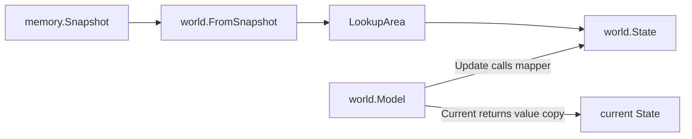

# Plan: Phase 2.2 Snapshot → World State Mapper

## Ziel

Schritt 2.2 verbindet die Phase-1-Rohdaten mit der in 2.1 gebauten Domain-Schicht: aus `memory.Snapshot` entsteht ein semantischer `world.State`. Tasks und spätere App-Integration sollen dadurch nicht mehr mit rohen Area-IDs, Positionsfeldern oder Probe-Validierungsdetails arbeiten müssen.



## Scope

- Neue Datei [`internal/world/mapper.go`](d:/CSharpProjekte/D2R-Offline-Farming-Bot/internal/world/mapper.go): pure Mapper-Funktion `FromSnapshot(snap memory.Snapshot) State` mit Godoc zu Invalid-Semantik und Phase-Heuristik. Der Name `FromSnapshot` ist für 2.2 festgelegt; ältere Plan-Erwähnungen von `StateFromSnapshot` werden nicht weiterverfolgt.
- [`internal/world/world.go`](d:/CSharpProjekte/D2R-Offline-Farming-Bot/internal/world/world.go): `Model` bekommt ein unexportiertes `current State`-Feld; `Update(snap memory.Snapshot) State` ruft `FromSnapshot` auf; `Current() State` liefert eine Value-Kopie. Kommentare/Ready-Log werden von „placeholder“ auf „initialized; state populated via Update“ angepasst.
- Neue Tests in [`internal/world/mapper_test.go`](d:/CSharpProjekte/D2R-Offline-Farming-Bot/internal/world/mapper_test.go): Mapper, invalid state, unknown areas, `Model.Update`, `Model.Current`. Die Testdatei darf `internal/memory` importieren; die Domain-Dateien bleiben memory-frei.
- [`docs/features/world-model.md`](d:/CSharpProjekte/D2R-Offline-Farming-Bot/docs/features/world-model.md): Schritt 2.2 als Mapping-Schicht dokumentieren.
- [`docs/CHANGELOG.md`](d:/CSharpProjekte/D2R-Offline-Farming-Bot/docs/CHANGELOG.md): `Added`-Eintrag für Snapshot-to-World-State mapping.

Nicht Teil dieses Abschnitts: App-Loop-Wiring, Umstellung des Probe-Loggings auf World-Logging, Tasks, Pathing, Objects, Monster, Items oder GamePhase-Erkennung über zusätzliche Memory-Reads. Das kommt in 2.3+.

## Mapper-Regeln

### Valid Snapshot

Bei `snap.Valid == true`:

- `State.At = snap.At`.
- `State.Valid = true`.
- `State.Reason = ""`.
- `State.Phase = GamePhaseInGame` als Best-effort-Heuristik: Player, Position und Vitals waren lesbar. Das ist keine harte In-Game-Garantie, weil die Phase-1-Probe auch bei `InGameGate == 0` einen gültigen Snapshot liefern kann, wenn der Main Player noch lesbar ist.
- `State.Area = LookupArea(AreaID(snap.AreaID))`.
- `State.Player.Position = Position{X: snap.PosX, Y: snap.PosY}`.
- `State.Player.HP`, `MaxHP`, `Mana`, `MaxMana` werden direkt aus dem Snapshot übernommen.

Wichtig: Das World-Modell berechnet keine eigenen beobachteten Max-Werte. Phase 1 führt die effektive Max-Logik bereits im `memory.Snapshot`; 2.2 übernimmt diese Werte als semantisches Player-Modell. Prozent-Clamping bleibt in `Player.HPPercent()` und `ManaPercent()`.

Spätere Schritte dürfen `GamePhase` nicht allein aus `State.Valid` ableiten. Eine belastbare Unterscheidung zwischen `Menu`, `Loading` und `InGame` muss in 2.3+ aus Gate/UI/Memory-Signalen kommen.

### Unknown Area

`LookupArea` bleibt die einzige Quelle für Area-Auflösung. Unbekannte IDs crashen nicht:

- Beispiel: `snap.AreaID = 9999` → `Area{Name: "Unknown Area 9999", Kind: AreaKindUnknown}`.
- Beispiel: `snap.AreaID = 0` bei `snap.Valid == true` → `Area{Name: "Unknown Area 0", Act: ActUnknown, Kind: AreaKindUnknown}` und der Player bleibt befüllt. Das bedeutet unvollständige Area-/Room-Chain, nicht automatisch Menü oder Loading.
- Bekannte IDs `137..141` ohne Namen bleiben ebenfalls Unknown-Fallbacks.
- Der `State` bleibt trotzdem `Valid`, wenn der Snapshot gültig war; unbekannte Area ist Debug-/Katalog-Thema, kein Snapshot-Fehler.

### Invalid Snapshot

Bei `snap.Valid == false`:

- `State.At = snap.At`.
- `State.Valid = false`.
- `State.Reason = snap.Reason`.
- `State.Phase = GamePhaseUnknown`.
- `State.Area = Area{}` und `State.Player = Player{}`.

Kein Raten: Auch `memory.ReasonNotInGame` wird in 2.2 nicht als `GamePhaseMenu` oder `GamePhaseLoading` interpretiert. Diese Unterscheidung braucht eine belastbare Quelle und bleibt späteren Schritten vorbehalten.

Der bestehende Godoc von `State` wird angepasst: Bei `Valid == false` sind `Area`/`Player` Zero-Values und dürfen nicht gelesen werden; `Reason` wird durchgereicht, wenn vorhanden. Damit widerspricht ein invalid State mit leerem Reason nicht der Dokumentation.

## API-Entscheidung

Empfohlene API:

```go
func FromSnapshot(snap memory.Snapshot) State

func (m *Model) Update(snap memory.Snapshot) State
func (m *Model) Current() State
```

Begründung:

- `FromSnapshot` ist pure, leicht testbare Mapping-Logik.
- `Model.Update` ist die spätere App-Boundary und hält `current State`.
- `Update` speichert den neuen State und gibt exakt diesen State-Wert zurück. Erwartete Implementierung: `m.current = FromSnapshot(snap); return m.current`.
- `Current` gibt eine Value-Kopie zurück; `State` enthält keine Pointer, Maps oder Slices.
- Keine Mutex-/Concurrency-Schicht in 2.2, weil der aktuelle Run-Loop single-threaded arbeitet. Falls später UI/Telemetry parallel lesen, kann `Model` gezielt erweitert werden.

## Paket-Grenzen

`internal/world/mapper.go` darf `internal/memory` importieren. Die Domain-Dateien aus 2.1 (`area.go`, `state.go`, `player.go`, `position.go`) bleiben memory-frei.

`internal/memory` bleibt Rohdaten-Schicht und darf `internal/world` nicht importieren.

## Tests

Geplante Tests:

- `FromSnapshot` mappt einen gültigen Snapshot in `GamePhaseInGame`, `Valid=true`, benannte Area, Position und Player-Vitals.
- `FromSnapshot` dokumentiert und testet `GamePhaseInGame` als Best-effort-Heuristik, nicht als sichere UI-/Gate-Phase.
- `FromSnapshot` übernimmt effektive Max-Werte unverändert aus `memory.Snapshot`, z. B. `HP=100`, `MaxHP=125`, `Mana=50`, `MaxMana=75`.
- `FromSnapshot` mit unbekannter `AreaID` bleibt valid und liefert `Unknown Area <id>`.
- `FromSnapshot` mit `Valid=true` und `AreaID=0` bleibt valid, liefert `Unknown Area 0`, `ActUnknown`, befüllte Player-Daten und `GamePhaseInGame` als Heuristik.
- `FromSnapshot` mit `Valid=false` liefert `Valid=false`, `Reason`, `GamePhaseUnknown`, Zero-Value `Area` und `Player`.
- `FromSnapshot` mit `Valid=false` und `ReasonNotInGame` bleibt `GamePhaseUnknown`, nicht `GamePhaseMenu`.
- `FromSnapshot` mit `Valid=false` und leerer Reason bleibt invalid; kein synthetischer Reason, damit der Mapper keine Fehlerursachen erfindet.
- `Model.Update` speichert und returned denselben State-Wert.
- Ein zweites `Model.Update` ersetzt den vorherigen State vollständig.
- `Model.Current` vor dem ersten Update liefert Zero-Value `State`.
- `Model.Current` nach `Update` liefert eine unabhängige Value-Kopie: `c1 := m.Current(); c2 := m.Current(); c1.Player.HP = 0` darf `c2.Player.HP` und den internen Model-State nicht verändern.
- Mutation des Rückgabewerts von `Update` darf den intern gespeicherten State ebenfalls nicht verändern.

## Dokumentation

- `world-model.md` aktualisieren: 2.1 Domain-Typen plus 2.2 Mapper, Invalid-Semantik, `Model.Update`/`Current`. Der Feature-Index bleibt unverändert, weil `world-model.md` seit 2.1 bereits dort geführt wird.
- In `world-model.md` klarstellen: `GamePhaseInGame` bei validem Snapshot ist nur eine Best-effort-Heuristik aus lesbarem Player/Vitals; spätere Phasen müssen Gate/UI separat auswerten.
- In `world-model.md` dokumentieren: `AreaID == 0` bei validem Snapshot bedeutet unvollständige Area-Chain und bleibt valid; es ist kein Menü-Signal.
- In `world-model.md` festhalten: Memory-only Felder wie `PlayerPtr` und `StatsSource` werden in 2.2 bewusst nicht in `world.Player` übernommen.
- Unter Grenzen ergänzen: `Model` hat in 2.2 keinen Mutex; parallele UI/Telemetry-Leser brauchen später Synchronisation oder immutable Handoff.
- `state-probe.md` nur dann anfassen, wenn bei der Umsetzung ohnehin Doku-Konsistenz zu Positionstypen auffällt; die eigentliche Probe-Verhaltensänderung kommt erst mit App-Wiring.
- Changelog: `Add snapshot-to-world-state mapper and current world model state storage`.

## Validierung

Nach Umsetzung:

- `gofmt` auf geänderte Go-Dateien.
- `go test ./internal/world`.
- `go test ./...`.
- `go build ./cmd/d2rbot`.
- `ReadLints` auf geänderte Dateien prüfen.

## Folgearbeit

Schritt 2.3 sollte danach den App-Loop an `World.Update` anbinden und entscheiden, ob `--probe` weiterhin rohe Probe-Logs schreibt oder auf World-State-Logs umgestellt wird.