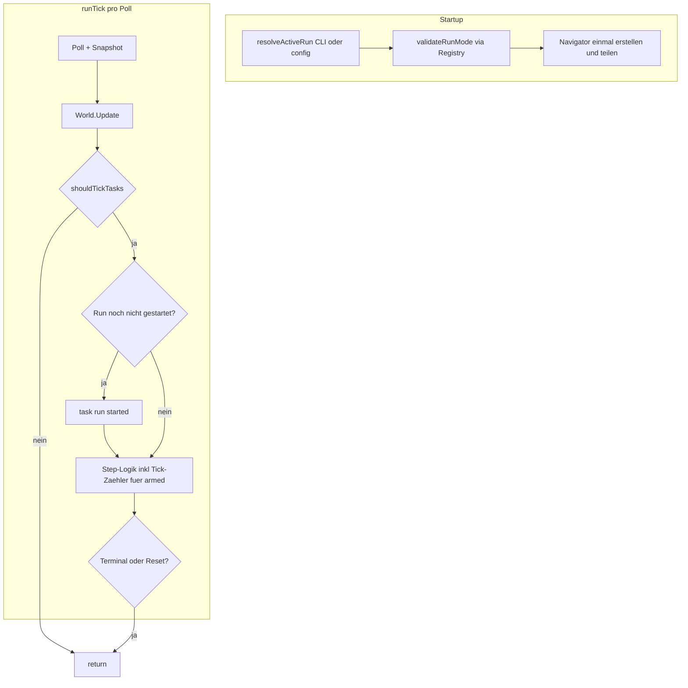

# Phase 4.1 — Task-Framework & App-Integration

## Ziel

Erster Schritt von „Bot liest und loggt“ zu „Bot führt eine Run-State-Machine aus“. Phase 4.1 liefert **Infrastruktur + Stub**, keine echte Countess-Navigation.

**Release-Kriterium:** `go run ./cmd/d2rbot --run countess` mit `input.enabled: true` startet einen Stub-Run, loggt Step-Übergänge/Timeouts, beendet den Run sauber und lässt danach den **passiven Monitor** weiterlaufen (kein App-Exit).



## Architektur-Entscheidungen

| Thema | Entscheidung |
|-------|--------------|
| Run-Auswahl | CLI `--run` überschreibt YAML `runs.active`; leer = passiver Modus (wie heute). Kein `--run passive` in 4.1 — YAML-`active` nur per leerem CLI-Override nicht deaktivierbar |
| Run-Validierung | **Single Source of Truth:** [`internal/tasks/registry.go`](internal/tasks/registry.go) — `KnownRuns()` / `IsKnownRun(name)`. Nur in `app.validateRunMode()` nach Auflösung CLI > config. Config prüft nur `step_timeout_ms > 0` |
| Navigator-Wiring | **Eine Instanz:** `nav := pathing.NewNavigator(log)` → `rt.Pathing = nav` und `tasks.Deps{Pathing: nav}` |
| Run-Start | **Lazy:** `task run configured` beim Startup; `task run started` beim **ersten** Tick mit allen Guards OK — nicht bei `NewRunner`, nicht beim ersten Tick ohne Guards |
| Task-Tick Guards | `shouldTickTasks`: konfigurierter Run gesetzt, `!Terminal()`, `!WasReset()`, `input.enabled` + `Status().Enabled`, `world.Valid`, `Input.Bound()`, nicht pausiert/gestoppt |
| Nach Run-Ende | `Terminal() == true` → keine weiteren `Tick`-Aufrufe; passiver Monitor läuft weiter; **kein zweiter Run ohne App-Neustart** (wie nach `process_lost`) |
| Nach `process_lost` | `Tasks.Reset("process_lost")` → `WasReset()==true`; **kein Auto-Restart** nach Re-Attach; App-Neustart nötig |
| `Reset` vs. `WasReset` | Mutator `Reset(reason string)`; Accessor `WasReset() bool` — keine Namenskollision in Go |
| `Ready()` | Beim Refactoring `tasks.go` → `runner.go` beibehalten (`verifyComponents` in `app.go`) |
| Pause | Guards blockieren still; Step-Timer läuft nicht weiter (kein Tick) — OK |
| Stop | Beendet App via `cancel()` — unverändert |
| Countess in 4.1 | Stub: `precheck` → `armed` (Tick-Zähler) → `complete`; kein echtes Input/Pathing |
| `tasks.go` | Bestehenden Placeholder-Runner nach `runner.go` migrieren; `tasks.go` nicht doppelt belegen |
| `ctx` in `Tick` | 4.1 ignoriert `ctx`; ab 4.3+ für abbrechende Steps |
| Route-Cache | Außen vor ([`docs/backlog.md`](docs/backlog.md)) |
| Paket-Grenze | `tasks` importiert nicht `app` |

## Kern-API (`internal/tasks`)

Dateien:

- [`internal/tasks/deps.go`](internal/tasks/deps.go) — `Deps`, Interfaces + Compile-Time-Checks
- [`internal/tasks/result.go`](internal/tasks/result.go) — `TickResult`, `RunOutcome`
- [`internal/tasks/step.go`](internal/tasks/step.go) — zeitbasierte Timeouts + `ticksInStep` Zähler
- [`internal/tasks/runner.go`](internal/tasks/runner.go) — `Runner`, `Tick`, `Reset`, `WasReset`, `Terminal`, `ConfiguredRun`, `Ready`
- [`internal/tasks/registry.go`](internal/tasks/registry.go) — `KnownRuns()`, `IsKnownRun()`, Factory `"countess"`
- [`internal/tasks/countess.go`](internal/tasks/countess.go) — Stub `countessRun`

`tasks.go` (bestehend): Inhalt nach `runner.go` verschieben und Datei löschen **oder** nur Package-Godoc behalten.

```go
// deps.go — Logger nur im Runner, nicht in Deps
type Deps struct {
    Input   Input
    Pathing Navigator
}

type Input interface {
    Status() input.Status
    Bound() bool
}

type Navigator interface {
    Ready() bool
}

// Compile-time checks in deps.go (Produktionscode — importiert input + pathing bewusst, kein Zyklus):
var _ Navigator = (*pathing.Navigator)(nil)
var _ Input = (*input.Controller)(nil)

type TickResult struct {
    Active  bool       // false wenn terminal, reset oder kein konfigurierter Run
    Outcome RunOutcome // idle | running | success | failed
    Step    string
    Reason  string
}

func (r *Runner) Tick(ctx context.Context, w world.State, now time.Time) TickResult
func (r *Runner) Reset(reason string)   // Mutator: No-Op wenn configuredRun=="" (kein Log); sonst reset=true
func (r *Runner) WasReset() bool        // Accessor: true nach Reset() (z. B. process_lost)
func (r *Runner) Terminal() bool        // true nach success/failed — andere Semantik als WasReset
func (r *Runner) ConfiguredRun() string // Name aus CLI/config; bleibt für Logs
func (r *Runner) Ready() bool           // verifyComponents; true wenn Runner initialisiert
```

### Lazy Run-Start

Runner-Zustand intern:

| Feld | Rolle |
|------|-------|
| `configuredRun` | Aufgelöster Name (`countess` oder `""`) |
| `started` | `true` nach erstem Guard-OK-Tick |
| `terminal` | `true` nach success/failed |
| `reset` | `true` nach `Reset()` (z. B. `process_lost`) — blockiert Lazy-Re-Start |

Ablauf in `Tick`:

1. Wenn `reset \|\| terminal \|\| configuredRun == ""` → No-Op, `TickResult.Active=false`
2. Wenn `!started` → `task run started` loggen, `started=true`, ersten Step beginnen
3. Step-Logik ausführen

### Step-Modell

Zwei Mechanismen (nicht vermischen):

| Mechanismus | Verwendung |
|-------------|------------|
| **Zeit-Timeout** (`stepStartedAt`, `stepTimeout`) | Warte-Steps auf Zustandsänderung (später, z. B. „zurück in Town“) — **nicht** für `precheck` |
| **Tick-Zähler** (`ticksInStep`) | Deterministische kurze Steps unabhängig von `poll_interval_ms` — `armed` |
| **Sofort-Fail** | Bedingung klar verletzt → sofort `step failed`, kein Warten |

- `armed`: `ticksInStep >= 2` → Step complete (nicht zeitbasiert)
- `precheck`:
  - `world.Valid && world.Area.IsTown()` → sofort Step complete
  - `world.Valid && !world.Area.IsTown()` → **sofort** `task step failed` mit `reason=not_in_town` (kein 30s-Warten in Black Marsh)
  - Zeit-Timeout in 4.1 für `precheck` nicht verwendet
- Bei Timeout (spätere Warte-Steps): `task step failed` mit `reason=timeout`, `elapsed_ms`
- Run-Ende: `task run finished` mit `outcome=success|failed`; `terminal=true`

**Stub Countess (4.1):**

| Step | Verhalten | Abschluss |
|------|-----------|-----------|
| `precheck` | Town-Check | sofort success (Town) oder sofort fail (`not_in_town`) |
| `armed` | kein Input | nach **2 Ticks** (`ticksInStep`) |
| `complete` | Run beenden | `outcome=success` |

Test-AreaIDs: `1` = Rogue Encampment (Town, Success); `6` = Black Marsh (`reason=not_in_town`).

## Config (`internal/config`)

```yaml
runs:
  active: ""           # countess | leer — Validierung nur in app via Registry
  step_timeout_ms: 30000
```

- `RunsConfig` mit Default `step_timeout_ms: 30000`
- **`RunsConfig.applyDefaults()`** in `config.Load` (analog `InputConfig`): fehlende `runs`-Sektion oder `step_timeout_ms: 0` → Default `30000`, sonst Validierungsfehler bei alter `config.yaml` ohne `runs`
- **`config.validate()`:** nur `step_timeout_ms > 0` — **kein** Lookup unbekannter `active`-Werte
- Unbekannter Run-Name → Fehler in `app.validateRunMode()` nur wenn `runName != ""`

## CLI & Options

[`cmd/d2rbot/main.go`](cmd/d2rbot/main.go): `--run countess`

[`internal/app/options.go`](internal/app/options.go): `Run string`

**`validateRunMode()`** (einzige Run-Name-Validierung):

- `runName == ""` → passiver Modus, **kein** Fehler, kein `task run configured`-Log
- `--run` + `--input-test` → Fehler
- `runName != ""` + `input.enabled: false` → Fehler
- `runName != "" && !tasks.IsKnownRun(runName)` → Fehler
- `runName != ""` → Log: `task run configured` mit `run`, `source=cli|config`

```go
if runName != "" {
    if !cfg.Input.Enabled { return errInputRequiredForRun }
    if !tasks.IsKnownRun(runName) { return errUnknownRun }
    log.Info("task run configured", "run", runName, "source", source)
}
```

## App-Integration

### Wiring in `app.New` (korrigiert)

```go
nav := pathing.NewNavigator(log)
inputCtrl, err := input.NewController(...)

runName := resolveActiveRun(opts, cfg)
if err := validateRunMode(runName, cfg, opts); err != nil {
    return nil, err
}

rt := &Runtime{
    // ...
    Pathing: nav,
    Input:   inputCtrl,
    Tasks: tasks.NewRunner(log, runName, mapRunConfig(cfg.Runs), tasks.Deps{
        Input:   inputCtrl,
        Pathing: nav, // dieselbe Instanz wie rt.Pathing
    }),
}
```

### `shouldTickTasks`

```go
func (rt *Runtime) shouldTickTasks(cur world.State) bool {
    if rt.Tasks.ConfiguredRun() == "" {
        return false
    }
    if rt.Tasks.Terminal() || rt.Tasks.WasReset() {
        return false
    }
    if !rt.Config.Input.Enabled {
        return false
    }
    if !cur.Valid || !rt.Input.Bound() {
        return false
    }
    st := rt.Input.Status()
    return st.Enabled && !st.Paused && !st.Stopped
}
```

Doppelte `input.enabled`-Prüfung (`Config` + `Status().Enabled`) ist in 4.1 bewusst Defense-in-Depth; `Status().Enabled` kommt heute aus derselben Config.

### `runTick` Erweiterung

Nach `World.Update`:

```go
if rt.shouldTickTasks(cur) {
    rt.Tasks.Tick(ctx, cur, time.Now())
}
```

### `process_lost` — feste Reihenfolge

In [`internal/app/run_tick.go`](internal/app/run_tick.go) bei `StateLost`:

1. `rt.Input.Unbind()`
2. `rt.Tasks.Reset("process_lost")` — No-Op ohne Log wenn `configuredRun == ""` (passiver Modus)
3. `rt.World.Reset(time.Now(), worldResetReasonProcessLost)`

Damit läuft der Task nicht auf invalidem World-State weiter. Nach Re-Attach: **kein** erneuter Lazy-Start (`reset=true`).

### Erster Attach-Tick

Nach erstem Attach returned `runTick` früh (nach `tryBindInput`) **ohne** `World.Update`. Run-Start verzögert sich um **1–2 Poll-Ticks** bis gültiger World-State — im manuellen Testplan erwähnen.

## Logging-Konvention

| Event | Wann | Felder |
|-------|------|--------|
| `task run configured` | Startup `validateRunMode`, nur wenn `runName != ""` | `run`, `source` |
| `task run started` | Erster Guard-OK-Tick (Lazy) | `run` |
| `task step started` | Step-Wechsel | `run`, `step` |
| `task step complete` | Step OK | `run`, `step`, `elapsed_ms` oder `ticks` |
| `task step failed` | Step Fail | `run`, `step`, `reason`, `elapsed_ms` |
| `task run finished` | Terminal | `run`, `outcome`, `reason` |
| `task run reset` | `Reset()` | `run`, `reason` |

Guards blockieren still (kein Log pro Tick).

## Tests

### `testRuntime`-Fix (kritisch)

[`internal/app/app_test.go`](internal/app/app_test.go) `testRuntimeWithInput` erweitern:

```go
func testRuntimeWithInput(...) *Runtime {
    nav := pathing.NewNavigator(config.NewLogger("error"))
    cfg := &config.Config{
        Process: config.ProcessConfig{ProcessName: "D2R.exe"},
        Input:   config.InputConfig{Enabled: false}, // Default passiv
    }
  return &Runtime{
        Config:  cfg,
        Pathing: nav,
        Tasks:   tasks.NewRunner(..., "", tasks.RunConfig{}, tasks.Deps{Input: in, Pathing: nav}),
        // ...
    }
}
```

Zusätzlich `testRuntimeWithTasks(...)` für gezielte Guard-Tests mit `ConfiguredRun: "countess"`, `Input.Enabled: true`, mock Input `enabled/bound`.

| Datei | Inhalt |
|-------|--------|
| [`internal/tasks/runner_test.go`](internal/tasks/runner_test.go) | Lazy start, armed Tick-Zähler, precheck Town/Fail, timeout, terminal → `Active=false`, Reset blockiert Re-Start |
| [`internal/tasks/step_test.go`](internal/tasks/step_test.go) | Timeout-Helfer, Tick-Zähler |
| [`internal/config/config_test.go`](internal/config/config_test.go) | `runs`-Parsing, `applyDefaults` ohne Sektion, `step_timeout_ms` Validierung |
| [`internal/app/task_tick_test.go`](internal/app/task_tick_test.go) | Guards, Tick nach Update, `process_lost`-Reihenfolge, Reset No-Op passiv, nil-sicherer `testRuntime` |
| [`internal/app/validate_run_test.go`](internal/app/validate_run_test.go) | `runName==""` passiv OK, unknown run, disabled input, mutual exclusive flags |

Precheck-Tests: `AreaID: 1` (Rogue Encampment), `AreaID: 6` (Black Marsh).

## Dokumentation

[`docs/features/task-runner.md`](docs/features/task-runner.md) muss explizit enthalten:

- Lazy Run-Start (1–2 Polls nach Attach)
- Kein Run-Repeat ohne App-Neustart — weder nach `terminal` (success/failed) noch nach `WasReset` (`process_lost` + Re-Attach)
- Pause stoppt Ticks, Timer/Zähler frieren ein
- `ConfiguredRun` bleibt für Logs; `Terminal()` / `WasReset()` stoppen weitere Ticks

Weitere Updates: [`docs/features/README.md`](docs/features/README.md), [`docs/CHANGELOG.md`](docs/CHANGELOG.md) `[Unreleased]`.

## Explizit nicht in 4.1

- Echte Countess-Navigation, Objects, Monster-Memory
- Pathing-Algorithmen
- Input-Aktionen aus Tasks
- Run-Loop/Wiederholung (Phase 5)
- Route-Cache / Run Recorder
- `--run passive` zum Überschreiben von YAML-`active`

## Validierung (manuell)

```powershell
go run ./cmd/d2rbot
go run ./cmd/d2rbot --run countess --probe   # input.enabled: true
```

**Startup (vor Attach):**

1. `task run configured` (in `validateRunMode`)

**In Town (nach Attach):**

2. `process attached` → 1–2 Polls → `task run started`
3. `precheck` → `armed` (2 Ticks) → `complete` → `task run finished outcome=success`
4. Danach: kein weiteres `task step`/`task run started`; World-Probe läuft weiter

**In Black Marsh:**

5. `precheck` → **sofort** `task step failed reason=not_in_town` → `task run finished outcome=failed`

```powershell
go test ./internal/tasks ./internal/app ./internal/config
go build ./cmd/d2rbot
```

## Feedback-Integration (Referenz)

| # | Punkt | Status im Plan |
|---|-------|----------------|
| 1 | Doppelte Navigator-Instanz | Behoben — eine Instanz geteilt |
| 2 | `testRuntime` ohne Tasks | Behoben — Defaults + `testRuntimeWithTasks` |
| 3 | Doppelte Run-Validierung | Behoben — nur Registry in `validateRunMode` |
| 4 | Run-Start-Zeitpunkt | Behoben — Lazy Start |
| 5 | `armed` Ticks vs. Zeit | Behoben — Tick-Zähler |
| 6 | Terminal + `shouldTickTasks` | Behoben — `Terminal()` / `WasReset()` in Guards |
| 7 | `process_lost` Reihenfolge | Behoben — Unbind → Tasks.Reset → World.Reset |
| 8 | Kein Auto-Restart | Behoben — `WasReset()`; Feature-Doc |
| 9 | `Reset()` Namenskollision | Behoben — Mutator `Reset()`, Accessor `WasReset()` |
| 10 | `precheck` Fail-Timing | Behoben — sofort `not_in_town`; Timeout nur für Warte-Steps |
| 11 | Compile-Time-Checks | In `deps.go`, nicht nur Tests |
| 12 | `Ready()` | Beibehalten für `verifyComponents` |
| 13 | Leerer `runName` | `validateRunMode`: nur prüfen wenn `runName != ""` |
| 14 | `RunsConfig` Defaults | `applyDefaults()` in `config.Load` |
| 15 | `Reset` passiv | No-Op ohne Log bei `configuredRun == ""` |

## Implementierungsfallen (Checkliste)

| # | Fall | Maßnahme |
|---|------|----------|
| 1 | Passiver Modus `runName == ""` | `IsKnownRun` nur wenn `runName != ""`; Test in `validate_run_test.go` |
| 2 | Fehlende `runs`-Sektion in YAML | `RunsConfig.applyDefaults()` in `config.Load` → `step_timeout_ms: 30000` |
| 3 | `deps.go` importiert `input`/`pathing` | Bewusst für Compile-Checks; kein Import-Zyklus |
| 4 | `Reset` bei passivem Modus | `configuredRun == ""` → sofort return, kein `task run reset`-Log |
