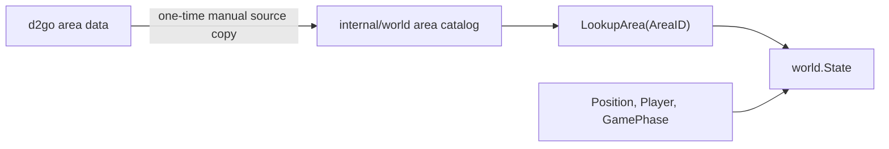

# Plan: Phase 2.1 Domain-Typen & Area-Katalog

## Ziel

Schritt 2.1 baut nur die semantische Grundlage im Paket [`internal/world`](d:/CSharpProjekte/D2R-Offline-Farming-Bot/internal/world). Danach kann Code im Projekt mit stabilen Begriffen wie `world.AreaID`, `world.Area`, `world.Position`, `world.Player`, `world.GamePhase` und `world.State` arbeiten, ohne d2go oder rohe `memory.Snapshot`-Felder zu kennen.

Noch nicht Teil dieses Abschnitts: Mapping von `memory.Snapshot` zu `world.State`, App-Loop-Integration, World-Logging, Pathing, Monster, Objects oder Items. Das bleibt Schritt 2.2+.



## Scope

- [`internal/world/world.go`](d:/CSharpProjekte/D2R-Offline-Farming-Bot/internal/world/world.go): Platzhalter behalten, `Model` aber noch nicht funktional erweitern. `Ready()` bleibt minimal.
- Neue Datei [`internal/world/area.go`](d:/CSharpProjekte/D2R-Offline-Farming-Bot/internal/world/area.go): `AreaID`, `Area`, `Act`, `AreaKind`, Kategorie-Methoden und Lookup-API.
- Neue Datei [`internal/world/areas_data.go`](d:/CSharpProjekte/D2R-Offline-Farming-Bot/internal/world/areas_data.go): lokale Area-Tabelle, kopiert aus d2go `pkg/data/area/area.go` und `areas.go` bei Commit `16d248a53591`; File-Header nennt Quelle, Commit und dass die Daten manuell gepflegt sind.
- Neue Datei [`internal/world/position.go`](d:/CSharpProjekte/D2R-Offline-Farming-Bot/internal/world/position.go): `Position` mit `X`, `Y` als `uint32`, passend zu `memory.Snapshot.PosX`/`PosY`.
- Neue Datei [`internal/world/player.go`](d:/CSharpProjekte/D2R-Offline-Farming-Bot/internal/world/player.go): `Player` mit Position und Vitalwerten, aber ohne Memory-Pointer.
- Neue Datei [`internal/world/state.go`](d:/CSharpProjekte/D2R-Offline-Farming-Bot/internal/world/state.go): `GamePhase` und immutable `State` pro Tick. `State` bleibt trotz Namensnähe zu `process.State`, weil Paketqualifizierung (`world.State`) die Boundary klar macht; optionaler Alias ist in `app` später möglich.
- Neue Tests in [`internal/world`](d:/CSharpProjekte/D2R-Offline-Farming-Bot/internal/world): Area-Lookup, Act/Town/Dungeon-Klassifikation, Unknown-Fallback, State-Value-Semantik.

## Datenmodell

- `type AreaID uint32`: passend zu `memory.Snapshot.AreaID`.
- `type Act uint8`: Werte `ActUnknown`, `Act1` bis `Act5`.
- `type AreaKind uint8`: Werte `AreaKindUnknown`, `AreaKindOutdoor`, `AreaKindDungeon`, `AreaKindSpecial`. Town ist keine zweite Wahrheit in `Kind`, sondern kommt aus `AreaID.IsTown()`.
- `type Area struct`: `ID`, `Name`, `Act`, `Kind` plus Methoden `IsKnown()`, `IsTown()`, `IsDungeon()`. `Act` wird nicht in `areas_data.go` gepflegt, sondern in `LookupArea` immer via `id.Act()` gesetzt.
- `type Position struct`: `X`, `Y uint32`; noch keine Area-Origin- oder Pathing-Normalisierung.
- `type Player struct`: `Position`, `HP`, `MaxHP`, `Mana`, `MaxMana` als `uint32` und Prozent-Methoden.
- `type GamePhase int`: `GamePhaseUnknown`, `GamePhaseMenu`, `GamePhaseLoading`, `GamePhaseInGame`.
- `type State struct`: `At`, `Phase`, `Valid`, `Reason`, `Area`, `Player`.

Festgelegte API:

```go
func LookupArea(id AreaID) Area
func (id AreaID) Act() Act
func (id AreaID) IsTown() bool
func (a Area) IsKnown() bool
func (a Area) IsTown() bool
func (a Area) IsDungeon() bool
func (p Player) HPPercent() uint8
func (p Player) ManaPercent() uint8
```

`HPPercent()` und `ManaPercent()` nutzen Integer-Math (`current * 100 / max`), liefern bei `max == 0` den Wert `0` und clampen Werte über 100 auf `100`, weil D2R-Buffs oder beobachtete Max-Wert-Korrekturen sonst UI-Logik verfälschen können.

Für spätere strukturierte Logs werden günstige `String()`-Methoden eingeplant: mindestens für `GamePhase`, optional für `AreaID`.

## Area-Katalog

Quelle:

- [`pkg/data/area/area.go`](d:/CSharpProjekte/D2R-Offline-Farming-Bot/.tmp/d2go-ref/github.com/hectorgimenez/d2go@v0.0.0-20251023061335-16d248a53591/pkg/data/area/area.go): Konstanten, `IsTown()`, `Act()`.
- [`pkg/data/area/areas.go`](d:/CSharpProjekte/D2R-Offline-Farming-Bot/.tmp/d2go-ref/github.com/hectorgimenez/d2go@v0.0.0-20251023061335-16d248a53591/pkg/data/area/areas.go): ID-zu-Name-Tabelle.

Umsetzung:

- Keine `go.mod`-Dependency auf d2go.
- Lokale `const`-Namen aus d2go kopieren. Wichtig: d2go `areas.go` enthält Namen für IDs `0..136`; `area.go` enthält zusätzliche Konstanten bis `141` (`MapsRuinedCitadel`), aber keine Namen für `137..141`.
- `areas_data.go` enthält nur `ID`, `Name` und `Kind`. `Act` wird nie in der Katalog-Tabelle gespeichert, sondern aus `AreaID.Act()` berechnet.
- Area-Namen für `0..136` lokal einbetten. IDs `137..141` bekommen Konstanten, aber `LookupArea` fällt wegen fehlendem Namen auf Unknown zurück.
- `IsKnown() == true` genau dann, wenn ein Katalog-Eintrag mit nicht-leerem Namen existiert. Praktisch sind das bekannte IDs `1..136`; ID `0` bleibt trotz d2go-Map-Eintrag mit leerem Namen unbekannt.
- `LookupArea(0)` liefert nicht den leeren d2go-Namen, sondern `Unknown Area 0` mit `AreaKindUnknown` und `ActUnknown`.
- Unbekannte IDs liefern immer `Area{ID: id, Name: fmt.Sprintf("Unknown Area %d", id), Act: id.Act(), Kind: AreaKindUnknown}`. Für ID `0` bleibt `ActUnknown`; für unbekannte IDs größer `0` darf `Act()` anhand der bekannten ID-Bereiche klassifizieren.
- d2go-Act-Regel bewusst verbessert: d2go behandelt `ID < 40` als Act 1, also auch `None(0)`. Dieses Projekt setzt `AreaID(0).Act() == ActUnknown`, weil `0` bei Menü/Ladezuständen auftreten kann und Act 1 dort irreführend wäre.
- Eine Quelle der Wahrheit festlegen:
  - `AreaID.IsTown()` ist ein ID-Switch für die 5 Towns wie d2go: Rogue Encampment, Lut Gholein, Kurast Docks, Pandemonium Fortress, Harrogath.
  - `Area.IsTown()` delegiert auf `AreaID.IsTown()`.
  - `Area.IsDungeon()` bedeutet `Area.Kind == AreaKindDungeon`.
  - `Area.Kind` wird nur für sichere Fälle manuell gepflegt.
  - Towns behalten `AreaKindUnknown`; Town-Erkennung läuft ausschließlich über `IsTown()`.
- Countess-Klassifikation:
  - `BloodMoor`, `ColdPlains`, `StonyField`, `DarkWood`, `BlackMarsh` = `AreaKindOutdoor`.
  - `ForgottenTower` = `AreaKindSpecial`, ausdrücklich nicht Dungeon.
  - `TowerCellarLevel1` bis `TowerCellarLevel5` = `AreaKindDungeon`.

## Immutable State

`State` soll als Value-Snapshot behandelt werden: Methoden geben Kopien zurueck, keine Pointer auf intern mutierbare Maps oder Slices. Der eigentliche `world.Model` kann spaeter `current State` halten, aber Schritt 2.1 definiert nur die Datenform.

Wichtig fuer spaetere Schritte:

- Invalid-States duerfen einen `Reason` tragen, aber keine erfundenen Area-/Player-Daten.
- `Area` bekommt einen Unknown-Fallback mit ID, damit unbekannte D2R-Areas sichtbar bleiben.
- Prozent-Methoden vermeiden Division durch Null und liefern bei fehlendem Max-Wert `0`.
- Konkrete Invalid-Semantik:

```go
// Invalid: Valid=false, Reason gesetzt, Area/Player sind Zero-Values und nicht zu lesen.
type State struct {
    At     time.Time
    Phase  GamePhase
    Valid  bool
    Reason string
    Area   Area
    Player Player
}
```

`GamePhaseUnknown` ist der Zero-Value. Schritt 2.1 definiert nur den Typ; die Memory-Quelle für `Menu`, `Loading` und `InGame` kommt in Schritt 2.2 im Mapper.

Geplante Mapper-Boundary für Schritt 2.2, noch nicht in 2.1 implementieren:

```go
func StateFromSnapshot(snap memory.Snapshot) State
```

`world` darf dafür in `mapper.go` später `internal/memory` importieren. Die Domain-Dateien (`area.go`, `state.go`, `player.go`) bleiben frei von `memory`.

## Tests

Geplante Tests:

- `LookupArea(BlackMarsh)` liefert Name `Black Marsh`, `Act1`, `AreaKindOutdoor`, nicht Town.
- `LookupArea(BloodMoor)` liefert `AreaKindOutdoor`, nicht Town, nicht Dungeon.
- `LookupArea(ForgottenTower)` liefert nicht Town und nicht Dungeon.
- `LookupArea(RogueEncampment)` liefert Town.
- `LookupArea(TowerCellarLevel5)` liefert Dungeon und Act 1.
- `LookupArea(AreaID(0))` liefert `Unknown Area 0`, `ActUnknown`, `AreaKindUnknown`, `IsKnown() == false`.
- `LookupArea(AreaID(137))` bis `LookupArea(AreaID(141))` liefern Unknown-Fallbacks, obwohl Konstanten existieren; `LookupArea(AreaID(137)).Act == Act5`.
- `LookupArea(AreaID(9999))` liefert `Unknown Area 9999`.
- `AreaID.Act()` behandelt Grenzwerte `0`, `39`, `40`, `74`, `75`, `102`, `103`, `108`, `109` korrekt.
- `Player.HPPercent()` und `ManaPercent()` sind stabil bei `MaxHP == 0` bzw. `MaxMana == 0` und clampen `HP > MaxHP` bzw. `Mana > MaxMana` auf `100`.
- State-Value-Semantik: `State` enthält keine Pointer, Maps oder Slices; Tests vergleichen per Felder.

## Dokumentation

Da dies ein neues Paketverhalten unter `internal/world` ist, nach Implementierung:

- Neue Feature-Doku [`docs/features/world-model.md`](d:/CSharpProjekte/D2R-Offline-Farming-Bot/docs/features/world-model.md) anlegen, aber nur fuer Schritt 2.1 beschreiben.
- [`docs/features/README.md`](d:/CSharpProjekte/D2R-Offline-Farming-Bot/docs/features/README.md) von „geplant“ zu dokumentiertem Feature aktualisieren.
- [`docs/CHANGELOG.md`](d:/CSharpProjekte/D2R-Offline-Farming-Bot/docs/CHANGELOG.md) unter `Added`: World-domain types and embedded area catalog.
- Godoc für alle exportierten Symbole in `internal/world` schreiben, insbesondere Typen, Konstantengruppen und Lookup-/Hilfsmethoden.
- `world.Model` kurz dokumentieren, dass es in Schritt 2.2 den aktuellen `State` halten wird; keine funktionale Erweiterung in 2.1.

## Validierung

Nach Umsetzung:

- `gofmt` auf neuen Go-Dateien.
- `go test ./internal/world` fuer schnelle Domain-Tests.
- `go test ./...` zur Regression.
- `go build ./cmd/d2rbot`, weil die Projektregel nach relevanten Go-Aenderungen Build-Validierung vorsieht.
- `ReadLints` auf geänderte Dateien prüfen.

## Offene Entscheidung

Keine Rueckfrage erforderlich; empfohlener Default: d2go-Area-Namentabelle für IDs `0..136` lokal einbetten, Konstanten bis `141` übernehmen, fehlende Namen per Unknown-Fallback behandeln, und `AreaKind` nur für sichere Countess-relevante Bereiche klassifizieren. So bekommen wir gute Debug-Namen ohne zu frueh falsche Pathing-Semantik zu behaupten.