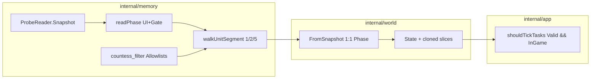

# Phase 4.2 — Memory/World-Erweiterung (minimal für Countess)

## Ziel

Vom **Player-only-Snapshot** zu einem World Model, das Countess-Pathing (ab 4.3+) vorbereitet:

| Daten | Warum | Unit-Table-Segment (d2go) |
|-------|-------|---------------------------|
| **Objects** | Waypoint, Good Chest | Segment **2** (`UnitTable + 2048`) |
| **Entrances** | Tower + Cellar-Treppen | Segment **5** (`UnitTable + 5120`) |
| **Monsters** | Countess (SuperUnique Dark Stalker) | Segment **1** (`UnitTable + 1024`) |
| **GamePhase** | Keine Task-Ticks während Load Screen | UI-Gate + Loading-Byte |

**Release-Kriterium:** Mit `--probe` erscheinen entlang der Countess-Route plausibel benannte Entities (Waypoint in Town/Marsh, Tower-Entrance 10, Catacombs Up/Down, Good Chest oder Countess); `phase=loading` blockiert `shouldTickTasks` trotz `Valid=true`; `go test ./...` grün.

**Explizit nicht in 4.2:** Items, volle Kataloge, Pathing, Input aus Tasks, Charakter/Difficulty, Screen-Transform.

**Referenz (nur Recherche):** `.tmp/d2go-ref` @ `16d248a53591`. **Keine Go-Dependency.**

---

## Ausgangslage

- [`internal/memory/probe.go`](internal/memory/probe.go): `findMainPlayer` walkt Segment 0 korrekt (`UnitTable + i*8` für `i ∈ [0,127]`).
- [`internal/world/mapper.go`](internal/world/mapper.go): `Valid` ⇒ pauschal `GamePhaseInGame` (wird ersetzt).
- [`internal/world/world.go`](internal/world/world.go): `Current()` kopiert Struct, aber künftige Slices brauchen `slices.Clone`.
- [`internal/app/run_mode.go`](internal/app/run_mode.go): `shouldTickTasks` ohne `Phase`-Check.



---

## Architektur-Entscheidungen

| Thema | Entscheidung |
|-------|--------------|
| Unit-Table **zwei Ebenen** | **Segment** = `moduleBase + UnitTable + unitType*1024`; **Listenkopf** = `segmentBase + i*8` (`i ∈ [0,127]`) — nicht verwechseln |
| Player-Scan | `findMainPlayer` → `walkUnitSegment(segment=0, …)` — **eine** Walk-Implementierung, keine parallele Logik |
| Monster/Object/Entrance | Segmente **1 / 2 / 5** — nie `UnitTable + bucket*8` ab Segment 0 |
| Performance | `readUnitTableSegment(segment)` liest `128*8` Bytes einmal (d2go-Stil); `maxTotalUnitVisits` **global pro Snapshot** über alle Walks |
| Walk-Caps | `maxUnitsPerBucket` (256) + `maxTotalUnitVisits` (4096) — Loop-Schutz Linked Lists |
| Snapshot-Caps | `maxEntitiesPerCategory` (32) — begrenzt Slice-Größe im Snapshot |
| ID-Filter | [`internal/memory/countess_filter.go`](internal/memory/countess_filter.go) — `uint32`-Allowlists; **memory importiert nicht world**; Kommentar „sync mit `world/*_ids.go`“ |
| Kataloge | `internal/world/*_ids.go` — Kind + Name; IDs müssen mit `countess_filter` übereinstimmen |
| `Snapshot.Phase` | **Ein** Feld `memory.GamePhase`; Konvertierung nur via `world.mapPhase()` |
| `Valid` vs `Phase` | **Orthogonal** — siehe Tabelle unten |
| Enumeration | Nur wenn `snap.Phase == in_game` (nicht nur `Valid`) |
| Entity-Slices | `Model.Update` / `FromSnapshot`: `slices.Clone` für `Objects`/`Entrances`/`Monsters` |
| World-Log | Entity-**Fingerprint** (Counts + sortierte `(kind, unitID)`-Paare), nicht Positions-Vergleich |
| Tasks 4.2 | App-Guard: `cur.Valid && cur.Phase == InGame`; Countess-Stub unverändert; **4.4+** Defense-in-Depth im Task |
| DarkStalker | NPC-ID **51** (d2go `npc.ID` iota — `VileHunter`=50, `DarkStalker`=51) |

---

## Valid vs Phase — verbindliche Semantik

| Situation | `snap.Valid` | `snap.Phase` | Entities |
|-----------|--------------|--------------|----------|
| Gate≠1, kein Player | `false` | `menu` | `[]` (leer, nicht nil) |
| Gate≠1, Player lesbar | `true` | `in_game` | ja |
| Loading≠0, Player nicht lesbar | `false` | `loading` | `[]` |
| Loading≠0, Player lesbar | `true` | `loading` | `[]` |
| !loading, Player lesbar | `true` | `in_game` | ja |
| Player/Stats/Area Read-Fail | `false` | `unknown` oder `menu` | `[]` |

**Regeln:**

- `Valid` = Player + Vitals + Area/Pos lesbar (Phase 1 — unverändert).
- `Phase` wird in `finalizePhase(gate, loading, playerFound)` **nach** Player-Read gesetzt — nicht vorher aus Gate allein.
- `FromSnapshot`: **immer** `Phase = mapPhase(snap.Phase)` — auch bei `!snap.Valid`; nur `Area`/`Player` Zero-Values bei `!Valid`.
- Test umbenennen: `TestFromSnapshotInvalidNotInGameMapsMenu` (nicht `…StaysUnknownPhase`).
- `shouldTickTasks`: `cur.Valid && cur.Phase == world.GamePhaseInGame`.
- Entity-Slices bei fehlender Enumeration: `make([]T, 0)`, nicht `nil` (stabiler Fingerprint).

### `Snapshot()` — verbindliche Reihenfolge

```text
1. Gate-Byte + UI-Buffer lesen (loading-Flag; Loading auch wenn Gate disabled)
2. Player + Vitals + Area/Pos lesen → Valid, Reason
3. finalizePhase(gate, loading, playerFound) → snap.Phase
4. Entities nur wenn Valid && Phase == in_game
```

Kein `readPhase()` vor `findMainPlayer()` ohne anschließendes `finalizePhase()` — sonst widerspricht Gate≠1/Player-lesbar der Implementierung.

### Gate disabled vs Gate-Byte 0 ([`internal/memory/phase.go`](internal/memory/phase.go))

| Bedingung | Verhalten |
|-----------|-----------|
| `InGameGateOffset() == 0` | Gate **ignorieren**; Phase aus Loading + Player (`finalizePhase`) |
| Gate-Byte `!= 1` && kein Player | `menu` |
| Gate-Byte `!= 1` && Player lesbar | `in_game` (bestehende Heuristik) |
| Loading-Byte `!= 0` | `loading` (überstimmt `in_game`, Entities leer) |

Loading-Byte: `moduleBase + UI - 0xA`, Buffer `0x16D`, Index `0x168` — wenn `off.UI != 0`, unabhängig vom Gate.

---

## Slice 4.2.1 — Unit-Enumeration (`internal/memory`)

### Dateien

- [`internal/memory/unit_table.go`](internal/memory/unit_table.go) — `readUnitTableSegment`, `walkUnitSegment`
- [`internal/memory/countess_filter.go`](internal/memory/countess_filter.go) — Allowlists
- [`internal/memory/entities.go`](internal/memory/entities.go) — Roh-Unit-Typen
- [`internal/memory/phase.go`](internal/memory/phase.go) — `GamePhase`, `readPhase`
- Erweiterung [`internal/memory/offsets.go`](internal/memory/offsets.go), [`internal/memory/probe.go`](internal/memory/probe.go)

### Zwei Ebenen (kritisch)

```go
const (
    unitTableSegmentBytes = 1024 // 128 list heads * 8
    unitTableListHeads    = 128
)

// Segment-Basis für Unit-Typ (d2go): 0=Player, 1=Monster, 2=Object, 5=Entrance
func unitSegmentBase(moduleBase, unitTable uintptr, unitType int) uintptr {
    return moduleBase + unitTable + uintptr(unitType)*unitTableSegmentBytes
}

// Listenkopf i innerhalb des Segments
func unitListHeadAddr(segmentBase uintptr, i int) uintptr {
    return segmentBase + uintptr(i)*8
}
```

`findMainPlayer` refactoren auf `walkUnitSegment(0, isMainPlayer, …)` — gleiche Linked-List-Logik (`NextUnit` @ `0x158`).

### Read-Layouts pro Unit-Typ

| Typ | `unit+0x00` | TxtFileNo | Position | Sonstiges |
|-----|-------------|-----------|----------|-----------|
| Monster | (Bucket 1, kein Typ-Check) | `uint32` @ `+0x04` | `path+0x02/0x06` | `Corpse` @ `0x1AE` skip; `unitData+0x1A` SuperUnique=`10` |
| Object | **== 2** | `uint32 & 0xFFFF` @ `+0x04` | `path+0x10/0x14` | |
| Entrance | **== 5** | `uint32` @ `+0x04` | `path+0x10/0x14` | |

**Robustheit:** `path == 0` oder `unitData == 0` → Unit überspringen, Snapshot **nicht** invalidieren (kaputte List-Knoten).

Früher Allowlist-Check auf TxtFileNo **vor** teuren Pointer-Reads.

### Caps (zwei Limits — nicht vermischen)

| Limit | Wert | Zweck |
|-------|------|-------|
| `maxUnitsPerBucket` | 256 | Linked-List pro Listenkopf |
| `maxTotalUnitVisits` | 4096 | Global pro `Snapshot()` über Segment 0+1+2+5 |
| `maxEntitiesPerCategory` | 32 | Max. Einträge in `Snapshot.Objects` etc. |

### `Snapshot` erweitern

```go
type GamePhase int // unknown, menu, loading, in_game — parallel zu world.GamePhase

type Snapshot struct {
    // ... bestehend At, Valid, Reason, PlayerPtr, HP, AreaID, PosX/Y ...
    Phase     GamePhase
    Objects   []ObjectUnit
    Entrances []EntranceUnit
    Monsters  []MonsterUnit
}
```

`Snapshot()` — siehe **verbindliche Reihenfolge** oben. Bei `Phase != in_game`: `Objects`/`Entrances`/`Monsters` = leere Slices (`make([]T,0)`).

---

## Slice 4.2.2 — Allowlists & World-Kataloge

### [`internal/memory/countess_filter.go`](internal/memory/countess_filter.go)

```go
func IsCountessNPCID(id uint32) bool      // 51
func IsCountessObjectID(id uint32) bool   // 580, Waypoint-IDs
func IsCountessEntranceID(id uint32) bool // 10, 11, 17, 18
```

### [`internal/world/*_ids.go`](internal/world/) — Kind + Name

| Kategorie | IDs (d2go @ `16d248a53591`) |
|-----------|-------------------------------|
| **Waypoint** | Alle `objects.go`-Einträge mit `Name: "Waypoint"` (119, 145, 156, 157, 237, 238, …) — **nicht** handverlesene Beispiele; Countess-Route braucht mindestens **157** (`Act1WildernessWaypoint` / Black Marsh) und Town-WP **119** |
| **Good Chest** | **580** |
| **Tower** | Entrance **10** (Wilderness→Tower), **11** (Tower→Wilderness) — **Pflicht** |
| **Cellar stairs** | **17** (Catacombs Up), **18** (Catacombs Down) |
| **Countess** | NPC **51** (`DarkStalker`), SuperUnique flag `10` |

Test: `npc_ids_test.go` — `DarkStalker == 51`.

**Allowlist-Sync:** `TestCountessFilterMatchesWorldIDs` — jede ID aus `world/*_ids.go` muss in `memory.IsCountess*ID()` true liefern (kein gemeinsames Paket nötig).

---

## Slice 4.2.3 — World-Domain & Mapper

### [`internal/world/entity.go`](internal/world/entity.go)

`Object`, `Entrance`, `Monster` mit `Kind`, `ID`, `UnitID`, `Position`, `Name`.

### `State` ([`internal/world/state.go`](internal/world/state.go))

```go
type State struct {
    At, Phase, Valid, Reason, Area, Player // bestehend
    Objects   []Object
    Entrances []Entrance
    Monsters  []Monster
}
```

### Immutability ([`internal/world/world.go`](internal/world/world.go))

```go
func (m *Model) Update(snap memory.Snapshot) State {
    m.current = cloneState(FromSnapshot(snap)) // slices.Clone auf Entity-Slices
    return m.current
}
func (m *Model) Current() State {
    return cloneState(m.current)
}
```

### Query-Helfer

- `NearestObject(kind)` / `NearestEntrance(kind)` — kürzeste Distanz zum `Player.Position`
- `FindSuperUnique(npcID uint32)` — nächster Treffer mit `npcID` **und** `MonsterTypeFlag == 10` (SuperUnique)
- **Enumeration vs Find:** Walk liefert alle **lebenden** NPC **51** (Corpse skip); `FindSuperUnique` filtert zusätzlich `flag==10` — normale Dark-Stalker-Spawn irrelevant für Countess

### Mapper ([`internal/world/mapper.go`](internal/world/mapper.go))

```go
// Immer — auch bei !snap.Valid:
state.Phase = mapPhase(snap.Phase)
// Area/Player nur wenn snap.Valid; Entity-Slices aus snap oder leere Slices
```

- `mapPhase(memory.GamePhase) world.GamePhase` — **einzige** Konvertierung; Test mit allen vier Werten (unknown, menu, loading, in_game) gegen iota-Drift
- Godoc-Heuristik-Hinweis entfernen
- `--probe` während Load: `Valid=false`, `Phase=loading` im Log sichtbar

---

## Slice 4.2.4 — App-Integration

### `shouldTickTasks` ([`internal/app/run_mode.go`](internal/app/run_mode.go))

```go
if !cur.Valid || cur.Phase != world.GamePhaseInGame {
    return false
}
```

### World-Logging ([`internal/app/world_log.go`](internal/app/world_log.go))

- Info: `phase`, `object_count`, `entrance_count`, `monster_count`
- `worldShouldLog`: Phase-Wechsel oder **Entity-Fingerprint**-Wechsel (nicht position-only)
- `--verbose`: nächste relevante Entity (Waypoint/Chest/Countess)

### `process_lost`

`Tasks.Reset` No-Op bei passivem Run (4.1) — unverändert.

---

## Tests

| Datei | Inhalt |
|-------|--------|
| [`internal/memory/unit_table_test.go`](internal/memory/unit_table_test.go) | Segment-Offsets `+1024/+2048/+5120`; Buffer-Read; zwei Cap-Limits |
| [`internal/memory/phase_test.go`](internal/memory/phase_test.go) | `finalizePhase`; Gate disabled; Loading bei Gate 0; Loading+no Player |
| [`internal/memory/probe_test.go`](internal/memory/probe_test.go) | Entities nur bei `Phase=in_game`; `setupProbeMock` erweitern |
| [`internal/memory/countess_filter_test.go`](internal/memory/countess_filter_test.go) | ID 51, 580, 10/11/17/18; `TestCountessFilterMatchesWorldIDs` |
| [`internal/world/entity_test.go`](internal/world/entity_test.go) | `FindSuperUnique` nearest + flag; `DarkStalker` 51 |
| [`internal/world/mapper_test.go`](internal/world/mapper_test.go) | `TestFromSnapshotInvalidNotInGameMapsMenu`; `mapPhase` alle Werte; loading+invalid |
| [`internal/world/world_test.go`](internal/world/world_test.go) | `Current()` unabhängig nach Slice-Mutation |
| [`internal/app/task_tick_test.go`](internal/app/task_tick_test.go) | `Valid=true`, `Phase=loading` → kein Tick |
| [`internal/app/world_log_test.go`](internal/app/world_log_test.go) | Fingerprint-Änderung loggt; position-only nicht |

### Mock-Segment-Adressen (Pflicht)

```go
monsterSegment  := moduleBase + off.UnitTable + 1024
objectSegment   := moduleBase + off.UnitTable + 2048
entranceSegment := moduleBase + off.UnitTable + 5120
```

### Test-Helper

[`internal/app/app_test.go`](internal/app/app_test.go) `validSnapshot` / `validWorldState`: explizit `Phase: GamePhaseInGame` wenn `Valid=true`.

---

## Dokumentation

| Datei | Änderung |
|-------|----------|
| [`docs/features/world-model.md`](docs/features/world-model.md) | Entities, Phase, `slices.Clone`, Fingerprint-Logging |
| [`docs/features/state-probe.md`](docs/features/state-probe.md) | Unit-Segmente, Phase (nicht mehr „folgt später“), Loading unabhängig vom Gate |
| [`internal/world/mapper.go`](internal/world/mapper.go) Godoc | Heuristik obsolet |
| [`docs/CHANGELOG.md`](docs/CHANGELOG.md) | `[Unreleased]` Added |

---

## Manuelle Validierung (D2R `3.2.92777`, `--probe`)

1. **Startup:** `task run configured` vor Attach (wenn Run aktiv)
2. **Town:** `phase=in_game`, Waypoint in `object_count`
3. **Load screen:** `phase=loading` (`Valid=false` oder `true`) — **keine** Task-Steps; Log zeigt `phase=loading`
4. **Black Marsh:** Waypoint (ID 157) in verbose
5. **Marsh → Tower:** Entrance **10** sichtbar
6. **Cellars:** Entrance **17** / **18**
7. **Countess:** Object **580** oder Monster NPC **51** SuperUnique

---

## Abhängigkeit zu späteren Phasen

| Phase | Nutzt 4.2 |
|-------|-----------|
| 4.3 Pathing | `NearestEntrance`, `NearestObject`, Positionen |
| 4.4+ Countess | GoodChest / DarkStalker; Task prüft zusätzlich `Phase==InGame` |
| 4.8 Route Cache | Weltkoordinaten aus Entities |

---

## Feedback-Integration (Referenz)

| # | Punkt | Status |
|---|-------|--------|
| 1 | Zwei Ebenen Unit-Table + `walkUnitSegment` | Behoben |
| 2 | DarkStalker ID **51** | Behoben |
| 3 | Valid vs Phase Tabelle + `shouldTickTasks` beides | Behoben |
| 4 | Ein Feld `Snapshot.Phase`, Menu-Test | Behoben |
| 5 | `countess_filter.go` in memory | Behoben |
| 6 | `slices.Clone` + Entity-Fingerprint | Behoben |
| 7 | Read-Layouts Tabelle | Behoben |
| 8 | Loading unabhängig vom Gate | Behoben |
| 9 | Waypoint-Allowlist aus d2go `Name=="Waypoint"` | Behoben |
| 10 | Tower Entrances 10/11 Pflicht | Behoben |
| 11 | `readUnitTableSegment` + global visits | Behoben |
| 12 | Zwei Cap-Limits dokumentiert | Behoben |
| 13 | Mock Segment-Offsets | Behoben |
| 14 | `validSnapshot` Phase | Behoben |
| 15 | `FindSuperUnique` nearest; Corpses skip | Behoben |
| 16 | Docs/Godoc | Behoben |
| 17 | `Snapshot()` 4-Schritt-Reihenfolge | Behoben |
| 18 | `FromSnapshot` Phase bei `!Valid` | Behoben |
| 19 | `mapPhase` einzige Konvertierung | Behoben |
| 20 | Gate disabled vs Gate-Byte 0 | Behoben |
| 21 | `TestCountessFilterMatchesWorldIDs` | Behoben |
| 22 | nil path/unitData skip | Behoben |
| 23 | NPC 51 in Enum; SuperUnique in Find | Behoben |
