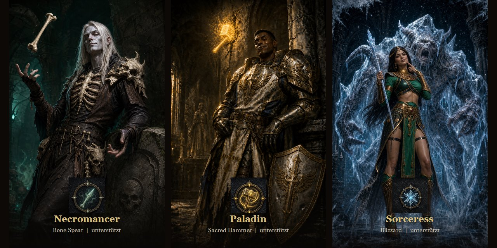
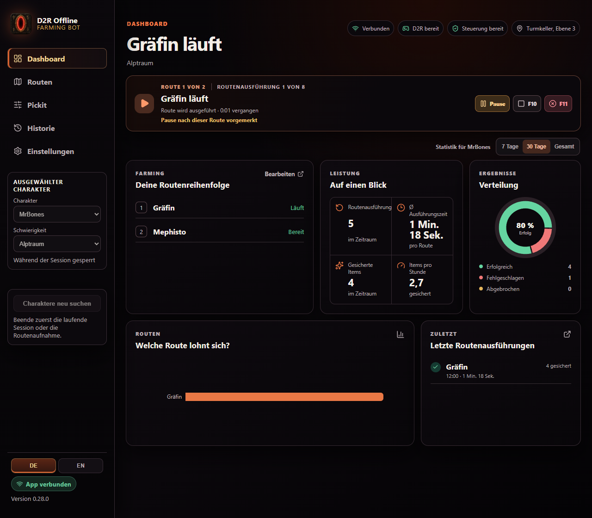
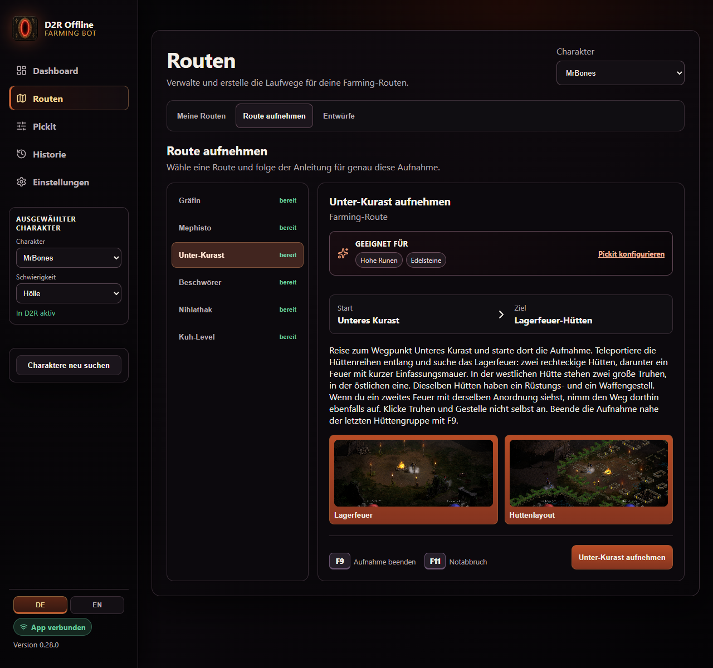
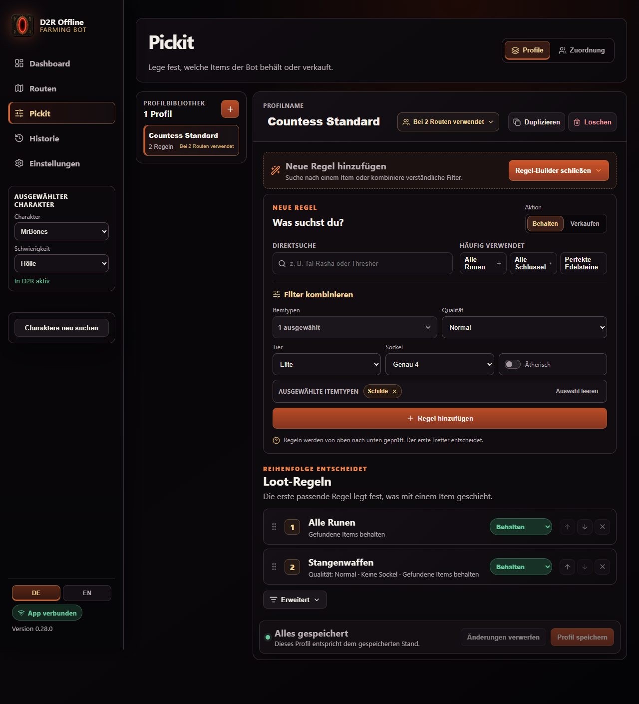

# D2R Offline Farming Bot

Windows-Desktop-App, die Diablo II: Resurrected **offline** farmt. Go liest den Prozess, baut ein World Model und steuert Tastatur und Maus. Electron zeigt Queue, Routen, Pickit und Verlauf. Battle.net ist nicht im Scope und nicht implementiert.

Persönliches Fallbeispiel: Architektur und Abnahme kommen von mir, der Code ist mit AI geschrieben. Kein Produkt, keine Aufforderung, die Blizzard-EULA zu umgehen.

English: a Windows desktop app (Go core, Electron UI) for repeatable **offline** D2R farming. Personal AI-assisted engineering case study, not an online cheat and not affiliated with Blizzard.

Aktuelle Version: [v0.28.0](https://github.com/Tyniann/d2r-offline-farming-bot/releases/tag/v0.28.0), veröffentlicht am 1. Oktober 2026.

## Klassen und Builds

Necromancer, Hammerdin und die [Blizzard-Zauberin](docs/features/sorceress-blizzard.md) sind vollständig implementiert und unterstützen alle sechs Farming-Routen.



<table>
  <tr>
    <td align="center" valign="top" width="33%">
      <br />
      <strong>Necromancer</strong><br />
      Bone Spear · unterstützt
    </td>
    <td align="center" valign="top" width="33%">
      <br />
      <strong>Paladin</strong><br />
      Sacred Hammer · unterstützt
    </td>
    <td align="center" valign="top" width="33%">
      <br />
      <strong>Sorceress</strong><br />
      Blizzard · unterstützt
    </td>
  </tr>
</table>

## Was es kann

- Farming-Ziele: Countess, Mephisto, Summoner, Nihlathak, Cow Level, Lower-Kurast-Supertruhen
- Kampfprofile: Necromancer Bone Spear, Hammerdin und Blizzard-Zauberin, jeweils mit Söldner
- Selbst aufgezeichnete Routen mit Playback gegen das Memory-World-Model
- Pickit-Profile, Town (Identifizieren, Verkaufen, Stash), Session-Queue und begrenzte Run-Recovery
- Automatische Verdichtung voller Edelstein-/Schädel-Slots ab normaler Stufe und niedriger Runen von El bis Ort, mit eigener Anzeige in der Session-Übersicht
- Desktop-UI auf Deutsch und Englisch, plus Windows-Installer

Auflösung 1280×720. D2R startet der Operator selbst.

## Oberfläche

Die Screenshots zeigen Version 0.28.0 mit Beispieldaten.

**Dashboard.** Laufende Session auf Alptraum mit Gräfin → Mephisto, aktiver Gräfin im Turmkeller, Sessionfortschritt, Kennzahlen und letzten Ausführungen.



**Routen aufzeichnen.** Aufnahme für Unter-Kurast mit Ziel, Start- und Zielgebiet, Anleitung, Referenzbildern und Hotkeys zum Beenden.



**Pickit.** Profilbibliothek und Regelbau mit Qualitätsfilter, Sockeln sowie Behalten-/Verkaufen-Auswahl. Gespeicherte Regeln lassen sich direkt umstellen.



## Architektur

```
D2R.exe  →  process  →  memory snapshot  →  world model
                                              ↓
Electron UI  ←  loopback API  ←  app  ←  tasks / profile / town / loot / crafting
                                              ↓
                                           input (SendInput)
```

Pathing, Loot, Town und Crafting hängen am World Model, nicht an Rohbytes. Die UI redet nur mit `internal/api` auf localhost. Input geht erst nach explizitem Opt-in und bleibt über Hotkeys abbrechbar.

## Wie es gebaut wurde

Phasenpläne, fail-closed Gates, Feature-Docs und ein Changelog vor jedem Release. Live-Abnahme im Spiel, nicht nur grüne Tests. Arbeitsregeln für den Agenten: [`AGENTS.md`](AGENTS.md). Phasenpläne: [`docs/plans/`](docs/plans/).

Aktuelle Aufwand-/Qualitätsbewertung (v0.24, 2026-08-23): [Repo-Effort-Evaluation](docs/reviews/repo-effort-evaluation-2026-08-23.md). Phase 24 ergänzt begrenzte Run-Recovery und die Startakt-Normalisierung. Der Juli-Snapshot (v0.16, vier Runs) bleibt unter [docs/reviews/](docs/reviews/) als Vergleich.

## Lizenz und Grenzen

[`LICENSE`](LICENSE): Quelltext ansehen und daraus lernen ja. Battle.net, Verkauf als Produkt, Blizzard-Affiliation nein.

Diablo II: Resurrected ist eine Marke von Blizzard Entertainment, Inc. Dieses Projekt ist inoffiziell.

## Installer und Entwicklung

Windows 10/11 x64, unsignierter NSIS-Installer. SmartScreen kann warnen. Daten: `%LOCALAPPDATA%\D2ROfflineFarmingBot\`.

```powershell
powershell -ExecutionPolicy Bypass -File scripts/build-release.ps1 -Version 0.28.0
```

Ergebnis: `dist/release/D2R-Offline-Farming-Bot-0.28.0-Setup.exe` plus SHA-256. Der veröffentlichte Download enthält beide Dateien als `D2R-Offline-Farming-Bot-0.28.0-Windows-x64.zip`. Installer-Hinweise: [`docs/INSTALLATION.md`](docs/INSTALLATION.md).

Lokal: Windows, Go 1.26+, Node/pnpm. `Copy-Item configs\config.example.yaml configs\config.yaml`, dann `go test ./...`. UI unter `web/`. Feature-Docs: [`docs/features/README.md`](docs/features/README.md). Changelog: [`docs/CHANGELOG.md`](docs/CHANGELOG.md).

```
cmd/d2rbot/     Einstieg
internal/       process, memory, world, pathing, input, tasks, profile, town, loot, crafting, api
web/            Electron und React
configs/        YAML, Pickit, Routen
docs/           Features, Pläne, Changelog
scripts/        Release-Build
```
